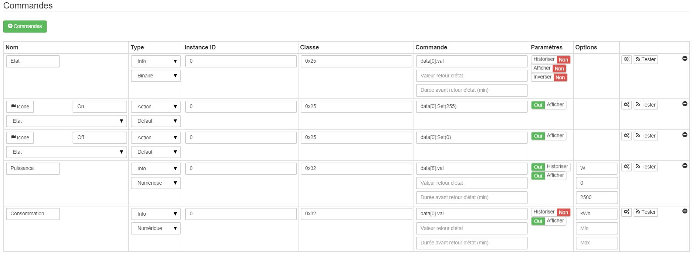
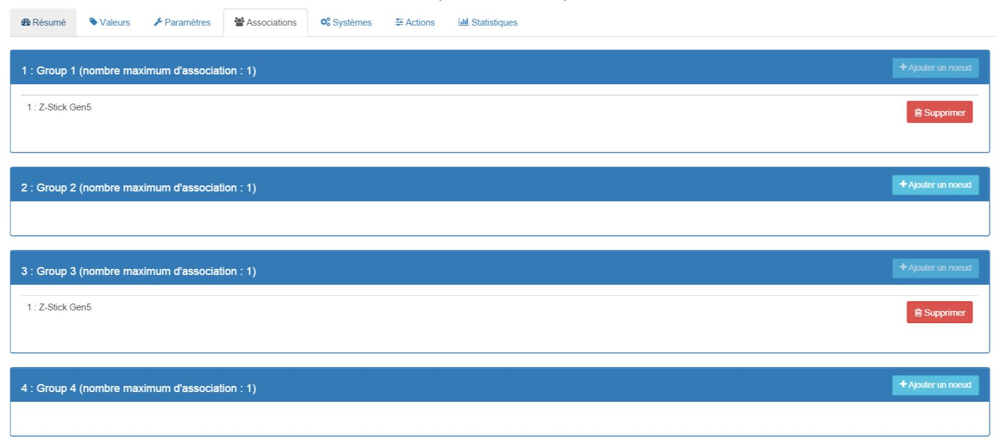

# Greenwave PowerNode - 1 Stecker

**Das Modul**

**Das Jeedom Visual**

## Zusammenfassung

Das PowerNode-Steckermodul von GreenWave ist ein intelligentes Gerät, das an eines Ihrer Haushaltsgeräte und Ihre Elektronik angeschlossen wird, damit Sie den Stromverbrauch über einen Webbrowser oder ein Smartphone fernüberwachen und steuern können.

Mit der Z-Wave-Technologie ist die PowerNode-gesteuerte Buchse mit den meisten auf dem Markt erhältlichen Hausautomationsboxen wie Fibaro Home Center 2, eedomus oder Zipabox kompatibel.

Das PowerNode-Socket-Modul sammelt Daten zum Energieverbrauch des angeschlossenen Geräts und überträgt diese an die Hausautomationsbox. Über diese kontrollierte Steckdose können Sie das Gerät auch über einen Webbrowser oder ein Smartphone aus der Ferne aktivieren oder deaktivieren oder einen Zeitplan festlegen, um Ihr Gerät zu voreingestellten Zeiten automatisch zu aktivieren oder zu deaktivieren.

Mit einem kleinen Rad an der Seite der Steckdose können Sie eine Farbe auswählen, die den Raum darstellt, dem sie zugeordnet ist. Zum Beispiel "blau für das Schlafzimmer ". Mit diesem Tipp können Sie Ihre verschiedenen PowerNode-Sockets und mehrere Sockets unterscheiden. Sie können dieses Einstellrad auch auf ein Vorhängeschloss einstellen. Mit dieser Funktion können Sie den Stecker verriegeln, um ein versehentliches Ausschalten zu vermeiden. Eine Steuerung über das Boxen der Heimautomation ist jedoch nicht mehr möglich.

Die PowerNode-gesteuerte Buchse verfügt außerdem über eine Lichtstatusanzeige, die je nach Farbe unterschiedliche Informationen liefert : Steckdosen ein oder aus, begrenzte Funkreichweite, Einschluss- und Ausschlussmodus.

Das PowerNode-Steckermodul ist mit einem Überstromschutz ausgestattet, um das angeschlossene Gerät zu schützen. Der PowerNode-Stecker wird bei einem defekten Gerät oder einem Kurzschluss deaktiviert. Zusätzlichen Schutz bietet die interne Sicherung in der Steckdose.

## Funktionen

-   Steuern Sie eine Lampe oder ein Gerät fern
-   Steckermodul, das direkt zwischen einer Steckdose und der zu steuernden Last integriert ist
-   Ermöglicht die Überwachung des Verbrauchs des angeschlossenen Geräts
-   EIN / AUS-Funktion
-   Möglichkeit, ihm eine Nummer und eine Farbe zuzuweisen, um die verschiedenen PowerNodes derselben Installation zu unterscheiden
-   Ein / Aus-Taste direkt an der Steckdose
-   Überstromschutz
-   Lichtstatusanzeige

## Technische Daten

-   Versorgung : 250 V AC, 50 Hz
-   Maximaler Ladestrom : 10A
-   Maximale Lastleistung : )
-   Standby-Verbrauch : 0,4 W.
-   Messgenauigkeit : ± 0,1 W.
-   Überstromschutz : 10A interne Sicherung
-   Steckertyp : )
-   Z-Wave-Radiofrequenz : 868,42 MHz
-   Maximale Reichweite Z-Wave : 30m
-   Betriebstemperatur : 0 ° C bis + 25 ° C
-   Lagertemperatur : -20 ° C bis + 60 ° C
-   Maximale Luftfeuchtigkeit : 5% bis 90%
-   ) : IP20

## Moduldaten

-   Machen Sie : GreenWave
-   Name : GreenWave \ [1 x Stecker \]
-   Hersteller ID : 153
-   Produkttyp : 2
-   Produkt-ID : 2

## Konfiguration

Informationen zum Konfigurieren des OpenZwave-Plugins und zum Einfügen von Jeedom finden Sie hier [Dokumentation](https://doc.jeedom.com/de_DE/plugins/automation%20protocol/openzwave/).

> **Wichtig**
>
> Um dieses Modul in den Einschlussmodus zu versetzen, drücken Sie die Einschluss-Taste unter der Buchse.

Einmal enthalten, sollten Sie dies erhalten :

### Befehle

Sobald das Modul erkannt wurde, sind die dem Modul zugeordneten Befehle verfügbar.

Hier ist die Liste der Befehle :

-   Zustand : Es ist der Befehl, mit dem der Status des Sockets ermittelt werden kann
-   Ein : Dies ist der Befehl, der die Steckdose einschaltet
-   Aus : Es ist der Befehl, der es ermöglicht, den Fang zu löschen
-   Macht : Es ist die Steuerung, die den momentanen Stromverbrauch erhöht
-   Verbrauch : Es ist die Bestellung, die den Gesamtverbrauch angibt

Beachten Sie, dass die Befehle ON / OFF / STATUS im Dashboard in einer einzigen Schaltfläche zusammengefasst sind.

### Konfiguration du module

Sie können das Modul entsprechend Ihrer Installation konfigurieren. Gehen Sie dazu auf die Schaltfläche "Konfiguration" des OpenZwave-Plugins von Jeedom.

Sie gelangen auf diese Seite (nachdem Sie auf die Registerkarte Einstellungen geklickt haben)

Wie Sie sehen, gibt es für dieses Modul nicht viel Konfiguration.

Parameterdetails :

-   1 : Verzögerung, bevor die Taste blinkt : )
-   2 : )

### Gruppen

Dieses Modul hat vier Assoziationsgruppen, nur die 3. Gruppe ist wichtig.

## Gut zu wissen

Im Gegensatz zu der Mehrfachsteckdose der großen Schwester erfordert diese Steckdose keine Abfrage, um den Verbrauch zu erhöhen.

### Zurücksetzen

Sie können Ihren Verbrauchszähler zurücksetzen, indem Sie auf diese Schaltfläche auf der Registerkarte System klicken. Wählen Sie PressButton.

### Besonderheiten

## Aufwachen

Keine Vorstellung von Aufwecken auf diesem Modul.
