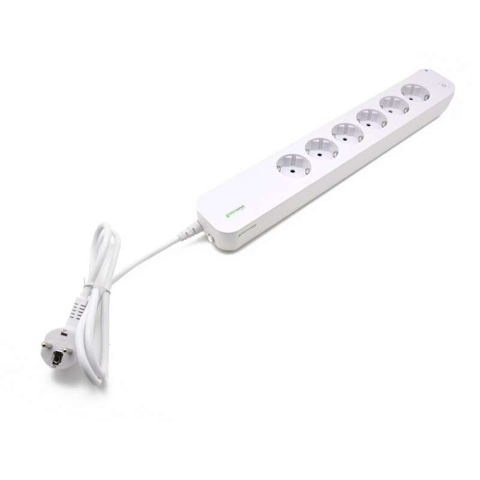
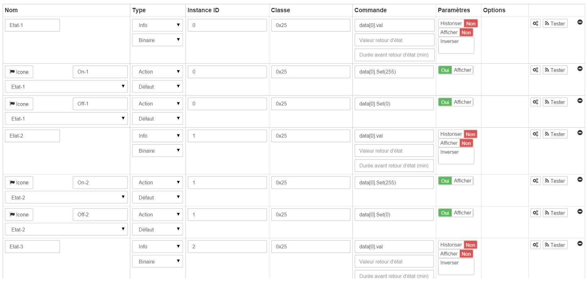
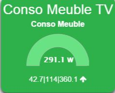

Greenwave PowerNode - 6 Sockel 
==============================

\.

-   **Das Modul**

\.

\.

-   **Das Jeedom Visual**

\.

\.

Zusammenfassung 
------

\.

Die Grünwelle PowerNode-Steckdosenleiste ist ein intelligentes Gerät, das
verbindet sich mit Ihren Haushaltsgeräten und Elektronik für Sie
Mit dieser Funktion können Sie den Stromverbrauch Ihres Geräts überwachen und steuern
Geräte aus der Ferne über Webbrowser oder Smartphone. Verwenden von
Mit der Z-Wave-Technologie ist die PowerNode-Steckdosenleiste kompatibel mit der
Die meisten Hausautomationsboxen auf dem Markt wie Fibaro Home Center 2, eedomus
oder Zipabox. Ausgestattet mit 6 Ports kann es 6 unabhängig steuern
verschiedene Elektrogeräte mit einer Gesamtleistung von .

Die PowerNode-Steckdosenleiste erfasst Verbrauchsdaten
von Energie von angeschlossenen Geräten und überträgt sie an die Hausautomationsbox.
Sie können dann den Energieverbrauch jedes Geräts steuern
verbunden. Mit dieser Steckdosenleiste können Sie auch aktivieren oder deaktivieren
Geräte aus der Ferne über einen Webbrowser oder ein Smartphone oder
Legen Sie einen Zeitplan fest, um Ihre automatisch zu aktivieren oder zu deaktivieren
Geräte zu voreingestellten Zeiten. Ein kleines Rad an der Seite des
Mit Multi-Socket können Sie eine Farbe auswählen, die das Teil darstellt, für das
das ist die Steckdosenleiste betroffen. Zum Beispiel "blau für das Schlafzimmer
". Mit diesem Tipp können Sie Ihre verschiedenen unterscheiden
PowerNode-Steckdosenleiste. Sie können dieses Einstellrad auch auf a stellen
Vorhängeschloss. Mit dieser Funktion können Sie die Steckdosenleiste so verriegeln
Vermeiden Sie ein versehentliches Ausschalten, sondern steuern Sie von der Box aus
Hausautomation wird nicht mehr möglich sein.

Die PowerNode-Steckdosenleiste verfügt außerdem über eine Leuchtstatusanzeige
Dies gibt je nach Farbe unterschiedliche Informationen : genommen
Ein oder Aus, begrenzte Funkreichweite, Einschluss- und Ausschlussmodus.

Die PowerNode-Steckdosenleiste ist mit einem Schutz gegen ausgestattet
Überströme zum Schutz angeschlossener Geräte. Der PowerNode
Deaktiviert die Ports im Falle einer Gerätefehlfunktion
defekt oder Kurzschluss. Zusätzlicher Schutz ist
Dies wird durch die interne Sicherung in der Steckdosenleiste sichergestellt.

Diese Steckdosenleiste ist ideal für die Steuerung von Multimedia-Geräten in
ein TV-Schrank oder zur Steuerung von Computergeräten
in einem Büro und vermeiden Sie daher die Verwendung von 6 Z-Wave-Buchsen
individuell. \.

Funktionen 
---------

\.

-   6-Port Z-Wave Steckdosenleiste

-   Ermöglicht die Überwachung des Verbrauchs angeschlossener Geräte

-   EIN / AUS-Funktion

-   Möglichkeit, ihm eine Nummer und eine Farbe zuzuweisen, um
    Unterscheiden Sie zwischen den verschiedenen PowerNodes derselben Installation.

-   Ein / Aus-Taste direkt auf der Steckdosenleiste

-   Überstromschutz

-   Lichtstatusanzeige

\.

Technische Daten 
---------------------------

\.

-   Versorgung : 250 V AC, 50 Hz

-   Maximaler Ladestrom : 

-   Maximale Lastleistung : 2400 W (bei 240 V)

-   Standby-Verbrauch : 0,4 W.

-   Messgenauigkeit : ± 0,1 W.

-   Überstromschutz :  interne Sicherung

-   Steckertyp : DIN49440 / EWG 7/7 (Schuko)

-   Z-Wave-Radiofrequenz : 868,42 MHz

-   Maximale Reichweite Z-Wave : 

-   Betriebstemperatur : 0 ° C bis + 25 ° C.

-   Lagertemperatur : -20 ° C bis + 60 ° C.

-   Maximale Luftfeuchtigkeit : 5% bis 90%

-   IP-Klasse (Feuchtigkeitstoleranz) : 

\.

Moduldaten 
-----------------

\.

-   Machen Sie : Grünwelle

-   Name : Grünwelle \ [6 x Sockets \]

-   Hersteller ID : 153

-   Produkttyp : 3

-   Produkt-ID : 4

\.

Konfiguration 
-------------

\.

So konfigurieren Sie das OpenZwave-Plugin und wissen, wie Sie Jeedom einsetzen
Aufnahme beziehen sich darauf
[Dokumentation](https://jeedom.fr/doc/Dokumentation/plugins/openzwave/de_DE/openzwave.html).

\.

> **Wichtig**
>
> Drücken Sie die Taste, um dieses Modul in den Einschlussmodus zu versetzen
> Einschluss an der Steckdose vorhanden.

\.

\.

Einmal enthalten, sollten Sie dies erhalten :

\.

\.

### Befehle 

\.

Sobald das Modul erkannt wurde, werden die dem Modul zugeordneten Befehle ausgeführt
verfügbar.

\.

\.

Hier ist die Liste der Befehle :

\.

-   Zustand-1 : Es ist der Befehl, mit dem der Status des
    nimm 1

-    : Dies ist der Befehl, der Socket 1 einschaltet

-   Aus-1 : Es ist der Befehl, der Socket 1 ausschaltet

-   Power-1 : Dies ist der Befehl, der die momentane Leistung erhöht
    entnommen aus Aufnahme 1

-    : Es ist der Befehl, der den Gesamtverbrauch des
    nimm 1

-   Zustand-2 : Es ist der Befehl, mit dem der Status des
    nimm 2

-    : Es ist der Befehl, der Socket 2 einschaltet

-   Aus-2 : Es ist der Befehl, der Sockel 2 ausschaltet

-   Power-2 : Dies ist der Befehl, der die momentane Leistung erhöht
    entnommen aus Aufnahme 2

-    : Es ist der Befehl, der den Gesamtverbrauch des
    nimm 2

-   Zustand-3 : Es ist der Befehl, mit dem der Status des
    nimm 3

-    : Dies ist der Befehl, der Socket 3 einschaltet

-   Aus-3 : Es ist der Befehl, der Socket 3 ausschaltet

-   Power-3 : Dies ist der Befehl, der die momentane Leistung erhöht
    entnommen aus Aufnahme 3

-    : Es ist der Befehl, der den Gesamtverbrauch des
    nimm 3

-   Zustand-4 : Es ist der Befehl, mit dem der Status des
    nimm 4

-    : Es ist der Befehl, der Socket 4 einschaltet

-   Aus-4 : Es ist der Befehl, der Socket 4 ausschaltet

-   Power-4 : Dies ist der Befehl, der die momentane Leistung erhöht
    entnommen aus Aufnahme 4

-    : Es ist der Befehl, der den Gesamtverbrauch des
    nimm 4

-   Zustand-5 : Es ist der Befehl, mit dem der Status des
    nimm 5

-    : Es ist der Befehl, der Socket 5 einschaltet

-   Aus-5 : Es ist der Befehl, der Socket 5 ausschaltet

-   Power-5 : Dies ist der Befehl, der die momentane Leistung erhöht
    entnommen aus Aufnahme 5

-    : Es ist der Befehl, der den Gesamtverbrauch des
    nimm 5

-   Zustand-6 : Es ist der Befehl, mit dem der Status des
    nimm 6

-    : Es ist der Befehl, der Socket 6 einschaltet

-   Aus-6 : Es ist der Befehl, der Socket 6 ausschaltet

-   Power-6 : Dies ist der Befehl, der die momentane Leistung erhöht
    entnommen aus Aufnahme 6

-    : Es ist der Befehl, der den Gesamtverbrauch des
    nimm 6

\.

Beachten Sie, dass im Dashboard die Befehle ON / OFF / STATUS zusammengefasst sind
in einer Taste.

\.

### Konfiguration des Moduls 

\.

Sie können das Modul entsprechend Ihrer Konfiguration konfigurieren
Installation. Dies erfordert das Durchlaufen der Schaltfläche "Konfiguration" des
Jeedom OpenZwave Plugin.

\.

\.

Sie gelangen auf diese Seite (nachdem Sie auf die Registerkarte geklickt haben
Einstellungen)

\.

\.

Wie Sie sehen, gibt es nicht viel Konfiguration
für dieses Modul.

\.

Parameterdetails :

\.

-   1 : Verzögerungen, bevor die Taste blinkt : Anzahl der Sekunden
    Minimum zwischen zwei Kommunikationen (wenn diese Verzögerung überschritten wird, die Taste
    der Steckdose blinkt)

-   2 : Ausgewählte Radfarbe (automatisch erkannt)

\.

### Gruppen 

\.

Dieses Modul hat vier Assoziationsgruppen, nur die 1. Gruppe
wesentlich.

\.

\.

Gut zu wissen 
------------

\.

### Besonderheiten / Polling 

\.

Im Gegensatz zu seiner kleinen Schwester "Une Preis" benötigt diese Steckdosenleiste
Umfragen zur Steigerung des Verbrauchs.

\.

\.

Es ist nur notwendig, es für den Power-Befehl eines jeden zu aktivieren
genommen. Dies hat zur Folge, dass die beiden Werte erhöht werden (Verbrauch und Leistung).

\.

### Gesamtverbrauch 

\.

\.

Sie können eine virtuelle verwenden, um einen kumulativen Verbrauch zu erstellen
von 6 nimmt.

\.

\.

### Zurücksetzen 

\.

\.

Sie können Ihre Verbrauchsanzeige zurücksetzen, indem Sie auf klicken
auf dieser Schaltfläche auf der Registerkarte System verfügbar. (Es erfolgt ein Zurücksetzen von
genommen). Wählen Sie PressButton.

\.

Aufwachen 
------

\.

Keine Vorstellung von Aufwecken auf diesem Modul.

\.

Faq. 
------

\.

Hast du für einen CRON bezahlt?.

\.

Nein, nein. Das Modul erlaubt es nicht. Legen Sie ein Stück schwarzes Klebeband
oben.

\.
**@sarakha63**
