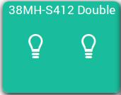
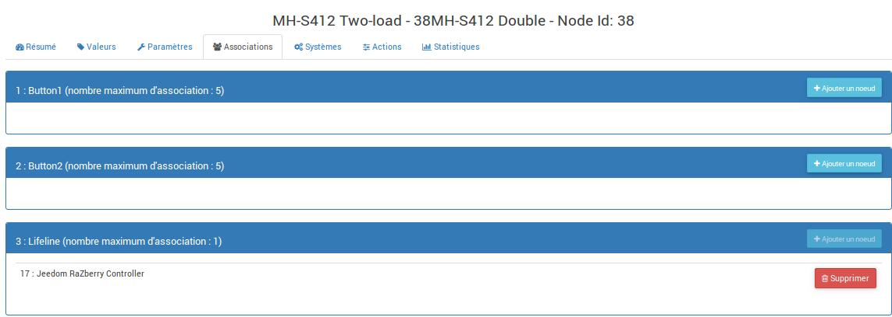

# MCO MH-S412 Double

**Das Modul**

**Das Jeedom Visual**

## Zusammenfassung

.

Die Glasoberfläche und das Design bringen einen modernen Stil.

.

.

## Fonctions

-   Steuern Sie zwei Lampen oder Geräte fern
-   
-   EIN / AUS-Funktion
-   Unterstützungszuordnungsbefehle (Gruppe 1 und Gruppe 2)
-   Kontrolle der beiden Ladungen vor Ort
-   Status-LED
-   Glasoberfläche, modernes Design
-   Berühren Sie die Tasten

## Technische Daten

-   Modultyp : Z-Wave Empfänger
-   Farbe : Blanc
-   Versorgung : 230 V, 50 Hz
-   Verkabelung : 3 Draht, Neutralleiter erforderlich
-   Maximale Leistung : 5A (1100 W) für jeden Kanal
-   Frequenz : 868,42 MHz
-   Geltungsbereich : bis zu 30 m
-   Abmessungen : 86 x 86 x 43 mm
-   Affichage: Blaue / rote LED

## Moduldaten

-   Machen Sie : MC HOME
-   Name : MH-S412 Double
-   Hersteller ID : 351
-   Produkttyp : 16642
-   Produkt-ID : 514

## Configuration

Informationen zum Konfigurieren des OpenZwave-Plugins und zum Einfügen von Jeedom finden Sie hier [Dokumentation](https://doc.jeedom.com/de_DE/plugins/automation%20protocol/openzwave/).

> **Wichtig**
>
> .

Einmal enthalten, sollten Sie dies erhalten :

### Commandes

Sobald das Modul erkannt wurde, sind die dem Modul zugeordneten Befehle verfügbar.

Wenn Sie das Modul dann entsprechend Ihrer Installation konfigurieren möchten, müssen Sie die Schaltfläche "Konfiguration" des OpenZwave-Plugins von Jeedom aufrufen.

Sie gelangen auf diese Seite (nachdem Sie auf die Registerkarte Einstellungen geklickt haben)

Parameterdetails :

-   1: Speicherzustand vor Stromausfall : 

### Groupes

Dieses Modul hat 3 Zuordnungsgruppen. .

## Gut zu wissen

### Besonderheiten

- 
- 
- 
- 

## Wakeup

## Faq.

Um dieses Modell auszuschließen, versetzen Sie Openzwave in den Ausschlussmodus und drücken Sie eine der beiden Tasten auf der Vorderseite gemäß der Papierdokumentation 3 Sekunden lang.

Um die Werkseinstellungen wiederherzustellen, drücken Sie gemäß der Papierdokumentation 10 Sekunden lang eine der beiden Tasten auf der Vorderseite.
