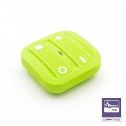
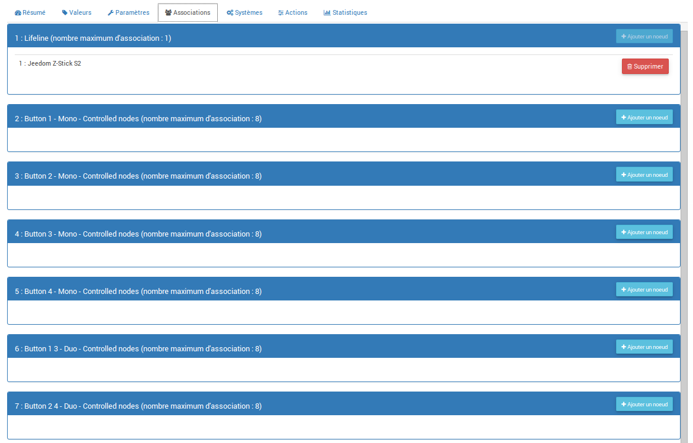

Nodon Fernbedienung - Soft Remote 
================================

\.

-   **Das Modul**

\.

\.

-   **Das Jeedom Visual**

\.

\.

Zusammenfassung 
------

\.

Die Soft Remote NodOn® kann jedes Gerät direkt steuern
Z-Wave®- oder Z-Wave Plus®-kompatibel wie der NodOn® Smart Plug.

Es kann auch Szenen über ein Hausautomationssystem auslösen
kompatibel.

\.

Funktionen 
---------

\.

-   Steuern Sie jedes Z-Wave-kompatible Gerät

-   Schlag- und spritzwassergeschützt

-   Wird dank des integrierten Magneten überall angebracht

-   6 Farben erhältlich

\.

Technische Daten 
---------------------------

\.

-   Versorgung : CR2032 Batterie - Autonomie 1,5 - 2 Jahre

-   4 Tasten

-   Integrierter Magnet zur Befestigung an der Metalloberfläche

-   Schlag- und spritzwassergeschützt

-   Betriebstemperatur : 0 ° C bis 40 ° C - Höhe : 2000m

-   Z-Wave®-Funkprotokoll : 868.4MHz - 500 Series - Z-Wave kompatibel
    Plus® SDK 06.51.06

-   Geltungsbereich : 40 m drinnen / 80 m draußen

-   Abmessungen 56 \ * 56 \ * 20 mm

-   2 Jahre Garantie

\.

Moduldaten 
-----------------

\.

-   Machen Sie : Nodon

-   Name : CRC-3-6-0x Soft Remote

-   Hersteller ID : 357

-   Produkttyp : 2

-   Produkt-ID : 2

\.

Konfiguration 
-------------

\.

So konfigurieren Sie das OpenZwave-Plugin und wissen, wie Sie Jeedom einsetzen
Aufnahme beziehen sich darauf
[documentation](https://jeedom.fr/doc/documentation/plugins/openzwave/de_DE/openzwave.html).

\.

> **Wichtig**
>
> Drücken Sie die beiden Tasten, um dieses Modul in den Einschlussmodus zu versetzen
> Taste (+ und 0 voll), bis das Licht dann rosa wird
> Drücken Sie die Taste + gemäß der Papierdokumentation.

\.

\.

Einmal enthalten, sollten Sie dies erhalten :

\.

\.

### Befehle 

\.

Sobald das Modul erkannt wurde, werden die dem Modul zugeordneten Befehle ausgeführt
verfügbar.

\.

\.

Hier ist die Liste der Befehle :

\.

-   Tasten : Es ist der Befehl, der den Knopf nach oben drückt

+ ---------------- + ---------------- + --------------- - + ---------------- + ---------------- +
| Tasten        | Unterstützung          | Lange drücken     | Entspannung    | Doppelte Unterstützung   |
+ =============== + =============== + ================ = + =============== + ================= +
| **1 (0         | 10             | 12             | 11             | 13             |
| voll)**       |                |                |                |                |
+ ---------------- + ---------------- + --------------- - + ---------------- + ---------------- +
| **2 (+)**      | 20             | 22             | 21             | 23             |
+ ---------------- + ---------------- + --------------- - + ---------------- + ---------------- +
| **3 (0 leer)** | 30             | 32             | 31             | 33             |
+ ---------------- + ---------------- + --------------- - + ---------------- + ---------------- +
| **4 (-)**      | 40             | 42             | 41             | 43             |
+ ---------------- + ---------------- + --------------- - + ---------------- + ---------------- +

-   Batterie : Es ist der Befehl, der den Füllstand der Batterien erhöht

\.

### Konfiguration des Moduls 

\.

> **Wichtig**
>
> Wecken Sie das Modul bei einer ersten Aufnahme immer gleich danach auf
> Einbeziehung.

\.

Dann, wenn Sie das Modul entsprechend konfigurieren möchten
Ihrer Installation müssen Sie durch die Schaltfläche gehen
"Konfiguration "des OpenZwave-Plugins von Jeedom.

\.

\.

Sie gelangen auf diese Seite (nachdem Sie auf die Registerkarte geklickt haben
Einstellungen)

\.

\.

Parameterdetails :

\.

-   1-2 : Ermöglicht die Auswahl des Profils der Schaltflächen bei Verwendung in
    zentral (für den Einsatz in Jeedom nicht erforderlich)

-   3 : Wichtiger Parameter, um zu sagen, ob der Schalter funktionieren soll
    im Szenen- oder zentralen Szenenmodus (Szene absolut einstellen)

-   4-7 : Wählen Sie die Tastenbetriebsart (falls vorhanden)
    Gruppenverbände)

-   8 : Hier können Sie den Betriebsmodus der LED auswählen

### Gruppen 

\.

Dieses Modul hat 7 Zuordnungsgruppen.

\.

\.

-   Gruppe 1 - Rettungsleine : Diese Gruppe wird im Allgemeinen für verwendet
    Übertragen Sie Informationen vom Smart Plug zum Hauptcontroller
    des Netzwerks.

-   Gruppe 2 bis 5 - Die Geräte in diesen Gruppen werden von der gesteuert
    entsprechende Schaltfläche entsprechend MONO-Profil

-   Gruppe 6 bis 7 - Die Geräte in diesen Gruppen werden von der gesteuert
    entsprechende Schaltflächen entsprechend DUO-Profil

\.

> **Wichtig**
>
> Jeedom sollte mindestens in Gruppe 1 landen

Gut zu wissen 
------------

\.

### Besonderheiten 

\.

-   Dieses Modul kann bei der Aufnahme schwierig sein. Zögern Sie nicht
    1 oder 2 mal nach der Aufnahme aufwachen. Und überprüfen Sie die
    Assoziationsgruppe.

\.

Aufwachen 
------

\.

Um dieses Modul zu aktivieren, drücken Sie einfach eine der Tasten

\.

Faq. 
------

\.

Dieses Modul ist ein Batteriemodul, die neue Konfiguration wird nicht sein
Berücksichtigen Sie dies, wenn Sie die Fernbedienung aktivieren.

\.

Wichtiger Hinweis 
---------------

\.

> **Wichtig**
>
> Sie müssen das Modul aufwecken : nach seiner Aufnahme, nach einer Änderung
> der Konfiguration, nach einer Änderung des Aufweckens, nach a
> Änderung der Assoziationsgruppen

\.

**@lunarok**
