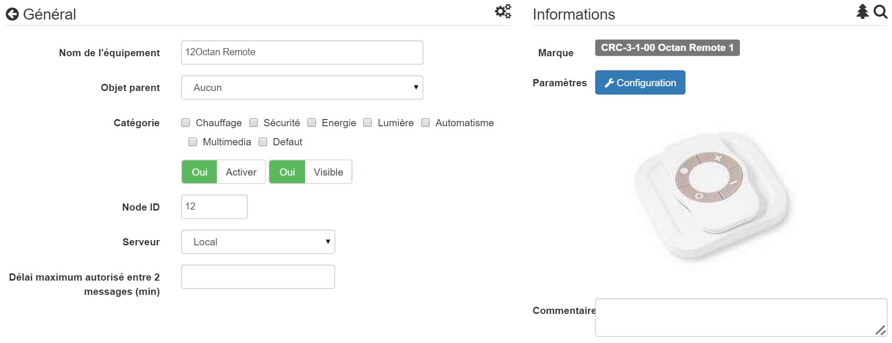

 
==========================

\.

-   **Das Modul**

\.

\.

-   **Das Jeedom Visual**

\.

\.

Zusammenfassung 
------

\.

. 

\.

Funktionen 
---------

\.

-   Steuerung allein oder mit einem Hausautomationssystem

-   

-   

-   

-   2 Jahre Batterie

\.

Technische Daten 
---------------------------

\.

-   Versorgung : CR2032 Batterie - Autonomie 1,5 - 2 Jahre

-   4 Tasten

-   
    

-   

-   Betriebstemperatur :  : 2000m

-   Z-Wave®-Funkprotokoll : 868.4MHz - 500 Series - Z-Wave kompatibel
    .: 

-   Abmessungen : 80 \ * 80 \ * 15mm

-   2 Jahre Garantie

\.

Moduldaten 
-----------------

\.

-   Machen Sie : 

-   Name : 

-   Hersteller ID : 357

-   Produkttyp : 2

-   Produkt-ID : 1

\.

Konfiguration 
-------------

\.

So konfigurieren Sie das OpenZwave-Plugin und wissen, wie Sie Jeedom einsetzen
Aufnahme beziehen sich darauf
[documentation](https://jeedom.fr/doc/documentation/plugins/openzwave/de_DE/openzwave.html).

\.

> **Wichtig**
>
> 
> 
> .

\.

\.

Einmal enthalten, sollten Sie dies erhalten :

\.

\.

### Befehle 

\.

Sobald das Modul erkannt wurde, werden die dem Modul zugeordneten Befehle ausgeführt
verfügbar.

\.

\.

Hier ist die Liste der Befehle :

\.

-   Tasten : Es ist der Befehl, der den Knopf nach oben drückt

| Tasten        | Unterstützung          | Lange drücken     | Entspannung    | Doppelte Unterstützung   |

| **1**          | 10             | 12             | 11             | 13             |

| **2**          | 20             | 22             | 21             | 23             |

| **3**          | 30             | 32             | 31             | 33             |

| **4**          | 40             | 42             | 41             | 43             |

\.

### Konfiguration des Moduls 

\.

> **Wichtig**
>
> Wecken Sie das Modul bei einer ersten Aufnahme immer gleich danach auf
> Einbeziehung.

\.

Dann, wenn Sie das Modul entsprechend konfigurieren möchten
Ihrer Installation müssen Sie durch die Schaltfläche gehen
"Konfiguration "des OpenZwave-Plugins von Jeedom.

\.

\.

Sie gelangen auf diese Seite (nachdem Sie auf die Registerkarte geklickt haben
Einstellungen)

\.

\.

Parameterdetails :

\.

-    : 
    

-   3 : 
    

-    : 
    

-   8 : 

### Gruppen 

\.

.

\.

\.

-   Gruppe 1 - Rettungsleine : Diese Gruppe wird im Allgemeinen für verwendet
    Übertragen Sie Informationen vom Smart Plug zum Hauptcontroller
    des Netzwerks.

-   
    

-   
    

\.

> **Wichtig**
>
> Jeedom sollte mindestens in Gruppe 1 landen

Gut zu wissen 
------------

\.

### Besonderheiten 

\.

-   . 
    
    .

\.

Aufwachen 
------

\.

\.

Faq. 
------

\.

Dieses Modul ist ein Batteriemodul, die neue Konfiguration wird nicht sein
Berücksichtigen Sie dies, wenn Sie die Fernbedienung aktivieren.

\.

Wichtiger Hinweis 
---------------

\.

> **Wichtig**
>
> Sie müssen das Modul aufwecken : nach seiner Aufnahme, nach einer Änderung
> der Konfiguration, nach einer Änderung des Aufweckens, nach a
> Änderung der Assoziationsgruppen

\.

**@sarakha63**
