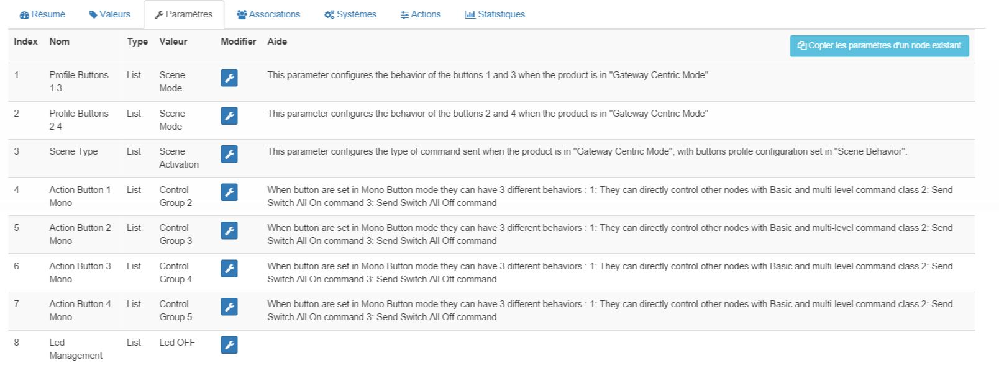

Nicken Fernbedienung - Octan 
==========================

\.

-   **Das Modul**

\.

\.

-   **Das Jeedom Visual**

\.

\.

Zusammenfassung 
------

\.

Mit der Octan Remote NodOn® können Sie jeden Empfänger steuern
Z-Wave®- oder Z-Wave Plus®-kompatibel wie die Fernbedienungsbuchse
NodOn® (Hauptcontrollermodus - Standalone) oder sogar Trigger
Szenen / Aktionen über ein kompatibles Hausautomationssystem (Modus
Gateway)

Dank seines integrierten Magneten kann er überall befestigt werden, vom Kühler bis zur Tür
Kühlschrank, durch seine Wandhalterung. Zwischen Fernbedienung
und schalten, die Octan Remote revolutioniert die Objektsteuerung
Inland

\.

Funktionen 
---------

\.

-   Steuerung allein oder mit einem Hausautomationssystem

-   Integrierter Magnet

-   Farbig geführt

-   Wandplatte

-   2 Jahre Batterie

\.

Technische Daten 
---------------------------

\.

-   Versorgung : CR2032 Batterie - Autonomie 1,5 - 2 Jahre

-   4 Tasten

-   Wandhalterung mit doppelseitigem Kleber (im Lieferumfang enthalten) oder Schrauben
    (nicht enthalten)

-   Integrierter Magnet zur Befestigung an der Metalloberfläche

-   Betriebstemperatur : 0 ° C bis 40 ° C - Höhe : 2000m

-   Z-Wave®-Funkprotokoll : 868.4MHz - 500 Series - Z-Wave kompatibel
    Plus® SDK 06.51.01 Geltungsbereich: 40 m innen / 80 m außen

-   Abmessungen : 80 \* 80 \* 15mm

-   2 Jahre Garantie

\.

Moduldaten 
-----------------

\.

-   Machen Sie : Nicken

-   Name : CRC-3-1-00 Octan Remote

-   Hersteller ID : 357

-   Produkttyp : 2

-   Produkt-ID : 1

\.

Konfiguration 
-------------

\.

So konfigurieren Sie das OpenZwave-Plugin und wissen, wie Sie Jeedom einsetzen
Aufnahme beziehen sich darauf
[Dokumentation](https://jeedom.fr/doc/Dokumentation/plugins/openzwave/de_DE/openzwave.html).

\.

> **Wichtig**
>
> Drücken Sie die beiden Tasten, um dieses Modul in den Einschlussmodus zu versetzen
> Taste (1 und 2) drücken, bis das Licht rosa wird, dann drücken
> Taste 1 gemäß der Papierdokumentation.

\.

\.

Einmal enthalten, sollten Sie dies erhalten :

\.

\.

### Befehle 

\.

Sobald das Modul erkannt wurde, werden die dem Modul zugeordneten Befehle ausgeführt
verfügbar.

\.

\.

Hier ist die Liste der Befehle :

\.

-   Tasten : Es ist der Befehl, der den Knopf nach oben drückt

+ ---------------- + ---------------- + --------------- - + ---------------- + ---------------- +
| Tasten        | Unterstützung          | Lange drücken     | Entspannung    | Doppelte Unterstützung   |
+ =============== + =============== + ================ = + =============== + ================= +
| **1**          | 10             | 12             | 11             | 13             |
+ ---------------- + ---------------- + --------------- - + ---------------- + ---------------- +
| **2**          | 20             | 22             | 21             | 23             |
+ ---------------- + ---------------- + --------------- - + ---------------- + ---------------- +
| **3**          | 30             | 32             | 31             | 33             |
+ ---------------- + ---------------- + --------------- - + ---------------- + ---------------- +
| **4**          | 40             | 42             | 41             | 43             |
+ ---------------- + ---------------- + --------------- - + ---------------- + ---------------- +

\.

### Konfiguration des Moduls 

\.

> **Wichtig**
>
> Wecken Sie das Modul bei einer ersten Aufnahme immer gleich danach auf
> Einbeziehung.

\.

Dann, wenn Sie das Modul entsprechend konfigurieren möchten
Ihrer Installation müssen Sie durch die Schaltfläche gehen
"Konfiguration "des OpenZwave-Plugins von Jeedom.

\.

\.

Sie gelangen auf diese Seite (nachdem Sie auf die Registerkarte geklickt haben
Einstellungen)

\.

\.

Parameterdetails :

\.

-   1-2 : Ermöglicht die Auswahl der Schaltflächenprofile bei Verwendung in
    zentral (für den Einsatz in Jeedom nicht erforderlich)

-   3 : Wichtiger Parameter, um zu sagen, ob der Schalter funktionieren soll
    im Szenen- oder zentralen Szenenmodus (Szene absolut einstellen)

-   4-7 : Wählen Sie die Tastenbetriebsart (falls vorhanden)
    Gruppenverbände)

-   8 : Hier können Sie den Betriebsmodus der LED auswählen

### Gruppen 

\.

Dieses Modul hat 7 Zuordnungsgruppen.

\.

\.

-   Gruppe 1 - Rettungsleine : Diese Gruppe wird im Allgemeinen für verwendet
    Übertragen Sie Informationen vom Smart Plug zum Hauptcontroller
    des Netzwerks.

-   Gruppe 2 bis 5 - Die Geräte in diesen Gruppen werden von der gesteuert
    entsprechende Schaltfläche entsprechend MONO-Profil

-   Gruppe 6 bis 7 - Die Geräte in diesen Gruppen werden von der gesteuert
    entsprechende Schaltfläche entsprechend DUO-Profil

\.

> **Wichtig**
>
> Jeedom sollte mindestens in Gruppe 1 landen

Gut zu wissen 
------------

\.

### Besonderheiten 

\.

-   Dieses Modul kann bei der Aufnahme schwierig sein. Zögern Sie nicht
    Wachen Sie 1 oder 2 Mal nach der Aufnahme auf und überprüfen Sie die
    Assoziationsgruppe.

\.

Aufwachen 
------

\.

Um dieses Modul zu aktivieren, drücken Sie einfach eine der Tasten

\.

Faq. 
------

\.

Dieses Modul ist ein Batteriemodul, die neue Konfiguration wird nicht sein
Berücksichtigen Sie dies, wenn Sie die Fernbedienung aktivieren.

\.

Wichtiger Hinweis 
---------------

\.

> **Wichtig**
>
> Sie müssen das Modul aufwecken : nach seiner Aufnahme, nach einer Änderung
> der Konfiguration, nach einer Änderung des Aufweckens, nach a
> Änderung der Assoziationsgruppen

\.

**@sarakha63**
