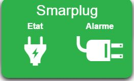

# Nicken Prise Intelligente - Smartplug

**Das Modul**

**Das Jeedom Visual**

## Zusammenfassung

Die ferngesteuerte NodOn®-Buchse kann über ein Z-Wave®- oder Z-Wave Plus®-kompatibles Hausautomationssystem oder direkt über andere Z-Wave®- oder Z-Wave Plus®-Steuerungen wie die Soft Remote, den Wandschalter oder gesteuert werden der Octan Remote NodOn®. Deutscher Standard (Schuko) oder französischer Standard (Typ E), der Stecker kann in beide Richtungen angeschlossen werden, Kopf hoch oder Kopf runter. In Verbindung mit seinem feinen Design ermöglichen diese beiden Eigenschaften eine einfachere Integration, ohne benachbarte Fässer auf einer Steckdosenleiste zu verstopfen. Das Erlernen der Buchse mit ihrem Controller dauert nur wenige Sekunden. Über eine lokale Taste können Sie die Steckdose direkt ein- oder ausschalten.

## Funktionen

-   Netzstromverlusterkennung
-   Ergonomique: Möglichkeit des Einsteckens der Kopf-oben / Kopf-unten-Buchse
-   Intelligentes Alarmmanagement
-   Verbesserte Funkreichweite
-   Maximale Stromstärke: 16A

## Technische Daten

-   Versorgung : 230 V AC +/- 10% - 50 Hz
-   Maximale Leistung : 3000 W kontinuierlich / 3500 W zyklisch (ohmsche Last) Eigenverbrauch : &lt;1W
-   Betriebstemperatur : 0 ° C bis 40 ° C - Höhe : 2000m
-   Z-Wave®-Funkprotokoll : 868.4MHz - 500 Series - Z-Wave Plus® SDK 06.51.01 kompatibel
-   Geltungsbereich: 40 m innen / 80 m außen
-   Dimensions: 104 \*51 \*36mm
-   2 Jahre Garantie
-   EU-Typ

## Moduldaten

-   Machen Sie : Nodon
-   Name : Smartplug
-   Hersteller ID : 357
-   Produkttyp : 1
-   Produkt-ID : 1

## Konfiguration

Informationen zum Konfigurieren des OpenZwave-Plugins und zum Einfügen von Jeedom finden Sie hier [Dokumentation](https://doc.jeedom.com/de_DE/plugins/automation%20protocol/openzwave/).

> **Wichtig**
>
> Um dieses Modul in den Einschlussmodus zu versetzen, drücken Sie die Taste, bis das Licht gemäß der Papierdokumentation rot wird.

Einmal enthalten, sollten Sie dies erhalten :

### Befehle

Sobald das Modul erkannt wurde, sind die dem Modul zugeordneten Befehle verfügbar.

Hier ist die Liste der Befehle :

-   Zustand : )
-   Ein : Dies ist der Befehl, der die Steckdose einschaltet
-   Aus : Es ist der Befehl, der es ermöglicht, den Fang zu löschen
-   Status : )

Beachten Sie, dass sich im Dashboard die Informationen zu Status, EIN / AUS auf demselben Symbol befinden.

### Konfiguration du module

Sie können das Modul entsprechend Ihrer Installation konfigurieren. Gehen Sie dazu auf die Schaltfläche "Konfiguration" des Zwave-Plugins von Jeedom.

Sie gelangen auf diese Seite (nachdem Sie auf die Registerkarte Parameter geklickt haben)

Parameterdetails :

-   1 : Dieser Parameter definiert den Zustand (EIN / AUS) des Smart Plug nach einem Stromausfall oder nach dem Anschließen
-   2 : ). ). Es wird empfohlen, diesen Parameter auf 1 zu setzen.
-   3 : Mit diesem Parameter können die Gruppen 2 und 3 aktiviert oder deaktiviert werden.
-   4 : Le paramètre force l'état de la Smart Plug à « ON » (Smart Plug activée). )
-   Parameter 5 bis 20 : Durch Konfigurationsparameter \#5 à \#In 20 können bis zu 8 verschiedene Alarme konfiguriert werden. Um Ihre Alarme richtig zu konfigurieren, das Online-Formular: www.nodon.de / support / asp3 / alarm führt Sie

### Gruppen

Dieses Modul hat 8 Zuordnungsgruppen.

-   Gruppe 1 - Rettungsleine : Diese Gruppe wird im Allgemeinen verwendet, um Informationen vom Smart Plug an den Hauptnetzwerkcontroller zu melden.
-   Gruppe 2 - Smart Plug-Statusüberwachung Wenn der Smart Plug über die lokale Taste aktiviert (bzw. deaktiviert) wird, sendet er einen Aktivierungsbefehl (bzw. Deaktivierungsbefehl) an die zugehörigen Geräte. Es wird kein Befehl gesendet, wenn die Statusänderung des Smart Plug durch einen Funkbefehl verursacht wurde
-   Gruppe 3 - Überwachung des Zusatzstatus Wenn der Smart Plug über die lokale Taste aktiviert (bzw. deaktiviert) wird, sendet er einen Deaktivierungsbefehl (bzw. Aktivierungsbefehl) an die zugehörigen Geräte. Es wird kein Befehl gesendet, wenn die Statusänderung des Smart Plug durch einen Funkbefehl verursacht wurde.
-   Gruppe 4 - Benachrichtigung über einen Stromausfall Wenn der Smart Plug einen Stromausfall oder eine Rückkehr der Stromversorgung feststellt, wird ein Benachrichtigungsbericht an die zugehörigen Geräte gesendet. Le rapport envoyé est un « Notification Report : ).
-   Gruppe 5 - Aktivierung bei Stromausfall Wenn der Smart Plug einen Stromausfall erkennt, werden die zugehörigen Geräte aktiviert.
-   Gruppe 6 - Deaktivierung bei Stromausfall Wenn der Smart Plug einen Stromausfall erkennt, werden die zugehörigen Geräte deaktiviert
-   Gruppe 7 - Aktivierung bei Stromrückführung Wenn der Smart Plug eine Stromrückführung erkennt, werden die zugehörigen Geräte aktiviert.
-   Gruppe 8 - Deaktivierung bei Stromrückführung Wenn der Smart Plug eine Stromrückführung erkennt, werden die zugehörigen Geräte deaktiviert

> **Wichtig**
>
> Jeedom sollte mindestens in den Gruppen 1 und 4 zu finden sein

## Gut zu wissen

### Besonderheiten

-   Es ist sinnlos, Spaß beim Ein- und Ausstecken der Steckdose zu haben, um den Alarm zu beobachten. Dies funktioniert nur etwa dreimal. Darüber hinaus muss der Stecker noch eine Weile mit Strom versorgt werden, um den internen Akku aufzuladen.

## Aufwachen

Keine Vorstellung von Aufwecken auf diesem Modul.
