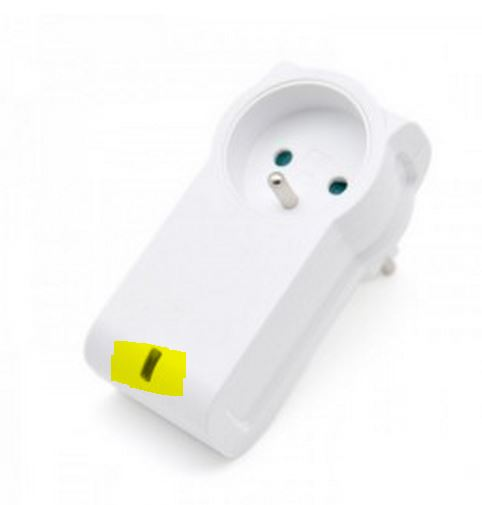

 
====================================

\.

-   **Das Modul**

\.

\.

-   **Das Jeedom Visual**

\.

\.

Zusammenfassung 
------

\.

,
. 

. 

. 
. 
.

\.

Funktionen 
---------

\.

-   

-   : 
    Niedrig

-   

-   

-   : 

\.

Technische Daten 
---------------------------

\.

-   Versorgung : 

-   Maximale Leistung : 
     : &lt;1W

-   Betriebstemperatur :  : 2000m

-   Z-Wave®-Funkprotokoll : 868.4MHz - 500 Series - Z-Wave kompatibel
    

-   Geltungsbereich: 

-   Abmessungen: 

-   2 Jahre Garantie

-   

\.

Moduldaten 
-----------------

\.

-   Machen Sie : 

-   Name : 

-   Hersteller ID : 357

-   Produkttyp : 1

-   Produkt-ID : 1

\.

Konfiguration 
-------------

\.

So konfigurieren Sie das OpenZwave-Plugin und wissen, wie Sie Jeedom einsetzen
Aufnahme beziehen sich darauf
[documentation](https://jeedom.fr/doc/documentation/plugins/openzwave/de_DE/openzwave.html).

\.

> **Wichtig**
>
> Drücken Sie die Taste, um dieses Modul in den Einschlussmodus zu versetzen
> 
> .

\.

\.

Einmal enthalten, sollten Sie dies erhalten :

\.

\.

### Befehle 

\.

Sobald das Modul erkannt wurde, werden die dem Modul zugeordneten Befehle ausgeführt
verfügbar.

\.

\.

Hier ist die Liste der Befehle :

\.

-   Zustand : Es ist der Befehl, mit dem der Status des
    

-   Ein : Dies ist der Befehl, der die Steckdose einschaltet

-   Aus : Es ist der Befehl, der es ermöglicht, den Fang zu löschen

-   Status : 
    

\.

.

\.

### Konfiguration des Moduls 

\.

Sie können das Modul entsprechend Ihrer Konfiguration konfigurieren
Installation. Dies erfordert das Durchlaufen der Schaltfläche "Konfiguration" des
.

\.

\.

Sie gelangen auf diese Seite (nachdem Sie auf die Registerkarte geklickt haben
Einstellungen)

\.

\.

Parameterdetails :

\.

-   1 : 
    Stromausfall oder nach dem Anschluss

-   2 : Mit dieser Einstellung können Sie die Berichtsberichte von konfigurieren
    Stromausfall / Rückgabe sowie die zugehörigen Gruppen (Gruppen
    4, 5, 6, 7, 8). Es sind mehrere Kombinationen möglich (siehe
    Papierdokumentation oder Hilfe Blase in Jeedom). Er ist
    empfohlen, diesen Parameter auf 1 zu setzen.

-   3 : Mit diesem Parameter können die Gruppen 2 und 3 aktiviert oder deaktiviert werden.

-   4 : Le paramètre force l'état de la Smart Plug à « ON » (Smart
    Stecker aktiviert). Wenn die Einstellung aktiviert ist, ist dies nicht der Fall
    möglich, den Smart Plug (lokal oder Radio) auszuschalten

-   Parameter 5 bis 20 : Über die Konfigurationsparameter \ # 5 bis
    \ # 20, es ist möglich, bis zu 8 verschiedene Alarme zu konfigurieren.
    Um Ihre Alarme richtig zu konfigurieren, das Einline-Formular:
    www.nodon.fr/support/asp3/alarm wird Sie führen

### Gruppen 

\.

Dieses Modul hat 8 Zuordnungsgruppen.

\.

\.

-   Gruppe 1 - Rettungsleine : Diese Gruppe wird im Allgemeinen für verwendet
    Übertragen Sie Informationen vom Smart Plug zum Hauptcontroller
    des Netzwerks.

-   Gruppe 2 - Überwachen des Status des Smart Plug Beim Smart Plug
    wird über die lokale Taste aktiviert (bzw. deaktiviert),
    Dies sendet einen Aktivierungsbefehl
    (bzw. Deaktivierung) zu den zugehörigen Geräten. Keine
    Befehl wird nicht gesendet, wenn sich der Status des Smart Plug geändert hat
    wurde durch einen Funkbefehl verursacht

-   Gruppe 3 - Nachverfolgung des Komplementärstatus Beim Smart Plug
    wird über die lokale Taste aktiviert (bzw. deaktiviert),
    Dies sendet einen Deaktivierungsbefehl
    (bzw. Aktivierung) zu den zugehörigen Geräten. Keine
    Befehl wird nicht gesendet, wenn sich der Status des Smart Plug geändert hat
    wurde durch einen Funkbefehl verursacht.

-   Gruppe 4 - Benachrichtigung über Stromausfall beim Smart Plug
    Erkennt einen Stromausfall oder eine Rückkehr der Stromversorgung, ein Bericht
    Die Benachrichtigung wird an gekoppelte Geräte gesendet. Der Bericht gesendet
    est un « Notification Report : Energieverwaltung - Wechselstrom getrennt
    / Wieder angeschlossen).

-   Gruppe 5 - Aktivierung bei Stromausfall Wenn der Smart Plug
    Erkennt ein Stromausfall, aktiviert es die zugehörigen Geräte.

-   Gruppe 6 - Deaktivierung bei Stromausfall Wenn der Smart
    Stecker erkennt einen Stromausfall, deaktiviert Geräte
    Mitarbeiter

-   Gruppe 7 - Aktivierung bei aktueller Rückgabe beim Smart Plug
    Erkennt eine Stromrückführung, aktiviert es die zugehörigen Geräte.

-   Gruppe 8 - Deaktivierung bei Stromrückführung beim Smart Plug
    Erkennt eine Stromrückführung, deaktiviert es die zugehörigen Geräte

\.

> **Wichtig**
>
> Jeedom sollte mindestens in den Gruppen 1 und 4 gefunden werden

Gut zu wissen 
------------

\.

### Besonderheiten 

\.

-   Es macht keinen Sinn, Spaß daran zu haben, den Stecker zu stecken oder zu ziehen
    Beobachten Sie den Alarm. Dies funktioniert nur etwa dreimal. Bei
    jenseits der Steckdose muss zum Aufladen eine Weile mit Strom versorgt bleiben
    die interne Batterie.

\.

Aufwachen 
------

\.

Keine Vorstellung von Aufwecken auf diesem Modul.

\.

Faq. 
------

\.

Sie sollten nicht die Möglichkeit haben, automatische Widgets herunterzuladen
aktiviert. Sie können die Mobil- und Dashboard-Widgets auf der Website abrufen
Markt : Alarm \ _back.

\.

Haben Sie Parameter 2 richtig eingestellt? ? Hast du Jeedom wenigstens gut?
in den Gruppen 1 und 4 ? Lassen Sie der Batterie Zeit
aufladen ?

\.

**@sarakha63**
