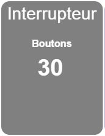

# Nicken Interrupteur - Wall Switch

**Das Modul**

**Das Jeedom Visual**

## Zusammenfassung

Der NodOn®-Wandschalter kann jedes Z-Wave®- oder Z-Wave Plus®-kompatible Gerät wie den NodOn®-Smart-Plug direkt steuern oder sogar Szenen über ein kompatibles Hausautomationssystem auslösen.

Der Schalter verfügt über eine Montageplatte zur einfachen Montage im Haus: Verwenden Sie die Schrauben eines Montagetopfs, schrauben Sie ihn an die Wand oder kleben Sie ihn einfach über die doppelseitigen Klebstoffe auf der Rückseite der Platte.

## Funktionen

-   Steuerung allein oder mit einem Hausautomationssystem
-   Einfach zu montieren und zu demontieren
-   Angenehmes Gefühl der Unterstützung
-   Drahtlos
-   2 Jahre Batterie

## Technische Daten

-   Versorgung : CR2032 Batterie - Autonomie 1,5 - 2 Jahre
-   4 Tasten
-   )
-   Betriebstemperatur : 0 ° C bis 40 ° C
-   Höhe : 2000m
-   Z-Wave®-Funkprotokoll : 868.4MHz - 500 Series - Kompatibles Z-Wave Plus® SDK 06.51.06
-   Geltungsbereich : 40 m drinnen / 70 m draußen
-   Abmessungen : 80 \*80 \*15mm
-   2 Jahre Garantie
-   EN 60950-1:2006 + A11:2009 + A1:2010 + A12:2011 + A2:2013
-   EN 300 220-2 V2.4.1
-   EN301 489-1 V1.9.2
-   EN301 489-3 V1.6.1
-   EN 62479:2010

## Moduldaten

-   Machen Sie : Nodon
-   Name : CWS-3-1-01 Wandschalter
-   Hersteller ID : 357
-   Produkttyp : 2
-   Produkt-ID : 3

## Konfiguration

Informationen zum Konfigurieren des OpenZwave-Plugins und zum Einfügen von Jeedom finden Sie hier [Dokumentation](https://doc.jeedom.com/de_DE/plugins/automation%20protocol/openzwave/).

> **Wichtig**
>
> Um dieses Modul in den Einschlussmodus zu versetzen, drücken Sie die beiden Tasten (1 und 2), bis das Licht rosa wird, und drücken Sie dann die Taste 1 gemäß der Papierdokumentation.

Einmal enthalten, sollten Sie dies erhalten :

### Befehle

Sobald das Modul erkannt wurde, sind die den Modulen zugeordneten Befehle verfügbar.

Hier ist die Liste der Befehle :

-   Tasten : Es ist der Befehl, der den Knopf nach oben drückt

+ ---------------- + ---------------- + --------------- - + ---------------- + ---------------- +
| Tasten        | Unterstützung          | Lange drücken     | Entspannung    | Doppelte Unterstützung   |
+ =============== + =============== + ================ = + =============== + ================= +
| **1**          | 10             | 12             | 11             | 13             |
+ ---------------- + ---------------- + --------------- - + ---------------- + ---------------- +
| **2**          | 20             | 22             | 21             | 23             |
+ ---------------- + ---------------- + --------------- - + ---------------- + ---------------- +
| **3**          | 30             | 32             | 31             | 33             |
+ ---------------- + ---------------- + --------------- - + ---------------- + ---------------- +
| **4**          | 40             | 42             | 41             | 43             |
+ ---------------- + ---------------- + --------------- - + ---------------- + ---------------- +

### Konfiguration du module

> **Wichtig**
>
> Wecken Sie das Modul bei einer ersten Aufnahme immer unmittelbar nach der Aufnahme auf.

Wenn Sie das Modul dann entsprechend Ihrer Installation konfigurieren möchten, müssen Sie die Schaltfläche "Konfiguration" des OpenZwave-Plugins von Jeedom aufrufen.

Sie gelangen auf diese Seite (nachdem Sie auf die Registerkarte Parameter geklickt haben)

Parameterdetails :

-   1-2 : )
-   3 : )
-   4-7 : )
-   8 : Hier können Sie den Betriebsmodus der LED auswählen

### Gruppen

Dieses Modul hat 7 Zuordnungsgruppen.

-   Gruppe 1 - Rettungsleine : Diese Gruppe wird im Allgemeinen verwendet, um Informationen vom Smart Plug an den Hauptnetzwerkcontroller zu melden.
-   Gruppe 2 bis 5 - Die Geräte in diesen Gruppen werden über die entsprechende Schaltfläche entsprechend dem MONO-Profil gesteuert
-   Gruppe 6 bis 7 - Die Geräte in diesen Gruppen werden über die entsprechende Schaltfläche entsprechend dem DUO-Profil gesteuert

> **Wichtig**
>
> Zumindest sollte Jeedom in Gruppe 1 landen

## Gut zu wissen

### Besonderheiten

-   Dieses Modul kann bei der Aufnahme schwierig sein. Zögern Sie nicht, es 1 oder 2 Mal nach der Aufnahme aufzuwecken. Überprüfen Sie die Assoziationsgruppe.

## Aufwachen

Um dieses Modul zu aktivieren, drücken Sie einfach eine dieser Tasten

## Wichtiger Hinweis

> **Wichtig**
>
> Sie müssen das Modul aufwecken : nach seiner Aufnahme, nach einer Änderung der Konfiguration, nach einer Änderung des Aufweckens, nach einer Änderung der Assoziationsgruppen
