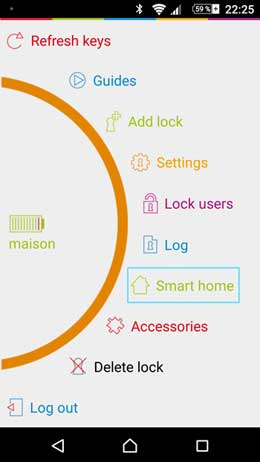

Danalock V2 BTZE 
================

\.

-   **Das Modul**

\.

\.

-   **Das Jeedom Visual**

\.

\.

Zusammenfassung 
------

 

**Sichern Sie Ihr Zuhause mit dem elektronischen Schloss Z-Wave von
Poly-Control !**

 ! 
.

. 
.

. 
. 
. 
. 
.. 

.

****

.

****

.


****

. ,

rentré.

****

. 

die Batterie. .

.

****

. 
. 

.

****

,
. 

intelligent und die gesamte Kommunikation ist stark verschlüsselt - niemand
Ich kann mich nicht in dein Haus hacken.

**Diskret, langlebig und dänisch**

Danalock kombiniert die Eleganz und den Minimalismus des skandinavischen Designs - mit
Lünette aus massiv eloxiertem Aluminium und fortschrittliche Technologien
Bluetooth und Z-Wave. Ein diskretes dänisches Design für die Ewigkeit.
\.

Funktionen 
---------

\.

-   Steuern Sie Ihre Haustür aus der Ferne

-   Verbundenes Schloss

-   1 Zylinder anpassbar an verschiedene Längen geliefert

-   5 physische Schlüssel dienen zum Öffnen der Tür von außen

-   Verbindung über Bluetooth Smart und Z-Wave

-   Integration in kompatible Z-Wave-Controller (eedomus,
    Vera,…)

-   Aktivitätsverlauf

-   Verschiedene Einstellmöglichkeiten zum Schließen und Öffnen

-   Zugriffsfreigabe : Geben Sie Ihrer Putzfrau oder einem Freund Zugang
    für eine begrenzte Zeit

-   Automatische Kalibrierung

-   Einfach zu installieren

-   Batteriebetrieb

-   Kompatibel mit iOS (iPhone 4s oder höher), aber
    auch Android (ab 4.4).

\.

Technische Daten 
---------------------------

\.

-   Essen : 4 CR123 3V Batterien

-   Versionen : V2

-   Material : Massives eloxiertes Aluminium

-   Kommunikation : Bluetooth und Z-Wave

-   Abmessungen : 79 mm x 49 mm (Durchmesser x Höhe)

-   Gewicht : 363g

\.

Moduldaten 
-----------------

\.

-   Machen Sie : Poly-Control

-   Nachname : Danalock V2 BTZE

-   Hersteller ID : 010e

-   Produkttyp : 1

-   Produkt-ID : 1

\.

Konfiguration 
-------------

\.

So konfigurieren Sie das OpenZwave-Plugin und wissen, wie Sie Jeedom einsetzen
Aufnahme beziehen sich darauf
[Dokumentation](https://jeedom.fr/doc/documentation/plugins/openzwave/de_DE/openzwave.html).

\.

> **Important**
>
> Es ist wichtig, dieses Modul in den sicheren Modus zu integrieren..

\.

So versetzen Sie das Z-Wave-Plugin (openzwave) im Einschlussmodus in Jeedom
sicher : Gehen Sie einfach zur Seite zur Verwaltung von Z-Wave-Modulen
und klicken Sie auf das Symbol "Zwave Network"

\.

Klicken Sie dann auf der Registerkarte "Aktionen" auf : "MODUL IM MODUS HINZUFÜGEN
SICHER (INKLUSION)"

\.

> **Important**
>
> Wir gehen davon aus, dass Sie die Anwendung installiert haben
> Ihr Smartphone oder iPhone und erstellt ein Konto. Wenn es nicht schon ist
> Fertig können Sie auf diese Seite verweisen.

Klicken Sie in der Anwendung auf "Smart Home", dann auf "Z-Wave" und schließlich
auf "CONNECT".

Einmal enthalten, sollten Sie dies erhalten :

\.

\.

### Bestellungen 

\.

Sobald das Modul erkannt wurde, lauten die dem Modul zugeordneten Befehle
disponibles.

\.

\.

Hier ist die Liste der Befehle :

\.

-   Status : Es ist der Befehl, der die letzte Aktion ausführt
    ausgeführt (öffnen / schließen)

-   Öffnen : Es ist der Befehl, der das Schloss öffnet

-   Schließen : Es ist der Befehl, der das Schließen des Schlosses ermöglicht

-   Batterie : Es ist der Batteriebefehl

\.

### Konfiguration des Moduls 

\.

> **Warning**
>
> Obwohl dieses Modul im Akkubetrieb ist, verwendet es die Flirs-Technologie.
> Dies bedeutet, dass er keine Vorstellung davon hat, aufzuwachen und zu erwachen. Er
> Konfigurationsänderungen werden nahezu in Echtzeit wiederhergestellt
> als Sektormodul.

\.

Wenn Sie das Modul entsprechend Ihrer Konfiguration konfigurieren möchten
Installation müssen Sie über die Schaltfläche "Konfiguration" der
Jeedom OpenZwave Plugin.

\.

\.

Sie gelangen auf diese Seite (nachdem Sie auf die Registerkarte geklickt haben
Einstellungen)

\.

\.

Parameterdetails :

\.

-   1 : Richtung 0-1 : 0 = Motor läuft im Uhrzeigersinn
    gesperrt, 1 = Motor läuft gegen den Uhrzeigersinn, wenn
    verrouillé

-   2 : Geschwindigkeit 1 = am langsamsten, 2 = langsam, 3 = normal, 4 = schnell, 5 = die
    schneller

-   3 : Modus 1 = Motorantrieb (Energieeinsparung), 2 = Modus
    volle Ausbildung (Normal)

-   4 : Anzahl der Umdrehungen (1 = 10 Grad, 9 = 90 Grad usw.)

-   5 : Automatische Sperre 0-60 Wie viele Sekunden ab dem Moment
    Das Schloss wurde entsperrt, um es automatisch zu schließen
    wieder. Wenn 0, ist es deaktiviert.

-   6 : Sperrsignal deaktivieren oder aktivieren oder
    Entsperren (0 = Deaktivieren, 1 = Aktivieren.)

-   7 : Batterietyp : Stellen Sie den Batterietyp ein
    versorgt das Gerät mit Strom.

-   8 : Batteriealarm : Wenn der Akkuladestand niedriger ist
    Bei diesem Wert informiert das Gerät den Benutzer mit einem Signal
    Ton nach dem Verriegeln oder Entriegeln.

-   9 : Turn & Go 0 = Turn & Go off, 1 = Turn & Go On. Latch & Go
    dreht den Griff automatisch, wenn
    manuell bedienen.

-   10 : Brake & GoBack 0 = Deaktiviert. 1⇒15 Sekunden zum Bremsen. Wann
    Dann werden die Feststellbremsen für x Sekunden verwendet
    gehe 75 Grad zurück. Entwickelt für spezielle Türen
    ohne Hebel. (Nur beim Entsperren).

-   11 : Async 0 = Async aus, 1 = Async ein. Wenn Async aktiviert ist, wird die
    Die Sperre wird automatisch kalibriert, wenn sie bereits entsperrt ist und
    Wird wieder entriegelt (wird für Türschlösser verwendet
    spezielle Tür).

-   12 : Betriebsbericht

\.

### Gruppen 

\.

Dieses Modul hat nur eine Zuordnungsgruppe.

\.

\.

Gut zu wissen 
------------

\.

### Besonderheiten 

\.

> **Tip**
>
> Obwohl dieses Modul im Akkubetrieb ist, verwendet es die Flirs-Technologie.
> Dies bedeutet, dass er keine Vorstellung davon hat, aufzuwachen und zu erwachen. Er
> Konfigurationsänderungen werden nahezu in Echtzeit wiederhergestellt
> als Sektormodul.

\.

> **Tip**
>
> Dieses Modul gibt seinen Status zurück, wenn Sie das Schloss von Hand bedienen
> Der Status wird aktualisiert. \.

### Alternative visuelle 

\.

\.

Aufwachen 
------

\.

Für dieses Modul gibt es kein Konzept zum Aufwecken.

\.

Faq. 
------

\.

Keine Vorstellung von Aufwachen in diesem Modul; Lesen Sie den Abschnitt Besonderheiten.

\.

**@noumea**
