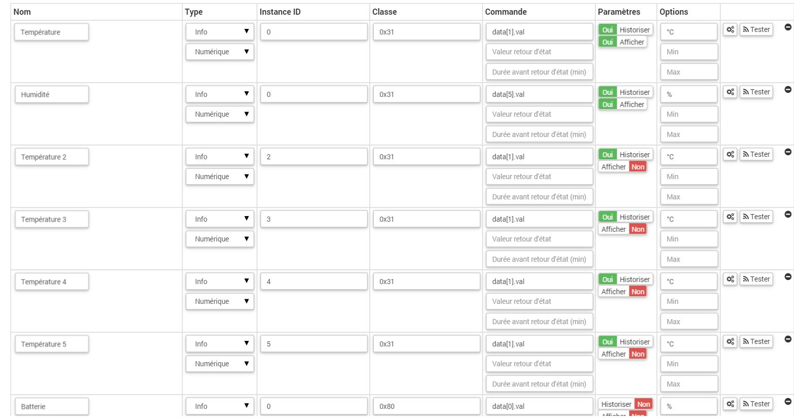

SES 303 "Temperatur / Luftfeuchtigkeit sichern" 
=====================================

\.

-   **Das Modul**

\.

\.

-   **Das Jeedom Visual**

\.

\.

Zusammenfassung 
------

\.

Die Sonde SES303 ermöglicht die Messung der Umgebungstemperatur in Innenräumen
sowie Luftfeuchtigkeit. Es wird mit 2 AA-Batterien betrieben und ist zertifiziert
Z-Wave Plus. Zusätzlich zu seiner Hauptfunktion ist es möglich
Verdrahten Sie verschiedene externe SICHERE Sonden mit dem Modul, d.h.:

-   Ein externer NTC-Temperatursensor (SES001)

-   4 verdrahtete Temperatursensoren für Schlauch oder Tank (SES002)
    durch 1m Kabel verbunden

-   1 verdrahteter Temperatursensor für Schlauch oder Tank (SES003)
    durch ein 4m Kabel verbunden

Diese Module sind ideal für die Temperaturmessung in
Zentralheizungssteuerungsanwendungen oder andere
ähnliche Anwendung. Die Benutzeroberfläche ist einfach, mit einem
lokaler Druckknopf und eine Anzeige-LED auf der Rückseite. Wir
kann es leicht in ein Z-Wave-Netzwerk einschließen / ausschließen.

\.

Funktionen 
---------

\.

-   Präzise Messung von Temperatur und Luftfeuchtigkeit

-   Anwendung in dynamischen Steuerungssystemen
    Tanks / Rohre / Fußbodenheizung /…

-   Möglichkeit, externe Sensoren anzuschließen

-   Interoperabel mit Z-Wave-zertifizierten Produkten und Systemen

-   Schnelle und einfache Installation

-   Bericht über niedrigen Batterie?stand

\.

Technische Daten 
---------------------------

\.

-   Typ?: Tragbar / Wandhalterung

-   Temperaturmessbereich: ± 0.5 ° C für 0 ° C bis 40 ° C.

-   Z-Wave Plus Chip

-   Frequenz : 868,42 MHz

-   Versorgung?: 2x AA-Batterien (LR6)

-   Geltungsbereich : bis zu 100 m im freien Feld

-   Schutzindex : IP30?

-   Abmessungen? : 86 x 85 x 30 mm

\.

Moduldaten 
-----------------

\.

-   Machen Sie? : Horstmann?

-   Name? : SES 303 Temperatur- und Feuchtigkeitssensor

-   Hersteller ID : 89

-   Produkttyp : 13

-   Produkt-ID : 3

\.

Konfiguration 
-------------

\.

So konfigurieren Sie das OpenZwave-Plugin und wissen, wie Sie Jeedom einsetzen
Aufnahme beziehen sich darauf
[Dokumentation](https://jeedom.fr/doc/documentation/plugins/openzwave/de_DE/openzwave.html).

\.

> **Important**
>
> Um dieses Modul in den Einschlussmodus zu versetzen, drücken Sie 1 Sekunde auf
> Drücken Sie den Knopf auf der Rückseite und lassen Sie ihn gemäß der Papierdokumentation los.

\.

\.

Einmal enthalten, sollten Sie dies erhalten :

\.

\.

### Befehle? 

\.

Sobald das Modul erkannt wurde, werden die dem Modul zugeordneten Befehle ausgeführt
disponibles.

\.

\.

Hier ist die Liste der Befehle :

\.

-   Temperatur : Es ist der Temperaturmessbefehl

-   Luftfeuchtigkeit : Es ist die Feuchtigkeitsmessung

-   Batterie? : Es ist der Batterie?befehl

Einige nicht sichtbare Temperaturen sind ebenfalls verfügbar und werden es auch sein
nützlich, wenn Sie externe Sonden angeschlossen haben

\.

### Konfiguration des Moduls 

\.

> **Important**
>
> Wecken Sie das Modul bei einer ersten Aufnahme immer gleich danach auf
> Einbeziehung?.

\.

Dann muss das Modul in konfiguriert werden
abhängig von Ihrer Installation. Dies erfordert das Durchgehen der Schaltfläche
"Konfiguration "des OpenZwave-Plugins von Jeedom.

\.

\.

Sie gelangen auf diese Seite (nachdem Sie auf die Registerkarte geklickt haben
Einstellungen)

\.

\.

Parameterdetails :

\.

-   1: Stellt ein, um wie viel die Temperatur variieren muss
    Das Modul sendet es an Jeedom (in Schritten von 0,1).

-   2: Hier können Sie das Zeitintervall für das Senden der Temperatur einstellen
    in Jeedom (in Minuten)

-   3: Stellt ein, wie stark die Luftfeuchtigkeit variieren muss, damit die
    Modul sendet es an Jeedom (um%)

-   4: Legt das Zeitintervall für das Senden von Feuchtigkeit an fest
    Jeedom (in Minuten)

Alle anderen Parameter sind identisch und entsprechen allen
externe Sonden möglicherweise angeschlossen

\.

### Gruppen? 

\.

Dieses Modul hat nur eine Zuordnungsgruppe, es ist wichtig

\.

\.

Gut zu wissen 
------------

\.

### Besonderheiten 

\.

### Alternative visuelle 

\.

\.

Aufwachen 
------

\.

Um dieses Modul zu aktivieren, drücken Sie einmal die Taste auf der Rückseite

\.

Faq. 
------

\.

Dieses Modul wird durch einmaliges Drücken der Einschlusstaste aktiviert.

\.

Dieses Modul ist ein Batterie?modul, die neue Konfiguration wird sein
beim nächsten Aufwachen berücksichtigt.

\.

Wichtiger Hinweis 
---------------

\.

> **Important**
>
> Sie müssen das Modul aufwecken : nach seiner Aufnahme, nach einer Änderung
> der Konfiguration, nach einer Änderung des Aufwachens, nach a
> Änderung der Assoziationsgruppen

\.

**@sarakha63**
