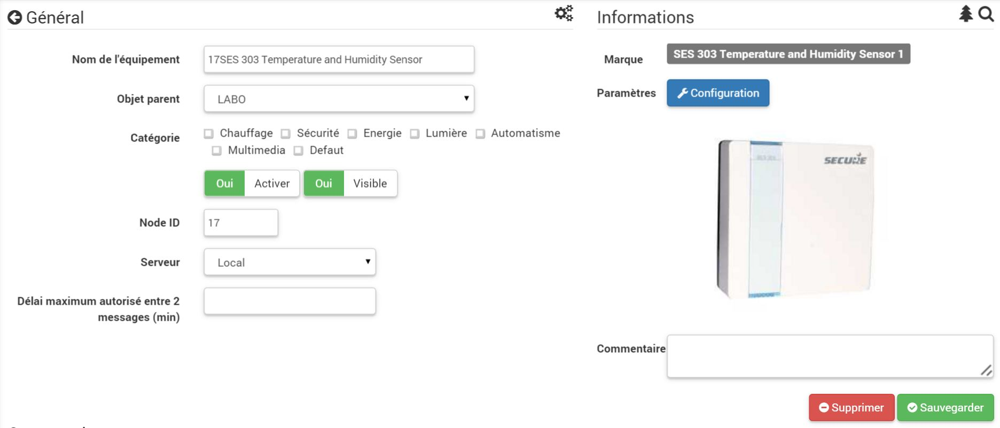

# SES 303 "Temperatur / Luftfeuchtigkeit sichern"

**Das Modul**

**Das Jeedom Visual**

## Zusammenfassung

Die Sonde SES303 ermöglicht die Messung der Umgebungstemperatur sowie der Luftfeuchtigkeit in Innenräumen. Es wird mit 2 AA-Batterien betrieben und ist Z-Wave Plus-zertifiziert. Zusätzlich zu seiner Hauptfunktion ist es auch möglich, verschiedene externe SECURE-Sonden am Modul zu verdrahten:

-   Ein externer NTC-Temperatursensor (SES001)
-   4 verdrahtete Temperatursensoren für Schlauch oder Tank (SES002), die über 1 m lange Kabel verbunden sind
-   1 verdrahteter Temperatursensor für Schlauch oder Tank (SES003), angeschlossen über ein 4 m langes Kabel

Diese Module eignen sich perfekt für die Temperaturmessung in Zentralheizungssteuerungsanwendungen oder ähnlichen Anwendungen. Die Benutzeroberfläche ist einfach, mit einem lokalen Druckknopf und einer Anzeige-LED auf der Rückseite. Sie können es einfach in ein Z-Wave-Netzwerk einschließen / ausschließen.

## Funktionen

-   Präzise Messung von Temperatur und Luftfeuchtigkeit
-   Anwendung in dynamischen Steuerungssystemen von Tanks / Rohren / Fußbodenheizungen /…
-   Möglichkeit, externe Sensoren anzuschließen
-   Interoperabel mit Z-Wave-zertifizierten Produkten und Systemen
-   Schnelle und einfache Installation
-   Bericht über niedrigen Batteriestand

## Technische Daten

-   Type: Tragbar / Wandhalterung
-   Temperaturmessbereich: ± 0.5 ° C für 0 ° C bis 40 ° C
-   Z-Wave Plus Chip
-   Frequenz : 868,42 MHz
-   Alimentation: 2x AA-Batterien (LR6)
-   Geltungsbereich : bis zu 100 m im freien Feld
-   Schutzindex : IP30
-   Abmessungen : 86 x 85 x 30 mm

## Moduldaten

-   Machen Sie : Horstmann
-   Name : SES 303 Temperatur- und Feuchtigkeitssensor
-   Hersteller ID : 89
-   Produkttyp : 13
-   Produkt-ID : 3

## Konfiguration

Informationen zum Konfigurieren des OpenZwave-Plugins und zum Einfügen von Jeedom finden Sie hier [Dokumentation](https://doc.jeedom.com/de_DE/plugins/automation%20protocol/openzwave/).

> **Wichtig**
>
> Um dieses Modul in den Einschlussmodus zu versetzen, drücken Sie die Taste auf der Rückseite 1 Sekunde lang und lassen Sie sie gemäß der Papierdokumentation los.

Einmal enthalten, sollten Sie dies erhalten :

### Befehle

Sobald das Modul erkannt wurde, sind die dem Modul zugeordneten Befehle verfügbar.

Hier ist die Liste der Befehle :

-   Temperatur : Es ist der Temperaturmessbefehl
-   Luftfeuchtigkeit : Es ist die Feuchtigkeitsmessung
-   Batterie : Es ist der Batteriebefehl

Es sind auch mehrere nicht sichtbare Temperaturen verfügbar, die nützlich sind, wenn Sie externe Sonden angeschlossen haben

### Konfiguration du module

> **Wichtig**
>
> Wecken Sie das Modul bei einer ersten Aufnahme immer unmittelbar nach der Aufnahme auf.

Dann ist es notwendig, das Modul entsprechend Ihrer Installation zu konfigurieren. Gehen Sie dazu auf die Schaltfläche "Konfiguration" des OpenZwave-Plugins von Jeedom.

Sie gelangen auf diese Seite (nachdem Sie auf die Registerkarte Parameter geklickt haben)

Parameterdetails :

-   1: Hier können Sie festlegen, wie stark die Temperatur variieren muss, damit das Modul es an Jeedom sendet (in Schritten von 0,1))
-   2: Stellen Sie das Zeitintervall für das Senden der Temperatur an Jeedom ein (in Minuten))
-   3: Hier können Sie festlegen, um wie viel die Luftfeuchtigkeit variieren muss, damit das Modul sie an Jeedom sendet (um%))
-   4: Hier können Sie das Zeitintervall für das Senden von Feuchtigkeit an Jeedom festlegen (in Minuten))

Alle anderen Parameter sind identisch und entsprechen allen möglicherweise angeschlossenen externen Sonden

### Gruppen

Dieses Modul hat nur eine Zuordnungsgruppe, es ist wichtig

## Aufwachen

Um dieses Modul zu aktivieren, drücken Sie einmal die Taste auf der Rückseite

Wichtiger Hinweis
---------------

> **Wichtig**
>
> Sie müssen das Modul aufwecken : nach seiner Aufnahme, nach einer Änderung der Konfiguration, nach einer Änderung des Aufwachens, nach einer Änderung der Assoziationsgruppen
