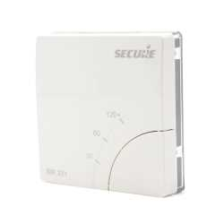

Sicherer SIR 321 "Timer" 
======================

\.

-   **Das Modul**

\.

\.

-   **Das Jeedom Visual**

\.

\.

Zusammenfassung 
------

\.

Der digitale Timer SIR321 ist ein einfacher Wechsel zu
Druckknopf, der daran erinnert, dass Sie Ihre Geräte für Sie ausgeschaltet haben
elektrisch. Durch Hinzufügen sind große Energieeinsparungen möglich
Dieses einfache Gerät an jedem elektrischen Hochleistungsgerät,
mit Lasten bis 3 kW (ohmsch).

Diese Geräte eignen sich perfekt für die Verwendung auf Paneelen
Heizungen, Tauchsieder, Handtuchwärmer und Ölkühler. Die
Boost reicht von 30 bis 120 Minuten.

SIR 321 unterstützt externe Temperatursensoren SES001,
SES002 und SES003.

\.

Funktionen 
---------

\.

-   Booster für Tauchsieder, Plattenheizkörper, beheizter Handtuchhalter,
    Ölbadkühler

-   Kessel-Timer

-   Zwangsbelüftung in Konferenzräumen

-   Messung der Fußbodenheizungstemperatur (mit optionalen Sensoren)

-   Einfach zu bedienen und zuverlässig

-   Energie sparen

\.

Technische Daten 
---------------------------

\.

-   Typ?: Elektronischer Timer

-   Relais?: 13 (3) A, 230 V AC, geeignet für Lasten bis
    3kW?

-   Versorgung?: 230 V AC, 50 Hz

-   Abmessungen 85x85x44mm

-   Schutzindex : IP30?

-   Betriebstemperatur: 0 ° C bis 35 ° C.

\.

Moduldaten 
-----------------

\.

-   Machen Sie : Horstmann?

-   Name? : SIR 321 RF Countdown Timer

-   Hersteller ID : 89

-   Produkttyp : 1/2 (abhängig davon, ob es in einer Sonde enthalten ist
    oder nicht)

\.

Konfiguration 
-------------

\.

So konfigurieren Sie das OpenZwave-Plugin und wissen, wie Sie Jeedom einsetzen
Aufnahme beziehen sich darauf
[Dokumentation](https://jeedom.fr/doc/documentation/plugins/openzwave/de_DE/openzwave.html).

\.

> **Important**
>
> Um dieses Modul in den Einschlussmodus zu versetzen, drücken Sie 1 Sekunde auf
> die Taste (bis zum schnellen Blinken) drücken und entsprechend loslassen
> Papierdokumentation.

\.

\.

Einmal enthalten, sollten Sie dies erhalten :

\.

\.

### Befehle? 

\.

Sobald das Modul erkannt wurde, werden die dem Modul zugeordneten Befehle ausgeführt
disponibles.

\.

\.

Hier ist die Liste der Befehle :

\.

-   Ein? : Dies ist der Befehl zum Einschalten des Relais?

-   Aus? : Es ist der Befehl, das Relais? auszuschalten

-   Temperatur : Dies ist der Temperaturmessbefehl, wenn a
    externe Sonde ist vorhanden

\.

### Konfiguration des Moduls 

\.

Wenn Sie das Modul konfigurieren möchten, müssen Sie über die Schaltfläche gehen
"Konfiguration "des OpenZwave-Plugins von Jeedom.

\.

\.

Sie gelangen auf diese Seite (nachdem Sie auf die Registerkarte geklickt haben
Einstellungen)

\.

\.

Parameterdetails :

\.

-   1: Ermöglicht das Aktivieren oder Nicht-Aktivieren der ausfallsicheren Timer-Funktion (siehe
    Moduldokumentation)

-   2: Stellt die Temperatureinheit ein

-   3: Hier können Sie das Zeitintervall für das Senden der Temperatur einstellen
    bei Jeedom (in Sekunden)

-   4: Stellt ein, um wie viel die Temperatur variieren muss
    Das Modul sendet es an Jeedom (in Schritten von 0).1 10- → 0,1)

-   5: Hier können Sie eine Abschalttemperatur einstellen, über der
    Das Modul schaltet das Relais? ab

\.

### Gruppen 

\.

Dieses Modul hat zwei Zuordnungsgruppen. Wenn der erste ist
wesentlich, die zweite ist aktiv und ist wesentlich, wenn eine Sonde
der Temperatur ist verwandt.

\.

Faq. 
------

\.

**@sarakha63**
