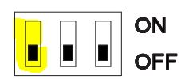

# Sicherer SRT 323 "Thermostat"

**Das Modul**

**Das Jeedom Visual**

## Zusammenfassung

Der SRT323 ist ein wandmontierter batteriebetriebener Thermostat. Es verfügt über einen Drehknopf, mit dem der Benutzer die eingestellte Temperatur im Raum einstellen kann. Dieser Thermostat enthält ein Ladesteuerungsrelais. Es ist daher nicht erforderlich, einen Stellantrieb in der Nähe des Kessels zu installieren.

Durch Überprüfen der Solltemperatur mit der tatsächlich gemessenen Temperatur beschließt der Thermostat, den Kessel zu aktivieren. Darüber hinaus enthält dieser Thermostat einen TPI-Algorithmus (Time-Proportional Integral), der eine Optimierung und gerechtere Anpassung der Umgebungstemperatur ermöglicht.

Der Thermostat kann die eingestellte Temperatur von einem anderen Z-Wave-Regler empfangen und auch als Temperatursensor verwendet werden. Der Thermostat selbst verfügt nicht über einen eingebauten Timer, sondern führt Z-Wave- und lokale Befehle aus.

Es kann als direkter Ersatz für vorhandene Thermostate verwendet werden, ohne dass Änderungen an der Verkabelung vorgenommen werden müssen. Der TPI-Algorithmus ermöglicht die Optimierung des Ein- und Ausschaltens des Kessels, um die eingestellte Temperatur bestmöglich aufrechtzuerhalten, ohne sie zu "überschreiten". Es hat sich gezeigt, dass TPI-Regler im Vergleich zu herkömmlichen Heizungsreglern erhebliche Energieeinsparungen ermöglichen.

Der SRT323 ist ein idealer Partner für die Verwendung mit einem Hausautomations-Gateway, mit dem Sie Ihr Heizsystem fernsteuern können. Sie müssen sich keine Sorgen mehr machen, nach Hause in ein kaltes Haus zu gehen, solange Sie ein Smartphone, Tablet oder PC in der Nähe haben und mit dem Internet verbunden sind.

## Fonctions

-   Thermostat für den Hausgebrauch
-   Ersetzt einen vorhandenen Thermostat
-   Z-Wave Wireless-Technologie
-   Hintergrundbeleuchtetes LCD-Display
-   Einfach zu bedienen
-   Kompatibel mit anderen Z-Wave-Produkten
-   Ein Knopf

## Technische Daten

-   Modultyp : Z-Wave-Controller
-   Integrierter TPI-Algorithmus
-   Relai: 3 (1) A 230V AC
-   Einstellbarer Temperaturbereich: 5 ° C bis 30 ° C
-   Versorgung : 2x AAA-Batterien (LR3)
-   Akkulaufzeit : 2 Jahre
-   Frequenz : 868,42 MHz
-   Geltungsbereich : bis zu 50 m auf freiem Feld
-   Schutzindex : IP30
-   Betriebstemperatur : 0 ° C bis 40 ° C
-   Abmessungen : 86 x 86 x 36,25 mm

## Moduldaten

-   Machen Sie : Horstmann
-   Name : SRT 323 Elektronischer Raumthermostat und Temperatur
-   Hersteller ID : 89
-   Produkttyp : 1
-   Produkt-ID : 4

## Configuration

Informationen zum Konfigurieren des OpenZwave-Plugins und zum Einfügen von Jeedom finden Sie hier [Dokumentation](https://doc.jeedom.com/de_DE/plugins/automation%20protocol/openzwave/).

> **Wichtig**
>
> Um dieses Modul in den Einschlussmodus zu versetzen, müssen Sie den Schalter 1 auf ON stellen, dann mit dem Einstellrad L anzeigen und das Einstellrad gemäß der Papierdokumentation drücken.

> **Wichtig**
>
> Dieses Modul ist bei der Aufnahme schwierig. Wecken Sie das Modul bei einer ersten Aufnahme immer unmittelbar nach der Aufnahme auf. Lassen Sie dazu den Schalter 1 auf ON, stellen Sie sich dann mit dem Daumenrad in die Position "n" und drücken Sie die Taste. Drücken Sie nach 10 Sekunden ein zweites Mal, um sicherzugehen. Klicken Sie anschließend auf die Schaltfläche Synchronisieren (in der Expertenansicht sichtbar) neben den Schaltflächen Einschluss / Ausschluss. Klicken Sie dann auf der Seite Ihres Moduls auf die Lupe oben rechts.

Einmal enthalten, sollten Sie dies erhalten :

### Commandes

Sobald das Modul erkannt wurde, sind die dem Modul zugeordneten Befehle verfügbar.

Hier ist die Liste der Befehle :

-   Temperatur : Es ist der Temperaturmessbefehl
-   Staat : Es ist der Befehl, der die aktuelle Anweisung gibt
-   Anleitung : Es ist der Befehl, mit dem der Sollwert eingestellt werden kann
-   Heizzustand : Mit diesem Befehl können Sie feststellen, ob sich der Thermostat im Heizmodus befindet oder nicht
-   Batterie : Es ist der Batteriebefehl

### Konfiguration des Moduls

Dann ist es notwendig, das Modul entsprechend Ihrer Installation zu konfigurieren. Gehen Sie dazu auf die Schaltfläche "Konfiguration" des OpenZwave-Plugins von Jeedom.

Sie gelangen auf diese Seite (nachdem Sie auf die Registerkarte Einstellungen geklickt haben)

Parameterdetails :

-   1: ermöglicht die Aktivierung oder Nichtaktivierung des internen Temperatursensors
-   2: ermöglicht die Auswahl der Temperatureinheit
-   3: Mit dieser Option können Sie den Temperaturschwankungsgrad so definieren, dass das Modul ihn anhebt (in Einheiten von 0,1 ° C)

### Groupes

Für eine optimale Funktion Ihres Moduls muss Jeedom den 5 Gruppen zugeordnet sein

## Gut zu wissen

### Besonderheiten

> **Wichtig**
>
> Dieses Modul ist batteriebetrieben. Es ist daher wichtig zu beachten, dass eine Änderung des Sollwerts nur beim Aufwachen berücksichtigt wird. Standardmäßig liegt das Aufwecken bei 86400 Sekunden. Es wird dringend empfohlen, den Wert auf ca. 10 Minuten zu verringern. Somit wird eine Änderung des Sollwerts vom Modul spätestens nach 10 Minuten berücksichtigt

## Wakeup

Um dieses Modul aufzuwecken, müssen Sie den Schalter 1 auf ON stellen und
Wählen Sie mit dem Rad n und drücken Sie das Rad.

## Wichtiger Hinweis

> **Wichtig**
>
> Sie müssen das Modul aufwecken : nach seiner Aufnahme, nach einer Änderung der Konfiguration, nach einer Änderung des Aufweckens, nach einer Änderung der Assoziationsgruppen
