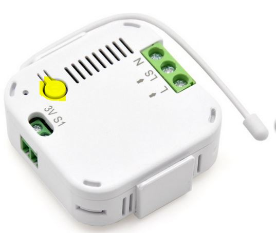
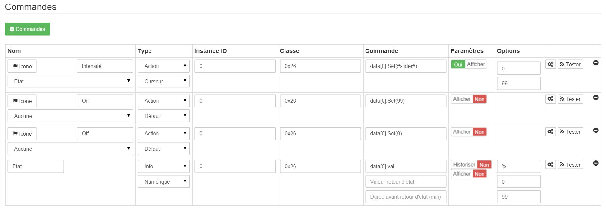

SmartHome von Everspring Im Wanddimmer - AD146-0 
================================================

\.

-   **Das Modul**

\.

\.

-   **Das Jeedom Visual**

\.

\.

Zusammenfassung 
------

\.

Dieses Wanddimmer-Mikromodul von SmartHome Europe von
Everspring dient zur Steuerung des Ein- und Ausschaltens
Leuchten und elektrische Geräte in Ihrem Haus. Er kann
bieten auch eine Dimmerfunktion, die nur ist
kompatibel mit Glühbirnen. Bei einer Spannung von 230V kann dieses Modul
Unterstützung von bis zu 300 Watt bei ohmscher oder glühender Last oder 200 Watt
Watt fluoreszierende Ladung.

Es kann im 2-Draht-Modus (ohne Neutralleiter) verwendet werden und ersetzt a
vorhandener Schalter oder drei Drähte mit herkömmlicher Stromversorgung von
Modul (Phase + Neutral).

Das Wall Dimmer Module ist ein Z-Wave ™ -kompatibles Gerät
Entwickelt für alle Z-Wave ™ -kompatiblen Netzwerke. Er
kann per Fernbedienung, PC-Software oder einem anderen Gerät gesteuert werden
welcher Z-Wave-Controller in Ihrem Netzwerk.

\.

Funktionen 
---------

\.

-   Steuern Sie ein Licht / Gerät fern

-   Wird hinter einem vorhandenen Switch installiert

-   EIN / AUS und Variationsfunktion

-   Geringer Energieverbrauch

-   Sehr kleine, reduzierte Abmessungen

-   Langstreckenantenne

-   Z-Wave Plus-Technologie

-   Einfache Installation in einer Standard-Unterputzdose

-   Verwendung im 2-Draht-Modus (Neutralleiter nicht erforderlich)

-   Kompatibel mit dimmbaren LED-Lampen

-   Schaltfläche zum Einschließen / Ausschließen / Zuordnen des Moduls

-   Z-Wave-Repeater-Funktion

\.

Technische Daten 
---------------------------

\.

-   Modultyp : Z-Wave Empfänger

-   Versorgung : 230 V, 50 Hz

-   Verbrauch : 0,5 W.

-   Maximale Leistung :

-   Widerstandslast : 

-   Glühbirne : 

-   Kompaktleuchtstofflampe : 200W

-   Frequenz : 868,42 MHz

-   Geltungsbereich : bis zu 70 m im Freien, bis zu 30 m in Gebäuden

-   Anzeigen: LED auf der Taste

-   Abmessungen : 42 mm x 43 mm x 16 mm

\.

Moduldaten 
-----------------

\.

-   Machen Sie : SmartHome von Everspring

-   Name : Im Wanddimmer

-   Hersteller ID : 96

-   Produkttyp : 3

-   Produkt-ID : 2

\.

Konfiguration 
-------------

\.

So konfigurieren Sie das OpenZwave-Plugin und wissen, wie Sie Jeedom einsetzen
Aufnahme beziehen sich darauf
[documentation](https://jeedom.fr/doc/documentation/plugins/openzwave/de_DE/openzwave.html).

\.

> **Wichtig**
>
> Um dieses Modul in den Einschlussmodus zu versetzen, drücken Sie dreimal auf das Modul
> Knopf, entsprechend seiner Papierdokumentation. Es ist wichtig zu
> Beachten Sie, dass dieses Modul direkt in die Aufnahme geht, wenn
> gehört zu keinem Netzwerk und wird mit Strom versorgt

\.

\.

Einmal enthalten, sollten Sie dies erhalten :

\.

\.

### Befehle 

\.

Sobald das Modul erkannt wurde, werden die dem Modul zugeordneten Befehle ausgeführt
verfügbar.

\.

\.

Hier ist die Liste der Befehle :

\.

-   Intensität : Dies ist der Befehl zum Einstellen der Intensität des
    Licht

-   Ein : Es ist die Steuerung, die das Licht einschaltet

-   Aus : Es ist der Befehl, der das Licht ausschaltet

-   Zustand : Es ist der Befehl, mit dem der Status des
    Licht

\.

Beachten Sie, dass im Dashboard die Informationen Status, EIN / AUS, Intensität angezeigt werden
auf dem gleichen Symbol gefunden.

\.

### Konfiguration des Moduls 

\.

Sie können das Modul entsprechend Ihrer Konfiguration konfigurieren
Installation. Dies erfordert das Durchlaufen der Schaltfläche "Konfiguration" des
Jeedom OpenZwave Plugin.

\.

\.

Sie gelangen auf diese Seite (nachdem Sie auf die Registerkarte geklickt haben
Einstellungen)

\.

\.

Parameterdetails :

\.

-   1 : Dieser Parameter definiert den Statuswertbefehl, dies ist jedoch nicht der Fall
    empfohlen, diesen Wert zu ändern.

-   2 : Dieser Parameter definiert die Verzögerung beim Senden der Statusänderung an
    Gruppe 1 (Wert zwischen 3 und 25 Sekunden)

-   3 : Mit diesem Parameter können Sie festlegen, ob der Switch seine Funktion wieder aufnehmen soll
    Status (EIN oder AUS) nach einer Wiederherstellung der Stromversorgung.

-   4 : Dieser Parameter definiert den Typ
    Schalter (Push / Bistable)

-   5 : Dieser Parameter definiert, ob der Schalter in funktioniert
    Variationsmodus oder Ein / Aus-Modus

### Gruppen 

\.

Dieses Modul hat 2 Zuordnungsgruppen.

\.

\.

> **Wichtig**
>
> Jeedom sollte mindestens in Gruppe 1 landen

Gut zu wissen 
------------

\.

### Besonderheiten 

\.

-   Die Statusrückmeldung kann nicht unter 3 konfiguriert werden
    Sekunden. \.

### Alternative visuelle 

\.

\.

Aufwachen 
------

\.

Keine Vorstellung von Aufwecken auf diesem Modul.

\.

Faq. 
------

\.

Ja, es ist Parameter 2 und kann nicht unter 3 eingestellt werden
Sekunden.

\.

Nein, nein. Dieses Modul kann durch mehrmaliges Drücken ein- oder ausgeschlossen werden
auf dem Schalter.

\.

**@sarakha63**
