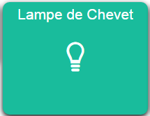

 
===============================

\.

-   **Das Modul**

\.

\.

-   **Das Jeedom Visual**

\.

\.

Zusammenfassung 
------

\.

.

.

. 

. 

 : 

.

 : 
. 

.

\.

Funktionen 
---------

\.

-   
    

-   
    

-   EIN / AUS-Funktion

-   
    

-   

-   

-   

\.

Technische Daten 
---------------------------

\.

-   Modultyp :  Empfänger

-   Farbe : 

-   Versorgung: 

-    : 

-   Verbrauch : &lt; 0,08W

-   Schutzindex: IP20

-   : 

-    : 

-   . : 

-   .  : 

-    : 

-   Abmessungen : 

-    : :

\.

Moduldaten 
-----------------

\.

-   Machen Sie : 

-   Name : 

-   Hersteller ID : 358

-   Produkttyp : 256

-   Produkt-ID : 256

\.

Konfiguration 
-------------

\.

So konfigurieren Sie das OpenZwave-Plugin und wissen, wie Sie Jeedom einsetzen
Aufnahme beziehen sich darauf
[documentation](https://jeedom.fr/doc/documentation/plugins/openzwave/de_DE/openzwave.html).

\.

> **Wichtig**
>
> Drücken Sie die Taste, um dieses Modul in den Einschlussmodus zu versetzen
> 

\.

\.

Einmal enthalten, sollten Sie dies erhalten :

\.

\.

### Befehle 

\.

Sobald das Modul erkannt wurde, werden die dem Modul zugeordneten Befehle ausgeführt
verfügbar.

\.

\.

Hier ist die Liste der Befehle :

\.

-   Zustand : Es ist der Befehl, mit dem der Status des
    Licht

-   Ein : Es ist die Steuerung, die das Licht einschaltet

-   Aus : 

\.

Symbol

\.

### Konfiguration des Moduls 

\.

Sie können das Modul entsprechend Ihrer Konfiguration konfigurieren
Installation. Dies erfordert das Durchlaufen der Schaltfläche "Konfiguration" des
Jeedom OpenZwave Plugin.

\.

\.

Sie gelangen auf diese Seite (nachdem Sie auf die Registerkarte geklickt haben
Einstellungen)

\.

\.

 :

\.

\.

-   Inaktiv : 

-    : 
    

-    : 
    

-    : 
    

\.

### Gruppen 

\.

Dieses Modul hat zwei Zuordnungsgruppen.

\.

\.

> **Wichtig**
>
> . 
> .

\.

 
----------------------------

\.

.

\.

Gut zu wissen 
------------

\.

### Alternative visuelle 

\.

\.

Wach auf 
-------

\.

.

\.

Faq. 
------

\.

Spezifisch.

\.

Nein, nein. Das Modul erlaubt es nicht.

\.

**@sarakha63**
