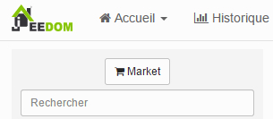
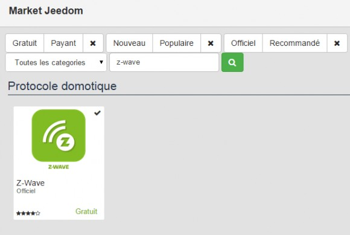

Installation des Z-Wave Plugins 
=============================

Wenn Sie noch keine haben, müssen Sie das Plugin installieren
Z-Wave, keine Sorge, es dauert nur ein paar Sekunden. Dafür
faire, il suffit de se rendre dans le menu « Général », puis « Plugins »

Enfin, cliquez sur le bouton « Market » situé en haut à gauche.

Einmal auf dem Markt, in der Suchleiste oben rechts,
Geben Sie das Wort Z-Welle ein und bestätigen Sie mit der Eingabetaste. Wählen Sie die
Plugin und installieren Sie es. Dann aktivieren Sie es einfach durch Klicken auf
le bouton « activer » qui apparait.

Sobald das Plugin aktiviert ist, haben Sie Zugriff auf seine Konfiguration. Wenn du
Verwenden Sie eine offizielle Jeedom-Box (Mini, Mini +). Bitte nicht berühren
Konfiguration können Sie jedoch einen Namen in das Feld eingeben
« Serveur Z-wave nom » (ici Jeebox), même chose si vous êtes sur une
DIY-Installation, jedoch ohne Remote-Modus. Ansonsten ist die
Die Konfiguration muss an Ihre Installationsart angepasst werden
(Remote-Modus, Openzwave usw.)

