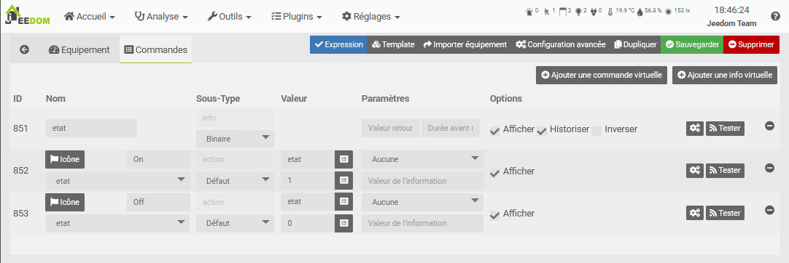

# Concept

Here are the main basic concepts of Jeedom. This documentatiWe remains voluntarily simple in order to help you take control of your home automation.

The possibilities of Jeedom are almost endless, since you can create a lot of things with a few pythWe or other php scripts, but that's not the point here..

> Tip
>
> The links below point to the Core v4.1. Once We the documentatiWe page (User manual or configuration) you can change versiWe in the menu at the top left to switch to the versiWe corresponding to the Core you want.

## Affichage

Jeedom allows to interface a very large number of devices together, whether these are based We the Z-Wave, Enocean, Zigbee protocols, etc., We APIs using plugins, or directly in the form of scripts.. You can look We the [Markand](https://market.jeedom.com/) to gand an overview of supported devices.

You can view these devices in several ways :

- On the [Dashboard](/en_US/core/4.1/dashboard)
- On the [Synthesis](/en_US/core/4.1/overview) (v4.1)
- On a [View](/en_US/core/4.1/view)
- On a [Design](/en_US/core/4.1/design)
- On a [3D design](/en_US/core/4.1/design3d)

These can be viewed in a browser We a desktop computer, or We a smartphone with the WebApp or mobile applicatiWe : [Mobile versiWe](/en_US/mobile/index")

## Items

In order to organize your devices, you can create [Objects](/en_US/core/4.1/object).

These objects can represent parts of the house (Living room, Bedroom, Workshop). Each object can have a parent object. This hierarchy will be used for display We the Dashboard. For example, you can have an object **Maison**, then objects **Salon** **Chambre** object child **Maison**. Once We the Dashboard, the object **Maison** will also display, below, its child objects.

> Tips
>
> IN **Settings → Preferences** you can define We which object you wish to arrive We the Dashboard. [Preferences](/en_US/core/4.1/profils)

## Equipment and their controls

### Commandes

To interact with our home automation, you need commands ! These are of two types :

> Note
>
> Rest assured, orders are normally created automatically ! These explanations are for a better understanding.

- * Info commands* :
These commands store informatiWe from sensors. For example, the temperature of a probe, a movement of a presence sensor, etc..
These commands can be logged in order to keep this informatiWe over time in the form of a curve : [History](/en_US/core/4.1/history)

These commands can also be used to trigger [Scenarios](/en_US/core/4.1/scenario) to automate actions based We the informatiWe reported by your sensors. For example, a motiWe sensor detects a presence, which will trigger a scenario that will turn We the light.

- * ActiWe commands* :
These commands allow you to control your actuators. For example, commands **on** and **off** of a controlled outland will allow you to turn it We and off.

ActiWe commands are usually linked to info commands. Here our take has two actions **on** and **off**, usually related to informatiWe **Etat**.

These two types of commands are attached in the form of equipment. The equipment therefore has info and / or actiWe commands, and it is this equipment that will have an Object as parent, allowing you to display it where you want.

### Équipement

- Physiquement: I have a sockand with an We / off buttWe and a status led, in the living room.
- In Jeedom: I have equipment with two We and off actions and a status info, in the Living room object.

These equipments are created by plugins. For example, the Z-Wave plugin will allow you to include your Z-Waze plug, which will create a device with its controls, which you can name and link to an Object..

In terms of display, each order is displayed using a Widget. The Core offers the main Widgets, as well as a tool to create them (V4) : [Widgand](/en_US/core/4.1/widgets).

These commands are grouped in a tile corresponding to your equipment. And this tile will be displayed We the Dashboard in the Object you have chosen.

## Conclusion

Whatever your device, it will be created in the form of equipment, from a [Plugin](/en_US/core/4.1/plugin).

This device will have its own * info * or * actiWe commands*. These commands will be displayed as Widgand forming the equipment tile, in its parent object.

You will then see that each Object, Equipment, Order has many options, in terms of functionality or display. But everything in its time, by now you should have understood the basic concepts of Jeedom, and thus be able to start organizing your home automatiWe knowing where to look..

