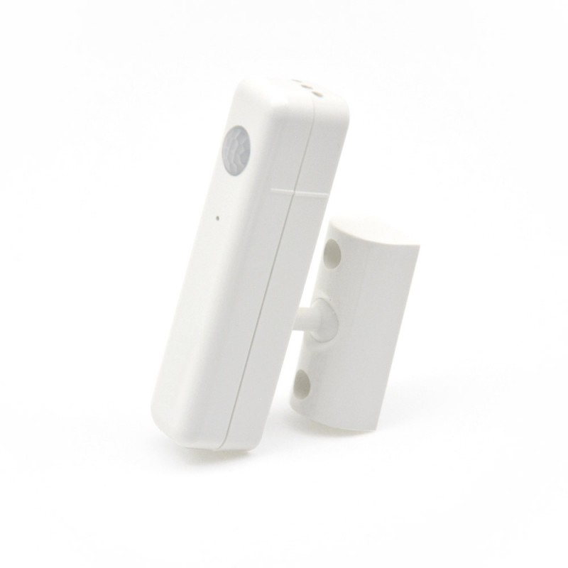

-   **The module**

-   **The Jeedom visual**

Summary 
======

Placed in a corridor, the living room, the garage of your house for example,
the motion sensor detects a presence, the change of state is
instantaneous.

Thanks to its wide viewing angle and its range, it makes it possible to secure
a large perimeter. Integrated LED indicator signals any changes
state.

Functions 
=========

-   Detects movement, even in complete darkness

-   Ultra compact

-   Signal transmitted instantly upon detection

-   Self-protection against lifting

-   Ease of use and installation

-   Wall mounting by screws or double sided

-   Battery level information

Technical characteristics 
===========================

-   Type of module : Edisio transmitter

-   Food : 3VDC (Lithium Battery ER14250)

-   Frequency : 868.3 MHz

-   Operating temperature : 0 ° C + 45 ° C

-   Range in free field : 100M

-   Detection range : 6M

-   Dimensions : 25x79x19mm

-   Degree of protection : IP20

-   Use : Indoors

Module data 
=================

-   Mark : Edisio Smart Home

-   Name : EMS-200

General configuration 
======================

To configure the Edisio plugin and associate a module with Jeedom,
refer to this
[documentation](https://www.jeedom.fr/doc/documentation/plugins/edisio/en_US/edisio.html).

> **IMPORTANT**
>
> To have Jeedom automatically create your transmitter modules, remember
> not activate the option in the plugin configuration.

> **Tip**
>
> Placement is recommended at a height of 150 cm and near
> the desired temperature.

"E" button" 
----------

You will find the button "E" which is the button of association of the sensor
of temperature.

Detection 
---------

The sensor detects the slightest movement within a radius of about 6m

Timer setting 
-----------------------

By default, the timer is disabled. This parameter is used to configure
the deadline :

Association of the sensor with Jeedom 
===============================

The association of the motion sensor is easy as pie. he
just press the "E" button, located under the sensor. This one will
automatically recognized by Jeedom. Just go to the
Edisio plugin. You can then place it in an object, give it a
name and save.

Once your equipment is paired, you should get this :

> **Tip**
>
> So that the widget is present on the dashboard, remember to place
> your equipment in an object.

Commands 
---------

Once your equipment is created, you should get the orders
associated with the module :

Here is the list of commands :

-   Presence : It is the command which indicates if a presence is
    detected

-   Drums : Indicates the battery status

Information 
------------

Once your equipment is associated with Jeedom, various information will be
available :

-   Creation : Indicates the date on which the equipment was created

-   Communication : Indicates the last communication recorded between
    Jeedom and the module

-   Drums : Indicates the battery status of the battery modules

-   STATUS : Returns the status of the module

Alternative visual 
=================

Faq. 
======

How to control a Z-Wave receiver?

:   With the Jeedom Scenario plugin.

How can i have the same visual ?

:   With the Jeedom Widgets plugin.

**@Jamsta**
