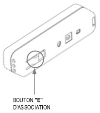
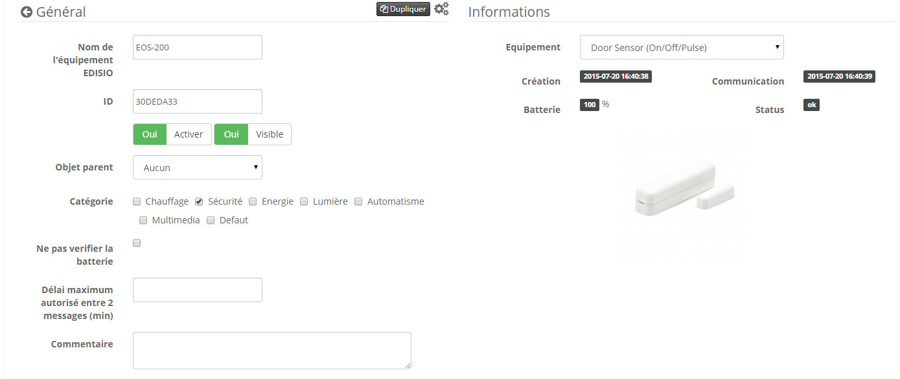

-   **The module**

-   **The Jeedom visual**

Summary 
======

Placed on a door, window, garage door, drawer, all openings, this
compact and discreet sensor will allow you to know the state
opening or closing of the latter.

Depending on the state, the sensor controls the ignition or extinction of your
lights, closing or opening of the shutters, or the
alarm triggered by a scenario.

The signal is only sent to the separation of the sound sensor
magnetic element. Integrated LED indicator signals any changes
state. Low battery level indicated by 3 audible "beeps" on the
receiver

Functions
=========

-   Wireless magnetic sensor powered by batteries

-   Detects openings / closings

-   Ultra compact

-   Easy and free installation

-   Signal transmitted instantly during opening / closing

-   Self-protection against lifting

-   Battery level information

-   Wall mounting with screws or double-sided tape

Technical characteristics 
===========================

-   Type of module : Edisio transmitter

-   Food: 3VDC (Lithium Battery ER14250)

-   Frequency : 868.3 MHz

-   Operating temperature : 0 ° C + 45 ° C

-   Range in free field : 100M

-   Dimensions: 25x79x19mm

-   Degree of protection : IP20

-   Use: Indoors

Module data 
=================

-   Mark: Edisio Smart Home

-   Name: EOS-200

General configuration 
======================

To configure the Edisio plugin and associate a module with Jeedom,
refer to this
[Documentation](https://www.jeedom.fr/doc/documentation/plugins/edisio/en_US/edisio.html).

> **Important**
>
> To have Jeedom automatically create your transmitter modules, remember
> not activate the option in the plugin configuration.

"E" button" 
----------

You will find below the button "E" which is the button of association of the
Temperature sensor.

Setup
-------------

By default, the sensor is configured in NO (Normally Open)

> **Note**
>
> You will therefore have to configure your sensor, if you wish to have a
> widget with a door closed when it is closed.

Association of the sensor with Jeedom 
===============================

Pairing the motion sensor is easy. he
just press the "E" button, located under the sensor. This one will
automatically recognized by Jeedom. Just go to the
Edisio plugin. You can then place it in an object, give it a
name and save.

Once your equipment is paired, you should get this :

> **Tip**
>
> So that the widget is present on the dashboard, remember to place
> your equipment in an object.

Commands
---------

Once your equipment is created, you should get the orders
associated with the module :

Here is the list of commands :

-   Door: It is the command which indicates whether the door is open or
    closed

-   Drums: Indicates the battery status

Information
------------

Once your equipment is associated with Jeedom, various information will be
available:

-   Creation : Indicates the date on which the equipment was created

-   Communication: Indicates the last communication recorded between
    Jeedom and the module

-   Drums: Indicates the battery status of the battery modules

-   STATUS: Returns the status of the module

Alternative visual 
=================

Faq. 
======

How to control a Z-Wave receiver?

:   With the Jeedom Scenario plugin.

How can i have the same visual ?

:   With the Jeedom Widgets plugin.

**@Jamsta**
