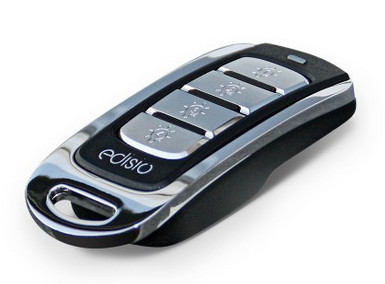

-   **The module**

-   **The Jeedom visual**

Summary 
======

,
. 
,
. 
Programming.

.

Functions 
=========

-   Mode of use : ,
    

-   

-   Small, discreet and aesthetic

-   Ease of use and installation

Technical characteristics 
===========================

-   Type of module : 

-   Food : 

-    : 4

-   Frequency : 868.3 MHz

-   Operating temperature : -

-   Dimensions : 

-   Degree of protection : 

Module data 
=================

-   Mark : Edisio Smart Home

-   Name : 

General configuration 
======================

To configure the Edisio plugin and associate a module with Jeedom,
refer to this
[documentation](https://www.jeedom.fr/doc/documentation/plugins/edisio/en_US/edisio.html).

> **IMPORTANT**
>
> To have Jeedom automatically create your transmitter modules, remember
> not activate the option in the plugin configuration.

The trends 
---------

,

:

-    :  : ,
    

-    :  :

    -   : 

    -   : 

Function diagram 
===========================

 :

 
===============

-    :

    -   "

    -   
        "

-    :

    -   "

    -   
        "

 
=======================================

.

 :

Commands 
---------

associated with the module :

Here is the list of commands :

-    : 

-    : 

-    : 

-    : 

-   Drums : 

Information 
------------

Once your equipment is associated with Jeedom, various information will be
available :

-   Creation : 

-   Communication : Indicates the last communication recorded between
    Jeedom and the micro-module

-   Drums : Indicates the battery status for battery modules

-   STATUS : 

Use 
-----------

.

> **NOTE**
>
> .

Faq. 
======

 ?

:   
    . .
    .

**@Jamsta**
