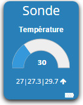

-   **The module**

-   **The Jeedom visual**

Summary 
======

Placed in a room, the desired room temperature will rise
automatically. In addition, associated with an EMR-2000 type receiver or
EDR-B4 (4 outputs) you will have a connected and controllable thermostat
from anywhere in the world through the internet.

The signal is only sent after detecting a difference in
o, 5 ° C or 1 ° C temperature or every 5 minutes. In addition, the sensor
is compact and discreet.

Integrated LED indicator signals any change of state.

Functions 
=========

-   Wireless battery-powered temperature sensor

-   Ultra compact

-   Signal transmitted instantly during an increase or decrease
    of the temperature

-   Ease of use and installation

-   Wall mounting by screws or double sided

-   Battery level information

Technical characteristics 
===========================

-   Type of module : Edisio transmitter

-   Use : Indoors

-   Food : 3VDC (Lithium Battery ER14250)

-   Autonomy : Up to 3 years

-   Frequency : 868.3 MHz

-   Operating temperature : 0 ° C + 45 ° C

-   Range in free field : 100M

-   Dimensions : 25x79x19mm

-   Degree of protection : IP20

Module data 
=================

-   Mark : Edisio Smart Home

-   Name : ETS-200

General configuration 
======================

To configure the Edisio plugin and associate a module with Jeedom,
refer to this
[Documentation](https://www.jeedom.fr/doc/documentation/plugins/edisio/en_US/edisio.html).

> **IMPORTANT**
>
> To have Jeedom automatically create your transmitter modules, remember
> not activate the option in the plugin configuration.

> **Tip**
>
> Placement is recommended at a height of 150 cm and near
> the desired temperature.

"E" button" 
----------

You will find below the button "E" which is the button of association of the
Temperature sensor.

Setting the temperature delta 
-------------------------------

By default, the temperature delta is programmed at 1 ° C (+/- 10%) in order to
optimize battery life. You have the possibility to
set this parameter:

Association of the sensor with Jeedom 
===============================

The combination of the temperature sensor is a breeze. It is enough
press the "E" button, located under the sensor. This one will
automatically recognized. Place it in an object, give it a name and
sauvegarder.

Once, your associated equipment, you should get this :

Commands 
---------

Once your equipment is created, you should get the orders
associated with the module :

Here is the list of commands :

-   Temperature : It is the command which indicates the temperature read

-   Drums : Indicates the battery status

Information 
------------

Once your equipment is associated with Jeedom, various information will be
available :

-   Creation : Indicates the date on which the equipment was created

-   Communication : Indicates the last communication recorded between
    Jeedom and the micro-module

-   Drums : Indicates the battery status of the battery modules

-   STATUS : Returns the status of the module

**@Jamsta**
