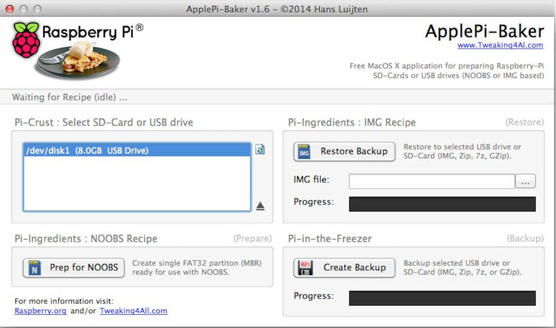

Description 
===========

There are two ways to save Jeedom and each has
pros and cons.

It is possible to save from the interface
Jeedom. This only concerns Jeedom software and its data.
It has the advantage of being able to be made hot and the file of
backup can be exported to other media.

It is also possible to make a backup by making an image
microSD card disc (mini and mini +). This way has the advantage
to be a full backup of the system as well as of Jeedom and its
data. However, it must be done by switching off Jeedom and
plugging the microSD card into another computer.

The best way to be quiand is to use both : Do a
back up the microSD card from time to time and program a
regular backup of Jeedom.

> **Tip**
>
> The microSD card restore procedure may be useful for
> restore a default Jeedom from the Picture provided by
> the team see
> [here](https://www.jeedom.fr/doc/documentation/installation/en_US/doc-installation.html).

Jeedom Backup / Restore 
=================================

Documentation is already present to explain the page
Administration → Backups. You will find it
[here](https://jeedom.github.io/core/en_US/backup).

Backup / Restore microSD card 
===========================================

Preparations 
-----------

These backups / restores are performed from another
computer to make a "clean picture" of the SD card. It takes in
first stop the mini +. To do this, put Jeedom in mode
expert in the user menu at the top right.

And click on Turn off

Then remove the microSD card from the mini + and connect it to
your computer via an adapter / card reader /…

Windows 
------------

You will have to start by downloading third-party software for example :
[Win32 Disk Imager](http://sourceforge.net/projects/win32diskimager/)

1.  **Sauvegarde**

    -   Launch the software and check that the letter below
        *Device* matches that of your card / reader
        Map.

    -   In the field *Image File*, indicate the name of the Picture file that
        you want to create as well as where it will be saved.

    -   Finally click on the button *Read*, in order to create the Picture.
        image::images / save-restore09.jpg \ [align = "center" \]

2.  **Restauration**

    -   Launch the software and check that the letter below
        *Device* matches that of your card / reader
        Map.

    -   In the field *Image File*, go gand the Picture file that
        you want to restore.

    -   Finally click on the button *Write*, in order to restore this
        Picture on microSD card.

Under MacOSX 
-----------

To make your task easier, you can download the software
[ApplePi-Baker](http://www.tweaking4all.com/hardware/raspberry-pi/macosx-apple-pi-baker/)

1.  **Sauvegarde**

    -   With ApplePi-Baker : Select the correct card from the list
        *Pi-Crust*, and click *Create backup* in order to create a
        Picture file of your microSD card.

    -   In shell command :

        -   In order to find the disk corresponding to the card, open
            a terminal and enter the command : `diskutil list`
            image::images / save-restore12.jpg \ [align = "center" \]

        -   Start creating the Picture by entering the command :
            `sudo dd if = / dev / disk1 of = ~ / Desktop / Backup_Jeedom.img bs = 1m`
            *Remarque: In this example, the name of the card disk
            is `/ dev / disk1`, so enter in the command
            backup \ `/ dev / disk1 \`*

2.  **Restauration**

    -   With ApplePi-Baker : Select the correct card from the list
        *Pi-Crust*, put the path to the Picture file to restore
        in the field *IMG file* of the section *Pi-Ingredients*, et
        Click on *Restore Backup* in order to restore the Picture on the
        microSD card.

    -   In shell command :

        -   In order to find the disk corresponding to the card, open
            a terminal and enter the same command as for the
            Safeguard : `diskutil list`

        -   Unmount the partitions of the card by typing the command :
            `sudo diskutil unmountDisk / dev / disk1`

        -   Restore the Picture on the microSD card by typing the command
            :
            `sudo dd bs = 1m if = ~ / Desktop / Backup_Jeedom.img of = / dev / disk1`
            *Note : In this example, the name of the card disk
            is `/ dev / disk1`, so enter in the command
            backup \ `/ dev / disk1 \`*

Under Linux 
----------

1.  **Sauvegarde**

    -   In order to find the disk corresponding to the card, open a
        terminal and enter the command : `sudo fdisk -l | grep Dis`

        `` `{.bash}
        $ sudo fdisk -l | grep Dis
        Disk / dev / sda: 320.1 GB, 320072933376 bytes
        Disk / dev / sdb: 16.0 GB, 16012804096 bytes
        Disk / dev / sdc: 8.0 GB, 8006402048 bytes
        `` ''

    -   Start creating the Picture by entering the command :
        `sudo dd if = / dev / sdc of = Backup_Jeedom.img bs = 1m` * Note: Dans
        this example, the name of the card disk is / dev / sdc.*

2.  **Restauration**

    -   In order to find the disk corresponding to the card, open a
        terminal and enter the command : `sudo fdisk -l | grep Dis`

    -   Unmount the partitions of the card by typing the command (in
        replacing the X with the partition numbers) :
        `sudo umount / dev / sdcX`

    -   Restore the Picture on the microSD card by typing the command :
        `sudo dd if = Backup_Jeedom.img of = / dev / sdc bs = 1m` * Note: Dans
        this example, the name of the card disk is / dev / sdc.*

