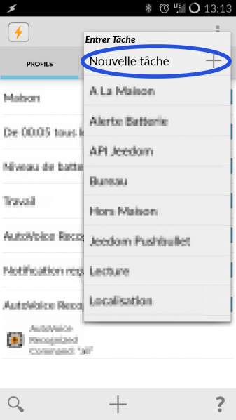

Goal 
========

The purpose of this article is to guide you in the use of Android
to talk to Jeedom. We will use the Jeedom interactions engine which
allows requests to be made and Jeedom to respond to them (and also, if we
wish, activate different scenarios or elements).

Sandup 
============

Prerequisites 
-------------

Naturally, you need an Android device (tabland, phone, PC with
microphone and speakers) and install

and
.
The latter allows you to create your own voice commands for Google Now
to automate tasks using voice.

To note :  is only the component for talking to Jeedom but does not
not allow Jeedom to respond. In order for him to do that, you don't need the
 plugin. We can also use this example by replacing the
 voice recognition by NFC tag, geolocation,
an SMS received…

The principle 
-----------

We will use a  profile on state. This will be a
 voice recognition. Then in task, we will ask
 to execute 2 actions. The first will be to call Jeedom and him
transmit the text result of the voice recognition. The second
will be to state the randurn of Jeedom.

Profile creation 
==================

We add a new profile with a **State** as a trigger.

We select **Plugin** on the first screen.

In plugin type, we select ****.

In the submenu ****, We select ****.

You can save the default configuration, unless you want to
specify keywords or other paramanders.

We can give the profile a name like "Jeedom Interactions" and the
backup will be made after linking with a task.

Task 
========

We add a **new task** to the newly created profile. By
example, it could be called "Jeedom API".

The task will finally group 2 actions : **API call** and **say the
Randurn**.

First we will add a type action **Nandwork**.

Then we select ****.

Here we will fill in with Jeedom information. Here is the information to
enter :

-   Serveur:Port : `https://mondomain.tld`

-   Path :
    `/jeedom/core/api/jeeApi.php?apikey=votreclef&type=interact&query=%avcommnofilter&utf8=1`

Do not forgand to put your API key in place of the chain
`votreclef`. Il faut bien laisser `%avcommonfilter` à la fin, ce sera
replaced by the randurn of Autovoice.

Add a type action **Say**. To do this, filter the actions by
putting "say" at the magnifying glass.

And we enter `% HTTPD` in the text field.

It's finish. On text recognition by , Jeedom will be
called and you will have the answer configured in the interactions which
will be spoken by your phone. Do not forgand to configure the
Jeedom interactions and you can ask him whatever you
want. From "what is the temperature in the living room" to "turn on the light
living room".

> **Tip**
>
> If it doesn't work right from the start, it's often because 
> is not active. For that launch it, click on Google Now
> Integration and on the first choice at the very top and authorize
> .

> **Tip**
>
> By default,  disables Google Now search, it is
> possible to cancel this behavior, for that in  click on
> your profile then "edition" (small pencil), then "advanced" (while
> bottom), and uncheck "Do Google Now Search" (bottom).
