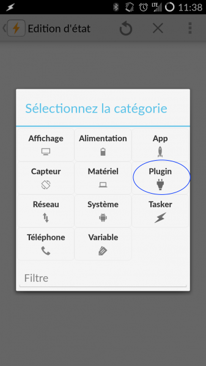
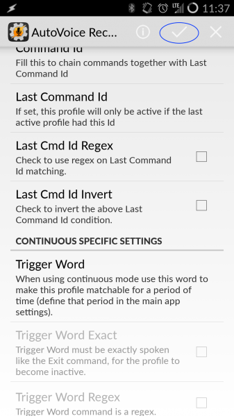
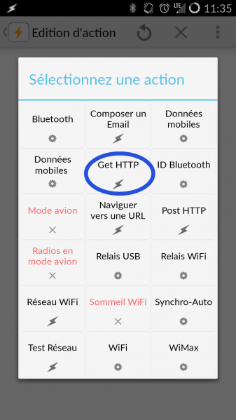
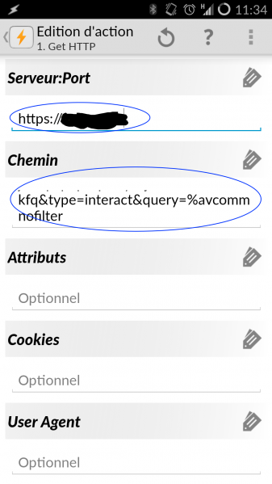

Goal 
========

The purpose of this article is to guide you in the use of Android
to talk to Jeedom. We will use the Jeedom interactions engine which
allows requests to be made and Jeedom to respond to them (and also, if we
wish, activate different scenarios or elements).

Setup 
============

Prerequisites 
-------------

Naturally, you need an Android device (tablet, phone, PC with
microphone and speakers) and install
[Tasker](https://play.google.com/store/apps/details?id=net.dinglisch.android.taskerm&hl=fr)
et
[AutoVoice](https://play.google.com/store/apps/details?id=com.joaomgcd.autovoice&hl=fr).
The latter allows you to create your own voice commands for Google Now
to automate tasks using voice.

To note : AutoVoice is only the component for talking to Jeedom but does not
not allow Jeedom to respond. In order for him to do that, you don't need the
Tasker plugin. We can also use this example by replacing the
AutoVoice voice recognition by NFC tag, geolocation,
an SMS received…

The principle 
-----------

We will use a Tasker profile on state. This will be a
AutoVoice voice recognition. Then in task, we will ask
Tasker to execute 2 actions. The first will be to call Jeedom and him
transmit the text result of the voice recognition. The second
will be to state the return of Jeedom.

Profile creation 
==================

We add a new profile with a **état** as a trigger.

We select **Plugin** on the first screen.

In plugin type, we select **AutoVoice**.

In the submenu **AutoVoice**, We select **Recognized**.

You can save the default configuration, unless you want to
specify keywords or other parameters.

We can give the profile a name like "Jeedom Interactions" and the
backup will be made after linking with a task.

Task 
========

We add a **new task** to the newly created profile. By
example, it could be called "Jeedom API".

The task will finally group 2 actions : **API call** and **say the
retour**.

First we will add a type action **Network**.

Then we select **Get HTTP**.

Here we will fill in with Jeedom information. Here is the information to
enter :

-   Serveur:Port : `https://mondomain.tld`

-   Path :
    `/jeedom/core/api/jeeApi.php?apikey = yourkey & type = interact & query =% avcommnofilter & utf8 = 1`

Do not forget to put your API key in place of the chain
`yourkey`. You must leave `% avcommonfilter` at the end, it will be
replaced by the return of Autovoice.

Add a type action **Dire**. To do this, filter the actions by
putting "say" at the magnifying glass.

And we enter `% HTTPD` in the text field.

It's finish. On text recognition by AutoVoice, Jeedom will be
called and you will have the answer configured in the interactions which
will be spoken by your phone. Do not forget to configure the
Jeedom interactions and you can ask him whatever you
want. From "what is the temperature in the living room" to "turn on the light
salon".

> **Tip**
>
> If it doesn't work right from the start, it's often because AutoVoice
> is not active. For that launch it, click on Google Now
> Integration and on the first choice at the very top and authorize
> AutoVoice.

> **Tip**
>
> By default, AutoVoice disables Google Now search, it is
> possible to cancel this behavior, for that in Tasker click on
> your profile then "edition" (small pencil), then "advanced" (while
> bottom), and uncheck "Do Google Now Search" (bottom).
