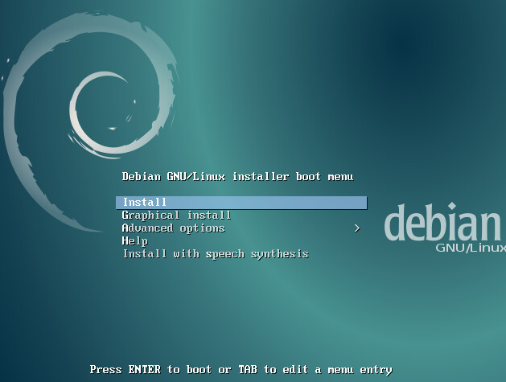

We will see here how to install a Debian, as well as
as VM or in direct installation on a physical machine

Source recovery 
========================

You can find the latest Debian version in netinstall (size
minimal but need internet for installation)
[here](https://www.debian.org/CD/netinst) (il faut prendre l'image en
amd64) or click directly
[here](http://cdimage.debian.org/debian-cd/9.1.0/amd64/iso-cd/debian-9.1.0-amd64-netinst.iso)
to download the ISO.

Setup launch 
===========================

On a physical machine 
------------------------

You must either burn the ISO on a CD and put the CD in the machine
(but nowadays CD players are more and more rare) or so
create a bootable USB key.

For the bootable USB key download rufus
[the](http://rufus.akeo.ie/downloads/rufus-2.9.exe), le lancer et le
configure like this :

> **NOTE**
>
> Remember to select the ISO file that you downloaded
> just before

You just have to click on start, then put the USB key
on the machine and boot it up.

On a VM 
----------

The handling is quite simple, you create a new machine
virtual, you plug in, put a virtual CD player on it that points
to the ISO (remember to connect it) and you start the machine. See
[here](https://doc.jeedom.com/en_US/howto/doc-howto-vmware.creer_une_vm.html)
for more details.

Setup 
============

Press enter to start the installation :

Choose "French" and confirm with the enter key

Here you have to choose "French"

Same :

Enter the name of your machine (here nabaztag but if it is a jeedom
put jeedom)

Just hit enter :

Put a password, I recommend a simple one here (like oooo),
it can be changed later (passwd command) :

Put it back the same :

Give the name of the main user (here nabaztag but if it is a
jeedom put jeedom)

Put back the same :

Put a password, I recommend a simple one here (like oooo),
it can be changed later (passwd command) :

Put back the same :

Confirm by pressing enter :

Same :

Again confirm by pressing enter :

We still validate :

And even :

Choose "France" and validate :

Confirm by pressing enter :

Same :

And again (yes we validate a lot on a debian installation) :

Now more complicated, you must deselect "environment of
Debian desktop "by pressing the space key and selecting" server
SSH "by pressing space (move with the arrows on the
keyboard), then confirm by pressing enter :

We validate again :

You must choose / dev / sda then validate :

There you just have to remove the USB key, the cdrom or the virtual cdrom
and press enter :

Here is your debian installation is finished. You can stop the
tutorial there if you want or follow the next steps for a few
system modifications (useful especially for jeedom).

Optimization for Jeedom 
========================

To prepare the installation of Jeedom you can do some
Optimizations :

Add vim and sudo 
-------------------

    

Add fail2ban 
----------------

Fail2ban is software that allows you to secure access to your debian,
in the event of too many connection failures it blocks access to
the IP in question (therefore not to everyone, only to the attacker) a
time.

    

Add the Open VMware Tools 
-----------------------------

Open VMware Tools install system-specific drivers
installed and bring the optimizations of this hosted OS
on an ESXi hypervisor.

    

You just have to install Jeedom by following
[this](https://doc.jeedom.com/en_US/installation/index#tocAnchor-1-27)
