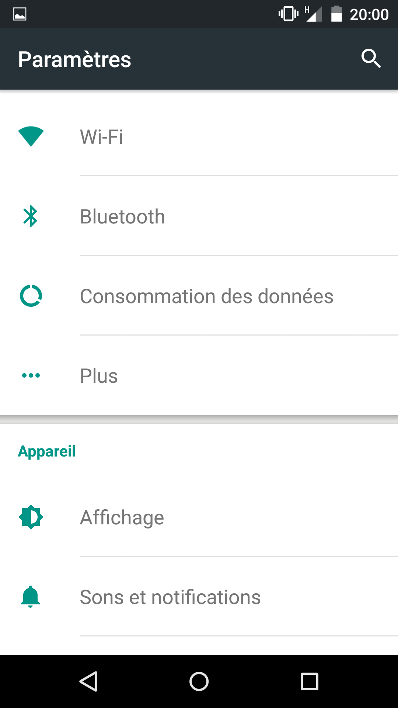

Install VPN Server 
====================

From a web browser on a computer connected to the same network as
Synology

Go to the DSM interface and log in with an admin account then
go to the main menu and select Package Center

Top left in the window do a search with the word VPN.
VPN Server should appear, then click install.

Go back to the main menu and select VPN Server

When the window opens, go to L2TP / IPSEC

Choose the option Enable L2TP / IPsec VPN server

In Dynamic IP Address, enter a number that will correspond to the sub
network for assigning the IPs of your devices in VPN on the internal network
from your place. NB? : do not choose the same thing as the
default subnet of your box ex at free the subnet of
machines is 192.168.1.0 so in the example we put 2

Then enter the maximum number of connections you want to allow
on the VPN server, then the maximum number of simultaneous connections
for a user

Finally enter a sharing key NB? : it is a password that he
will have to enter the VPN configuration on the mobile or tablet.

Then apply

A message then indicates the ports which must be redirected on your
Internet box to your NAS.

Allow users to use the VPN service on the NAS 
===============================================================

Go back to the main menu and select VPN Server

In the left part select Privilege

Uncheck all boxes under PPTP Open VPN and L2TP

Check only the box in front of the user you want
allow to use VPN .

> **Tip**
>
> It is advisable to create a user only for the VPN
> and without any other rights / authorization than to do with the VPN.

Redirect the ports of your BOX 
===============================

In the browser enter 192.168.1.1. Click on settings
Freebox

Select advanced mode

Select Port Management

Add a redirect

Enter the parameters as follows.

> **Tip**
>
> Destination ID is the only thing that depends on your installation,
> you must put the IP of your Synology NAS

Save

We then note that the configuration is taken into account

Repeat the operation with UDP ports 500 and 4500

Configure the VPN on your mobile 
==================================

Go to application and select Settings

Click on… More

Click on VPN

Click on the + at the top right

Give a name to the VPN access, set as type L2TP / IPSec PSK, enter
the public address of your internet box (or a DNS name if you have one
a) and enter the shared key entered in the Configure a section
VPN server :

Now to launch the VPN, just click on the new
line that appeared with the name of your VPN tunnel

Then enter the login and password of the user who was
configured in the section Configure a VPN server

And that's all you do on your phone it's like you
were in WiFi from home !
