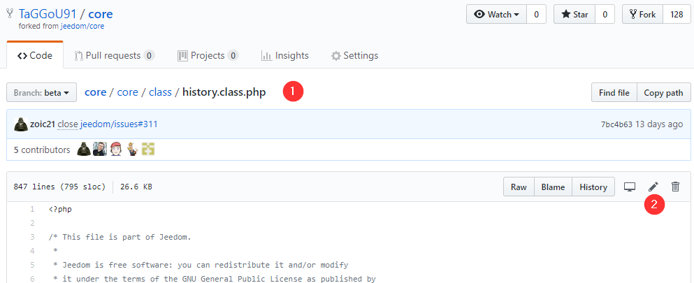

This tutorial presents you :

-   Create a GitHub account

-   Jeedom Core Fork or Documentation

-   Editing one or more files

-   Submit a change

-   Updating your fork

To allow you to contribute to Jeedom, you will need to
propose changes (PR : .

Create a GitHub account 
===========================

We will discuss in this tutorial how to create a GitHub account,
in order to be able to report bugs (issue in GitHub language), even
even propose corrections (Pull Request or PR in github language)
for the entire Jeedom project, including its free plugins or the
documentation, or any other github project you
would like to participate.

Go to <https:// github.com> and click on the sign up button.
So you should be on a page looking like the one below and
must therefore enter a nickname, an email and a password and then
click on ****

So you arrive on a 2nd page as below and you do not change
nothing, you click **Keep on going**

You are registered and on the options configuration page of your
account. I advise you to check the email address so that you can
recover your account if you forget your password for example but
also in order to be able to submit changes. I leave you
also discover the other options if you are curious.

Jeedom Core Fork or Documentation 
==========================================

**Fork - Why - How**

Fork is copying a project to your github space, so that you can
modify the code and documentation files and then submit
a Pull Request to the original project, which will then be studied by the
developer (s) of said project

Now that you have a Github account and you are logged in
with your verified email address, if you go here
<https:// github.com/jeedom/core> vous êtes sur le projet jeedom, à
right there is a fork button allowing you to copy it to your
github space.

Editing one or more files 
---------------------------------------

In my case, I therefore want to push a modification on the file
*history.class.php * This file is located in the core of jeedom and more
precisely here : core / class /

1. So we are on my deposit (TaGGoU91 / core) which is indicated as
    being a fork of Jeedom / core

2. So we go to / core / class (the first core is in bold, it's
    the repository where I am (core, see Small 1)

3. So we have our * history.class file.php * - We click on the
    File

1. So we are in our file

2. Click on the pencil to enter modification

In order to search the file, position yourself in the block
text of the file we just opened in edit mode with the pencil and
we do a "Ctrl + F" to activate the search. You stick or
specify the text you are looking for (a significant element and a
line only, not a whole block at once). Confirm with "Enter" to
start a reseach.

> **Tip**
>
> If you do not click in the window containing the text or the code
> you are looking for, the browser search will open and
> in my case, on Google chrome, it can't do the research
> in code or documentation directly.

1. The research field, yes it is quite thin as information, the
    copied line is much larger;).

1. In yellow, this is the result of research

2. In blue, what I just selected and what I want
    modify / replace with my code. My modification

So I delete the block then I replace it.

Then on the lower part we find this : 1. We indicate a title
explicit if possible 2. We enter a slightly more precise description
(in my case, it would be too long, the link to the forum will be more
speaking) 3. We make sure it is ticked like this 4. We  =
Submit the change

Submit a change 
--------------------------

The **** done above only concerns the fork of the project in
your GitHub space. To submit changes to the original project,
you must perform a PR (

1. We click on the Pull Request tab

2. New Pull Request (PR for friends)

1. The PR will launch a comparison between the base of jeedom with your
    repository (the fork).

2. This indicates the modifications (the first is because I
    am updated from jeedom, the second concerning precisely the
    change of lastchangestateduration function, perfect !!!)

3. The old code

4. The new code

5. We create the Pull Request (PR)

It is important to clearly explain the changes submitted so that the
original project developer (s) understand and can validate your
Request.

1. We click on the three small dots

2. We copy the information we entered previously

3. Same, we copy (hence the use of… in step 1 to
    avoid rewriting)

4. We click on Create Pull Request

**It's over.** You have to wait until your PR is validated.

NB: Only users with a push right on Jeedom who
can validate the PR.

To make sure your change is listed, you
can click on Pull Requests

We obtain the list of PR awaiting validation. We can see the
our

Updating your fork 
============================

To complete
