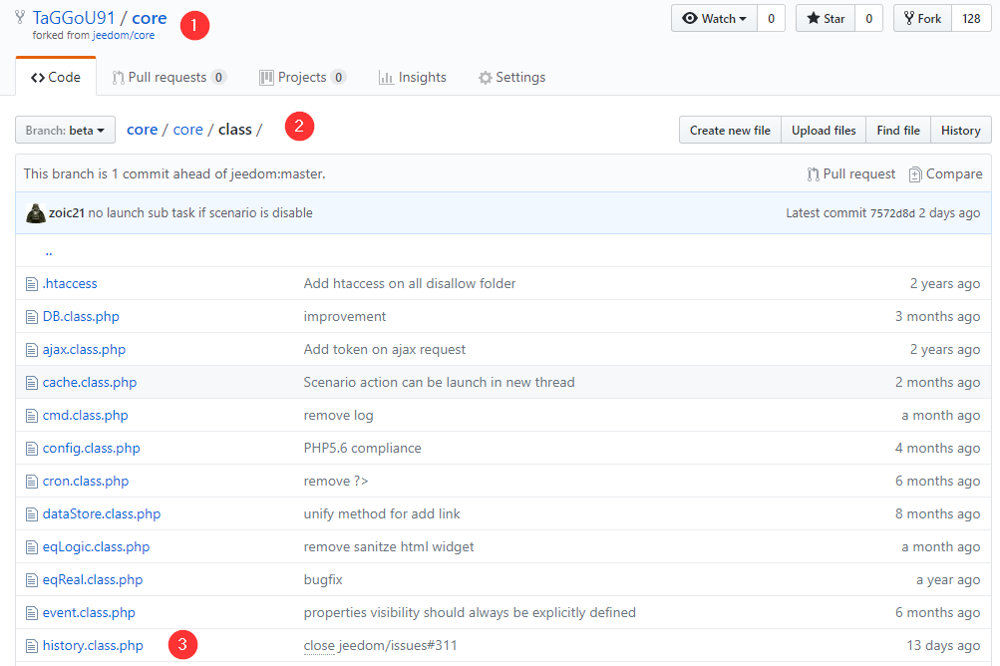

 :

-   

-   

-   

-   

-   

 : .

 
===========================

,

.

:// github..

click on ****

 ****

. 
.

 
==========================================

****

<https:// github.com/jeedom/core> vous êtes sur le projet jeedom, à

.

 
---------------------------------------

*
 : 

    

    

.
    File

. 

. 
.

> **Tip**
>
> 
> 
> 
> .

    .

    . 

.

Then on the lower part we find this : 1. We indicate a title
explicit if possible 2. We enter a slightly more precise description
(in my case, it would be too long, the link to the forum will be more
speaking) 3. We make sure it is ticked like this 4. We commit =
Submit the change

 
--------------------------

The **commit** done above only concerns the fork of the project in
your GitHub space. To submit changes to the original project,
you must perform a PR (

1. We click on the Pull Request tab

2. New Pull Request (PR for friends)

1. The PR will launch a comparison between the base of jeedom with your
    repository (the fork).

2. This indicates the modifications (the first is because I
    am updated from jeedom, the second concerning precisely the
    change of lastchangestateduration function, perfect !!!)

3. The old code

4. The new code

5. We create the Pull Request (PR)

It is important to clearly explain the changes submitted so that the
original project developer (s) understand and can validate your
Request.

1. We click on the three small dots

2. We copy the information we entered previously

3. Same, we copy (hence the use of… in step 1 to
    avoid rewriting)

4. We click on Create Pull Request

**It's over.** You have to wait until your PR is validated.

NB: Only users with a push right on Jeedom who
can validate the PR.

To make sure your change is listed, you
can click on Pull Requests

We obtain the list of PR awaiting validation. We can see the
our

 
============================

To complete
