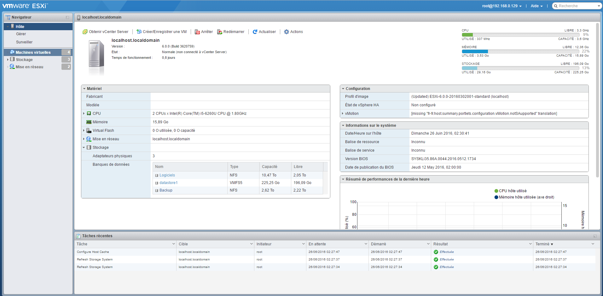
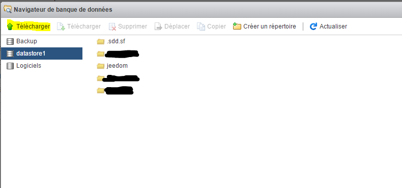
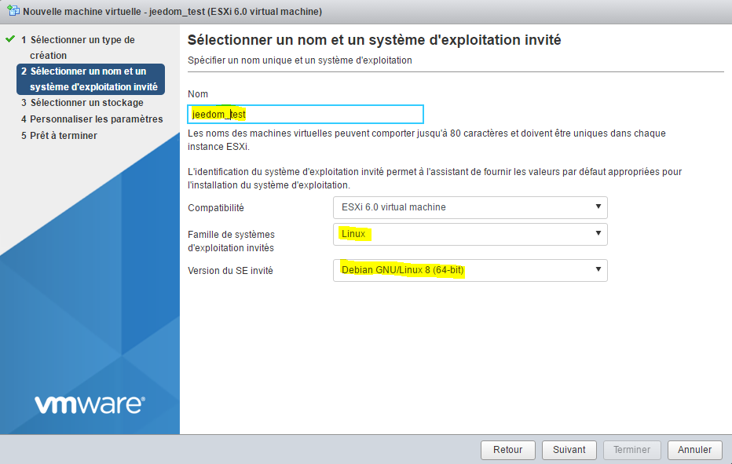
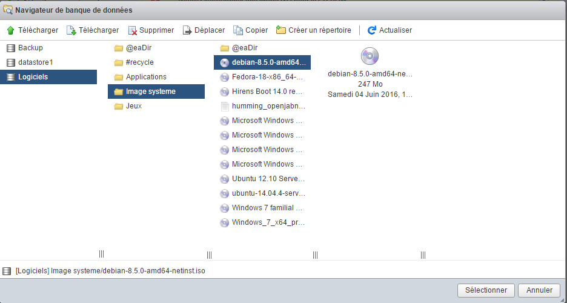
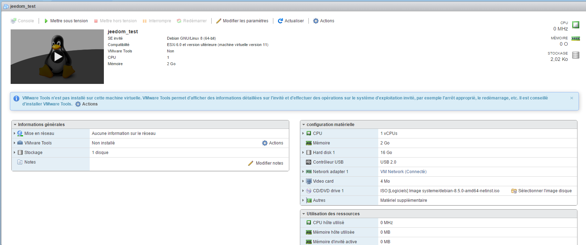
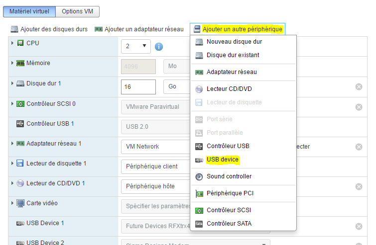

.

 :

-   .
    
    

-   

.
.

.

 
===========================

 :

> **NOTE**
>
> 
> 
> [ici](https:

 :

 :

-   

-   

-   ,
    

-   

-   
    
    
    

 
=============================

:
.
.

 :

 :

" :

 :

 :

 :

datastore :

 
=============================

" :

 :

 :

 :

 :

> **NOTE**
>
> 
> 
> a hard drive, you can increase it (but you have to know how to manage it
> OS level next) but not reduce it.

In the CD / DVD drive, select "ISO file bank of
Data" :

Then select the location where your ISO is stored (see
previous chapter) and validate :

Then do next :

You then have a summary of your configuration, click on
"Finish" :

A message at the top will tell you that it's good, then click on
"Virtual machines" :

You should see your virtual machine (if not click
on "Refresh") click on it :

You must have a page of this type, click on the play button :

Your machine will launch and you will be able to install
your OS :

> **IMPORTANT**
>
> Once your machine is installed you MUST install the
> VMware tools (this allows VMware to have information about your VM
> and turn it off properly). Under debian just do
> "sudo apt-get -y install open-vm-tools".

For the rest of the installation I invite you to read this
[tutoriel](https://jeedom.github.io/documentation/howto/en_US/doc-howto-debian.installation.html#_installation)

Mount USB devices in the VM 
=======================================

> **NOTE**
>
> If you do not have the options below it is necessary to update
> the ESXi Embedded Host Client, all information
> [ici](https:

It's a fairly rare need, but I had to use it for Jeedom, in
indeed I have on my ESXi the keys Zwave, RFXcom, edisio, enOcean and GSM
connected and I had to connect them to my Jeedom VM to be able to
use it.

> **NOTE**
>
> For Zwave, RFXcom, edisio and enOcean there is no problem, for
> GSM keys you must follow this
> [tutoriel](https://jeedom.github.io/documentation/howto/en_US/doc-howto-gsm.huawei_mode_modem.html)
> before to force the key in modem mode only otherwise it is not
> not seen correctly on the ESXi.

Go to your VM then do "Change settings" :

Click on "Add another device" then USB controller :

> **NOTE**
>
> The following step should be repeated for each USB device that
> you want to connect

Save, redo "Change settings", then "Add another
device "and" USB device" :

Choose your USB device from the drop-down list :

And now your device is plugged into your VM. Every
restart it will be automatically reconnected to the VM and if you
physically disconnect / connect then it will be reconnected to
your VM. In other words the use is now totally
transparent.
