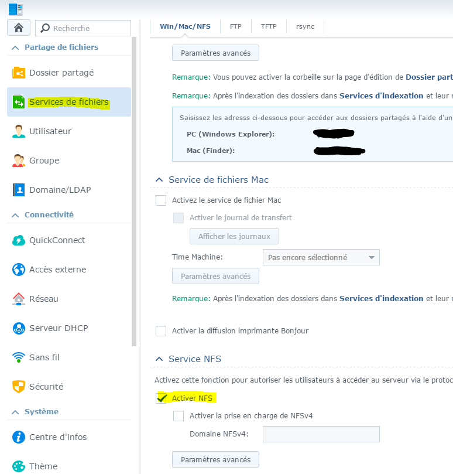
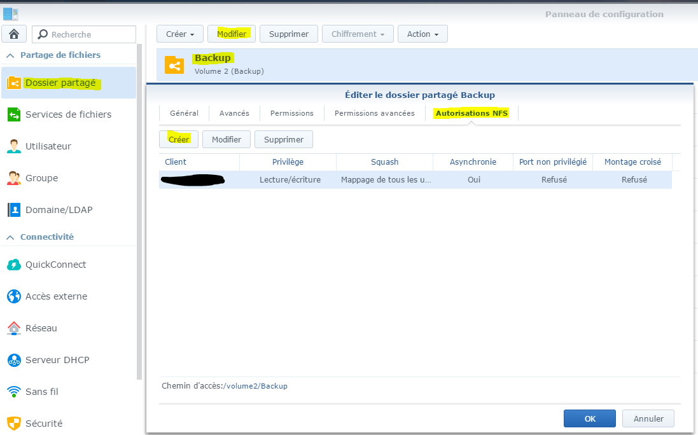
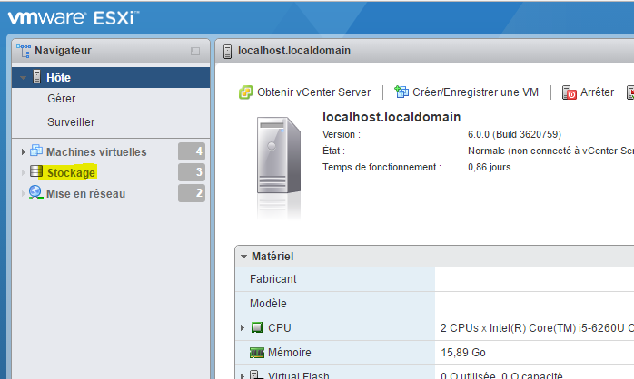
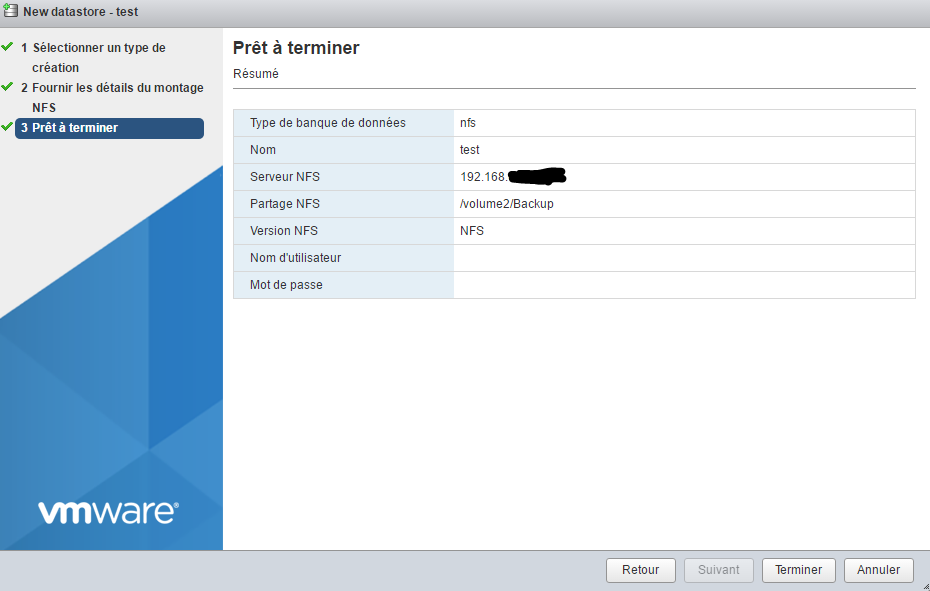
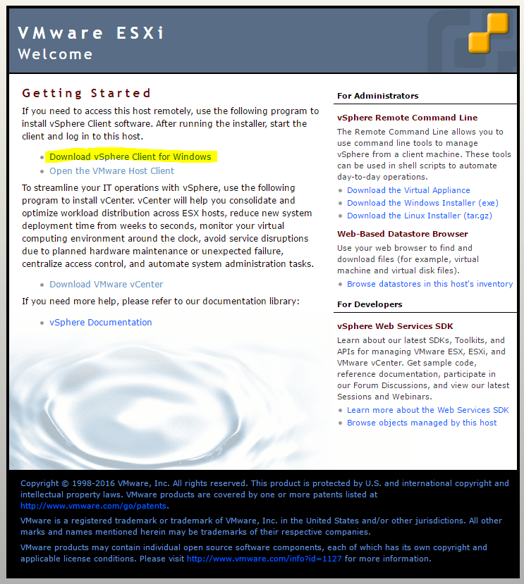
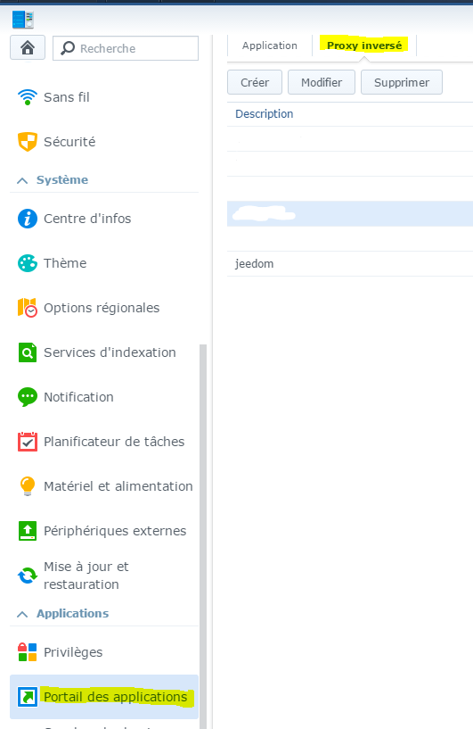

Not really a howto here but more a collection of tips and tricks on
VMware

Add your license 
==================

Once connected on the web interface (IP\_ESXI / ui) you have to go to
"Manage" :

Then on "Licensing" and click on "Assign a license"

And enter your license key

> **Note**
>
> As a reminder, if you don't do this your ESXi may no longer be
> operate after 60 days

Mount an NFS datastore with Synology 
========================================

We will see here how to mount an NFS share from a Synology on
VMware. This allows for example to put virtual machines on the
Synology (which may have more space than the ESXi) or send the
machine backups on Synology

Synology configuration 
-------------------------

You have to go to the control panel then "Services de
files "and check the box" Enable NFS" :

Then click on "Shared folder", then choose the folder to
share (here Backup), click on modify then "NFS authorization" and
finally on create (here I already have one, your list should be
empty) :

Then you put the IP of your ESXi and in "Squash" you put
"Map all users to admin "then validate :

We must then recover the share path (here / volume2 / Backup) :

Here it is finished on the Synology side, we will now switch to the ESXi side

ESXi configuration 
-----------------------

Go to "Storage" :

Then click on "New database" :

There you select "Mount an NFS database" then do
next :

Enter the name of the datastore to create (be careful to avoid spaces and
special characters), put the IP of our Synology and put the path
sharing (see above) and finally validate :

Click on finish :

And now your new datastore should appear (otherwise click on
"Actualiser").

Added VAAI Synology plugin for NFS mounting 
==============================================

Adding this plugin enables hardware acceleration on
NFS mounts (for an explanation, see
[here](http://www.virtual-sddc.ovh/exploiter-les-vaai-nfs-avec-un-nas-synology/))

To see if you have it, you have to connect with the thick client
(I did not find the info on the web client) and go to configuration →
storage :

The installation is quite simple, first you have to activate the service
ESXi SSH (on the web interface, go to action ⇒ services
⇒ Activate Secure Shell), then connect in SSH above (the
identifiers are the same as to access the interface). Then he
you just do :

    esxcli software vib install -v https://global.download.synology.com/download/Tools/NFSVAAIPlugin/1.0-0001/VMware_ESXi/esx-nfsplugin.vib -f

You must have :

You must then restart the ESXi, to verify that it is ok you must
then return with the thick client to configuration → storage :

Install / Update ESXi Embedded Host Client 
===================================================

ESXi Embedded Host Client is a web interface (in HTML5) of ESXi which
allows in 95% of cases to do without the heavy client. She is here
default in version 6.0 update 2, but in version 1.0 it is
strongly advised to update it.

You will find all the information
[here](https://labs.vmware.com/flings/esxi-embedded-host-client)

To see if you have the web interface, just go with
your browser on IP\_ESXI / ui if you have nothing you need
install it, you must first connect in SSH on the ESXI then do :

    esxcli software vib install -v http://download3.vmware.com/software/vmw-tools/esxui/esxui-signed-latest.vib

If you already have it, to update it you have to do :

    esxcli software vib update -v http://download3.vmware.com/software/vmw-tools/esxui/esxui-signed-latest.vib

Installation of the thick client 
============================

This part is optional if you don't need to manage the USB.

You must go, with your internet browser, to the IP of the ESXi
then click on the link "Download vSphere Client for Windows" :

Once downloaded you just have to start the installation (I pass
voluntarily on this part because it is enough to validate everything).

Then launch VMware vSphere Client, you should have :

You just have to enter the IP of your ESXi, the username and the
password and you are connected to it :

ESXi update 
=====================

The procedure is quite easy, you must first recover the patch
going [here](https://my.vmware.com/group/vmware/patch#search) (il
you will probably have to log in with your VMware account). On the
"Select a Product" list put "ESXi (Embedded and Installable)", in
face leave the latest version of VMware and do "Search". Then
download the desired patch (usually the last one). The build number (the
first issue not the one starting with KB) gives you the version of the
patch that you can compare with your build number.

Then transfer the zip to one of your datastores and make :

    esxcli software vib update -d /vmfs/volumes/576c8ab3-fdf64d2f-091b-b8aeedeb87fb/ESXi600-201605001.zip

> **Note**
>
> Replace the path and the zip name according to your
> configuration

> **Important**
>
> Be careful to put the full path to the zip otherwise it won't
> not working

The command above only updates the vibes that need it but
you can force the installation of all the vibes of the package (so
be careful this can be downgrade) by doing :

    esxcli software vib install -d /vmfs/volumes/576c8ab3-fdf64d2f-091b-b8aeedeb87fb/ESXi600-201605001.zip

NTP configuration 
====================

By default the ESXi does not use NTP so that it is not at
the time and the VMs are not on time, to correct it is very
simple. From the web version, go to Manage → System →
Date and time, there you click on "Change settings" :

And in the "NTP server" box you have to put : 0.debian.pool.n,
1.debian.pool.n, 2.debian.pool.n, 3.debian.pool.n, time.nist.gov

Then in Actions → NTP Service → Strategy click on "Start and
stop with host" :

Still in Actions → NTP Service click on "Start"

This is your ESXi should take the time alone by now.

External access to the ESXi 
========================

To access the ESXi from the outside you need :

-   open port 443 to ESXi 443

-   open port 902 to ESXi 902

And that is all. Little tip if you have a Synology NAS you
can do (be careful to follow) :

-   open 443 to 5001 on Synology NAS

-   open the 80 towards the 80 of the NAS (useful just to generate the
    let's encrypt certificates)

-   open port 902 to ESXi 902

Then on the NAS in the control panel then portal
application and reverse proxy (beware DSM 6 is essential) :

Click on create and put :

In "Host name" (at source level) you must put the desired DNS
(for example monesxi.mondsn.synology.me) and in "Hostname" (at the level
of the destination) you must put the IP of the ESXi

> **Note**
>
> You can also do the same to access jeedom but by
> this time putting the jeedom IP (from the vm if you are in
> virtualized) and port 80

> **Note**
>
> Once you've done that and your DNS is pointing correctly
> on the NAS you can generate a valid SSL certificate for free
> with Let's encrypt, by going to Secrity ⇒ certificate and doing
> Add. Then don't forget to click on configure to
> assign it to your reverse proxy

Then to access your ESXi you just need with your browser
go to your external DNS or IP by adding / ui at the end and that's
bon.

> **Important**
>
> If you go through the NAS reverse proxy, the console in web mode of
> VMs do not work (because it goes through websocket), however
> if you go through VMware Remote Console everything should be ok (this
> goes through port 902)

> **Note**
>
> There is also a Vmware Watchlist app on Android for
> have access to ESXi as well as VM consoles

SSL certificate 
==============

It is possible to import vmware certificates directly into
your pc to no longer have the alert.

In order it is necessary :

-   have a url (dns) to access your esxi, here we will take
    esxi1.lan

-   configure the name of your esxi, in ssh above do :

<!-- -->

    esxcli system hostname set --host = esxi1

-   configure the fqdn :

<!-- -->

    esxcli system hostname set --fqdn = esxi1.lan

-   Retrieve the root certificate of esxi, it is in
    /etc/vmware/ssl/castore.pem

Right click on the computer then install the certificate, put it in
"Trusted Root Certification Authority"
