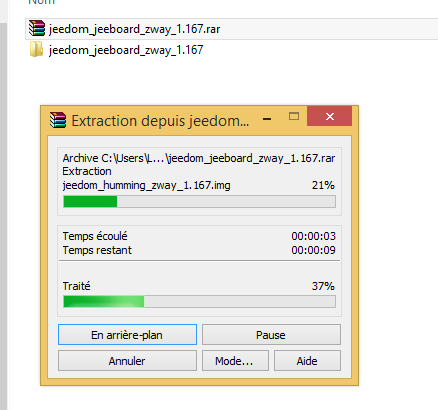
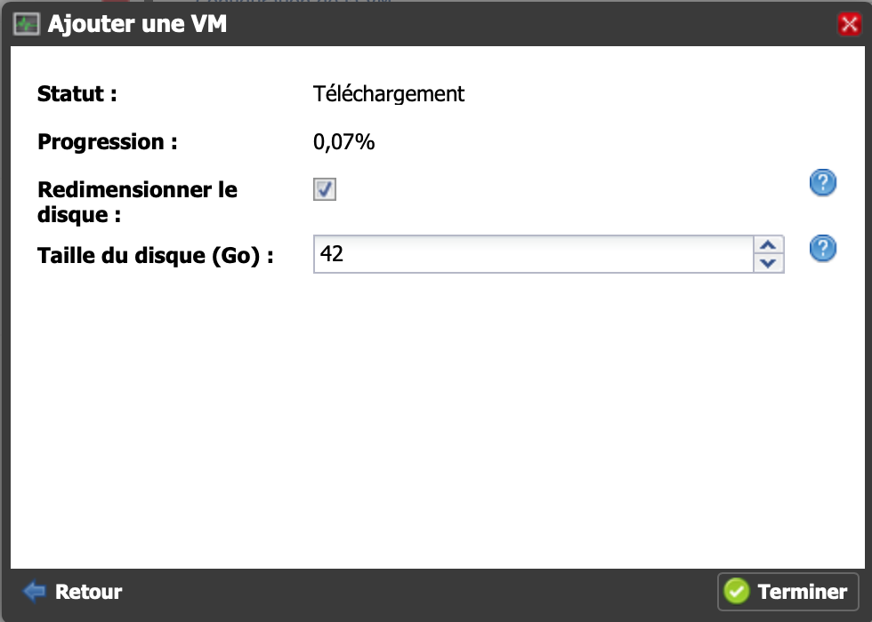
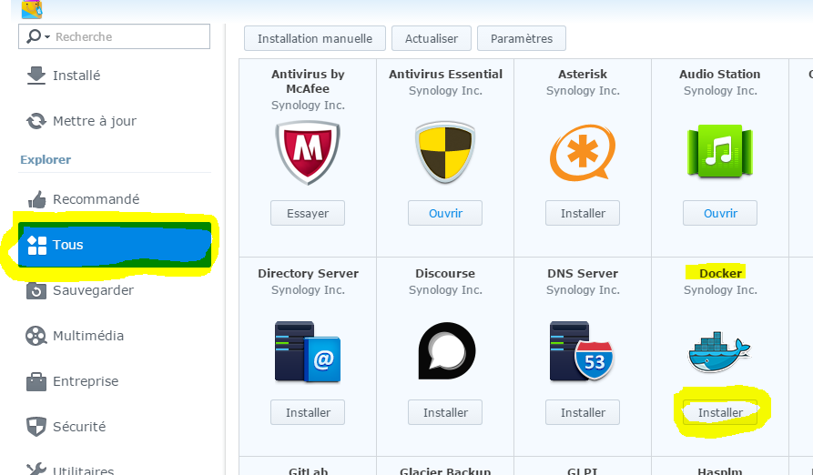
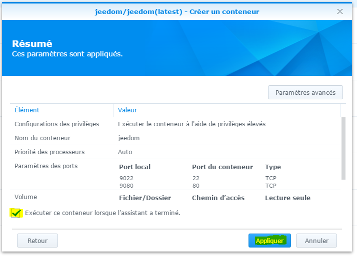

Hardware
========

Jeedom can be installed on different hardware components :

-   a Raspberry pi 2 or 3
-   Synology NAS
-   any Linux system based on Debian 9 (stretch)
-   Freebox Delta

You can also buy a ready-made box with Jeedom preinstalled which also contains a service pack (more support and services) and plugins offered :

-   [Jeedom Smart Z-Wave +](https://www.domadoo.fr/fr/box-domotique/3959-jeedom-controleur-domotique-jeedom-smart-z-wave.html)

-   [Jeedom Smart Z-Wave + and RFXCOM](https://www.domadoo.fr/fr/box-domotique/4043-jeedom-controleur-domotique-jeedom-smart-z-wave-et-interface-rfxcom.html)

-   [Jeedom Smart EnOcean](https://www.domadoo.fr/fr/box-domotique/4041-jeedom-controleur-domotique-jeedom-smart-enocean.html)

-   [Jeedom Smart EnOcean and RFXCOM](https://www.domadoo.fr/fr/box-domotique/4044-jeedom-controleur-domotique-jeedom-smart-enocean-et-interface-rfxcom.html)

Here is a "typical" configuration to get started with Jeedom in Z-Wave :

1. Raspberry pi 3 :

    -   A raspberry + box 50 €
    -   An Aeon Gen key 5 € 60
    -   A micro SD card 7 €
    -   A USB power supply € 8

A total of € 125 for an open source home automation box with complete control over its installation.

> **Tip**
>
> It is possible to add or change by an Rfxcom antenna, or an enOcean key.

> **Tip**
>
> Jeedom is software that is and will remain open source, its use is completely free and does not depend on a cloud or a subscription. However, some plugins that increase the capacity of Jeedom or its use may be chargeable **and may need an internet connection**. You can find the list of plugins [here](http://market.jeedom.fr/index.php?v=d&p=market&type=plugin).

> **Tip**
>
> Service pack ? What is it ? You can see [here](https://blog.jeedom.fr/?p=1215) the advantages of service packs.


Jeedom Smart
===========

Here you will find step by step documentation to install or restore Jeedom

[here](https://doc.jeedom.com/en_US/howto/recovery_mode_jeedom_smart)

Jeedom mini +
===========

> **Tip**
>
> The name of the Jeedom image may be different from that of the captures made in this documentation

Step 1 : Etcher installation
---

You must download Etcher software [here](https://etcher.io/) then install it on your pc

2nd step : Jeedom image recovery
---

You have to go [here](https://images.jeedom.com/jeeboard/),then in the Images folder recover the jeedom-jeeboard - \*. rar image


Stage 3 : Decompressing the Jeedom image
---

Unzip the Jeedom image (if you have nothing to unzip it you can install [winrar](http://www.clubic.com/telecharger-fiche9632-winrar.html)), you must obtain :




Step 4 : Burning the image to the SD card
---

Insert your SD card in your computer then launch the Etcher software, give it the path of the image, the path of the SD card and click on "Flash!". The software will burn the SD card and check the burning.

You just have to put the SD card in the Jeedomboard (or Hummingboard), connect the network and the power supply, your Jeedom will start (5 min) and you should see it on the network.

> **Tip**
>
> SSH IDs are jeedom / Mjeedom96

For the rest, you can follow the documentation [First step with Jeedom](https://doc.jeedom.com/en_US/premiers-pas/index.html)


Raspberrypi
===========

You will find here the documentation to install Jeedom on a raspberry PI **with an SD card.**

> **Important**
>
> Debian 9 (Stretch) is the officially supported distribution for version 3.1.5 of jeedom.

**1 / Download the last "lite" image, ie without graphical interface** [here](https://downloads.raspberrypi.org/raspbian_lite/images/raspbian_lite-2018-04-19/2018-04-18-raspbian-stretch-lite.zip)

**2/ Decompress the image with winrar** [here](http://www.win-rar.com)

**3/ Burn this image on an SD with etcher for example** [here](https://etcher.io/)

> **Note**
>
> If you use Etcher to burn your image, the decompression step is useless (Zip format recognized directly in the selection of the image file).

**4/ Activate SSH access**

> **Warning**
>
> For security reasons, SSH access is no longer enabled by default on this distribution. So you have to activate it.

An empty ssh file must be created on the boot partition (the only one accessible under windows).

Just right click : new / text document and rename it to "ssh" **without extension**

> **Important**
>
> Under windows, in the explorer you must therefore check your configuration in display / options / modify the folder and search options /


**5/ Start the PI**

Insert your SD card, connect the network cable, connect the power.

**6/ Connect using SSH**

Identify your Pi on the network

You need to know the IP address of your PI. Many solutions :

-   Consult the DHCP configuration in your router
-   Use an angyipscanner type port scanner" [here](http://angryip.org/download/#windows)

Establish connection

Then use for example putty to establish your connection [Here](http://www.putty.org/)

Enter the IP address of your PI (here 192.168.0.10) and click on open. Accept the default security message when logging in for the first time.

Log in with credentials **pi / raspberry**

> **Important**
>
> For security reasons, it is imperative to change the default notsword. Cases of hacking based on the use of the default login / notsword pair of the Raspberry are particularly widespread. (passwd and sudo notswd command)

**7/ Launch the jeedom installation script**

``wget -O- https://raw.githubusercontent.com/jeedom/core/master/install/install.sh | sudo bash``

**The sudo notsword is also raspberry**

> **Note**
>
> Depending on your internet speed, the installation can take 45 to 90 minutes. You must not interrupt the process before the end. Otherwise, you will have to repeat the entire procedure.

Then just go to IP\_MACHINE\_JEEDOM

> **Note**
>
> The default credentials are admin / admin

> **Note**
>
> The following arguments can be used : -w = webserver folder -z = installation dependencies z-wave -m = desired mysql root notsword

````
./install.sh -w /var/www/html -z -m Jeedom
````

**8/ System optimization**

If you use your Raspberry for Jeedom without a screen connected, it is recommended to carry the minimum RAM at the video part.

Just log in **SSH** and modify the config file : ``sudo nano /boot/config.txt``

Add **and or** De-comment (by removing the #) **and or** Edit the lines :

````
gpu_mem=16
disable_l2cache=0
gpu_freq=250
````

Quit by saving : ``CTRL+X`` then ``O`` then ``ENTER``

Reboot your RPI

Then you can follow the documentation [First step with Jeedom](https://doc.jeedom.com/en_US/premiers-pas/index)

Freebox Delta
=============

It is possible to install on Freebox Delta Jeedom via the VM system.

Step 1 : Connection to the Delta
---

You must go to the configuration interface of your Freebox Delta. Then click on VMs.


2nd step : Set the different options
---

Click on "Add a VM"


Configure features. We recommend that you put 2 CPUs and the maximum in RAM.


Configure user and notsword, **they must be kept in memory they will be asked for during an SSH connection**:


Stage 3 : Loading installation
---

Wait while the image downloads


Step 4 : Connect to your Jeedom
---

You can connect using the address indicated on the page:


Remember to assign the Delta's USB port to the VM if you want to use an antenna.

Born **pas** check "Screen", this is useless on the Jeedom image (apart from overconsumption).

The IP address of your Jeedom on the Freebox Delta is written at the top, under its name.

The default login and notsword are admin / admin when you access jeedom via your browser.

For the rest, you can follow the documentation [First step with Jeedom](https://doc.jeedom.com/en_US/premiers-pas/index.html)

VM
==

If you want to discover Jeedom without risk, you can also virtualize it on your PC, here is the procedure to follow. You take no risk in a VM, the integrity of your PC is protected :

Step 1 : Download and install VMware Player
---

You must download the Virtual Box software [Here](http://download.virtualbox.org/virtualbox/5.1.28/VirtualBox-5.1.28-117968-Win.exe)

2nd step : Downloading a Debian strecht image - netinstall
---

Download a minimalist debian 9 Stretch image [Here](https://cdimage.debian.org/debian-cd/current/amd64/iso-cd/debian-9.3.0-amd64-netinst.iso)

Download the extension pack, and install it. [Here](http://download.virtualbox.org/virtualbox/5.1.28/Oracle_VM_VirtualBox_Extension_Pack-5.1.28.vbox-extpack)

Stage 3 : Configuring the VM environment
---

Click on new and fill in the fields as below :


-   Click on next, adapt the memory size in relation to your system (1024 are sufficient)
-   Click next, create a virtual disk now
-   Click Create, choose VDI
-   Click on next, dynamically allocated
-   Click on next, Choose a size for the space (4GB is enough)
-   Click on create

Step 4 : VM launch
---

-   Click on configuration
-   Select storage
-   Add an optical drive
-   Choose a disc


-   Indicate the image previously downloaded
-   Then select network and choose "bridge access" in network access mode.


-   Click OK \*Click start

Step 5 : Debian 9 installation
---

It's classic…


-   Choose Graphical install
-   Install the debian preferably without graphical interface because useless. Username doesn't matter. In most screens, you just have to validate the default choice. You can leave empty fields, it is not blocking.
-   For software selection :


-   For Grub, do not worry, the boot sector is that of the VM, not that of your PC. No risk of breaking anything.

Step 6 : Jeedom installation
---

-   Launch your VM
-   Identify yourself with the user and notsword chosen during installation
-   Go root

``su``

-   Enter the root notsword set during installation
-   Get the jeedom script, make it executable, launch it


````
wget https://raw.githubusercontent.com/jeedom/core/master/install/install.sh
chmod +x install.sh
./install.sh
````

-   and let it go ...

Step 7 : Jeedom launch
---

-   To know the Ip Lan address of the VM

````
ip -s -c -h a
````

Your IP address, type 192.168.0.XX appears in red. Just enter it in your browser.

> **Warning**
>
> If this does not work, you have not configured your network card as Borntwork Bridge as indicated at the start.

Then you can follow the documentation [First step with Jeedom](https://doc.jeedom.com/en_US/premiers-pas/index)

Docker
======

> **Important**
>
> Please note, we assume here that you are already familiar with Docker

To discover Jeedom, you can also rotate it in a Docker container :

Step 1 : Docker installation
---

Docker is now available on all recent distributions.
To install it on a distribution

-   rpm based

````
yum install docker
````

-   deb based

````
apt-get update
apt-get install docker
apt-get install docker.io
````

2nd step : Installing a mysql image
---

> **Note**
>
> You can also install mysql directly on the host machine, in this case, skip this step.

I use [this one](https://hub.docker.com/_/mysql/). To install it :

``docker pull mysql:latest``

Then launch it :

``sudo docker run --name jeedom-mysql -v /opt/jeedom/mysql:/var/lib/mysql -e MYSQL_ROOT_PASSWORD=your-mysql-password -d mysql:latest``

With :

-   ``jeedom-mysql`` : the name of the mysql container
-   ``/opt/jeedom/mysql`` : the file of the host where we have to store MySql data
-   ``your-mysql-password`` : the root notsword of the MySql instance

Stage 3 : Installing a Jeedom image
---

Image installation :

``docker pull jeedom/jeedom``

Then launch the :

``sudo docker run --name jeedom-server --link jeedom-mysql:mysql --privileged -v /your/jeedom/path:/var/www/html -e ROOT_PASSWORD=your-root-password -p 9080:80 -p 9022:22 jeedom/jeedom``

With :

-   ``jeedom-server`` : jeedom Docker name wanted
-   ``/your/jeedom/path`` : directory where Jeedom data is put on the host
-   ``your-root-password`` : root notsword to access Jeedom in SSH

Then you need to install Jeedom by going to : IP\_DOCKER:9080 and enter the connection information to mysql :


For the rest, you can follow the documentation [First step with Jeedom](https://doc.jeedom.com/en_US/premiers-pas/index)

> **Important**
>
> For the name of the host MySql, you have to put jeedom-mysql

Synology
========

Here you will find the documentation step by step to install Jeedom on a Synology (DSM 5.2 minimum).

Step 1 : Docker installation
================================

Go to the package center :


Click all, then install the Docker package



Wait until the installation is finished :


> **Important**
>
> To access the Docker package, you must have DSM 5.2 and a compatible NAS

2nd step : Recovery and installation of Jeedom images
========================================================

You need Docker to run Jeedom, the first one Docker Mysql which will contain the database and a second one which contains Jeedom

Launch the Docker application :


MYSQL
-----

Click on "Register" :


In the search field type "mysql", select mysql and click on download :


Then validate the version request, the best being to take the latest version :


Then click on image, here you can follow the progress of the download (can take several tens of minutes) :


Once finished, click on the image then launch :


Give a name to your mysql as well as a local port redirected to port 3306 of the container, then do the following :


Do next :


Click on "Advanced settings" :


Then on "Add a folder", and there, put the desired folder on the Synology side (it is in this folder that there will be all the files in the database) and / var / lib / mysql on the container side (be careful uncheck "Read only")


Click on "Environment" then "Add a variable" and putting in "Variable" : "MYSQL\_ROOT\_PASSWORD "and in value put the desired BDD notsword (it will be used later). Then validate :


Check "Run this container when the wizard has finished" then click on "Apply".

Jeedom
------

Click on "Register" :


In the search field, type "jeedom", select jeedom / jeedom and click on download :


Then validate the version request, the best being to take the last.

Then click on image, here you can follow the progress of the download (can take several tens of minutes) :


Once finished, click on the image then launch :


Give a name to your jeedom as well as a local port redirected to port 80 (here 9080) and one to 22 (here 9022) of the container, then do the following :


Do next :


Click on "Advanced settings"


Then on "Add a folder"


Choose a folder on your Synology (it is in this folder that there will be all jeedom files), be careful to uncheck "Read only"


In path, put / var / www / html then click on "Environment" :


Check "Run the container using elevated privileges" then validate everything :



Check "Run this container when the wizard has finished" then click on "Apply".

> **Advanced configuration setting**
>
> There are 3 optional configuration parameters, these parameters must be notsed as an environment variable
> - APACHE_PORT : allows to change the default port (80) for listening to the web server
> - SSH_PORT : allows to change the default port (22) for listening to ssh
> - MODE_HOST : indicates that the network is in host mode

> **IMPORTANT**
>
> Certain plugin you need to have the network broadcast (Xioami plugin type), for that you must ABSOLUTELY switch to the network in host mode (only possible during creation), change the default listening port of the web server and ssh by unused ports (type 9080 for the web server and 9022 for the ssh), and set the variable MODE_HOST to 1

Stage 3 : Jeedom configuration
---

Now you need to install Jeedom, it's very simple, go to IP\_NAS:9080


Fill in the fields according to your configuration (configuration of the Docker mysql installed previously) and validate.

> **Important**
>
> The IP address of the BDD is the IP address of the NAS, the port is the one redirected from the Docker Mysql, the notsword is the one put in the Docker Mysql. Username is root and base name is whatever you want (Jeedom recommended)


> **Tip**
>
> If you want SSH access, you need in ports to redirect a local port to port 22 of the container, the SSH identifiers are root / jeedom. You can change the notsword by setting the environment variable ROOT\_PASSWORD to the value of the desired notsword.

Then you can follow the documentation [First step with Jeedom](https://doc.jeedom.com/en_US/premiers-pas/index)

Autres
======

Here you will find the documentation to install Jeedom on most linux systems (tested and approved on the Debian distribution)

> **Important**
>
> Debian 9 (Stretch) is the officially supported distribution for version 3.1.7 of Jeedom (but Jessie remains perfectly functional). If you do not master Linux environments a minimum, we advise you to go on an official image (OVF) or the use of a Mini + or Smart (available soon).

> **Important**
>
> Installation script can be dangerous because it assumes your system is blank. If not, please read the script and install by hand..

Connect in SSH to your system and do :

````
wget https://raw.githubusercontent.com/jeedom/core/master/install/install.sh
chmod +x install.sh
./install.sh
````

Then just go to ``IP_JEEDOM`` from your internet browser.

> **Note**
>
> The default credentials are admin / admin

> **Note**
>
> The following arguments can be used : -w = webserver folder -z = installation dependencies z-wave -m = desired mysql root notsword

````
./install.sh -w /var/www/html -z -m Jeedom
````

Then you can follow the documentation [First step with Jeedom](https://doc.jeedom.com/en_US/premiers-pas/index).
