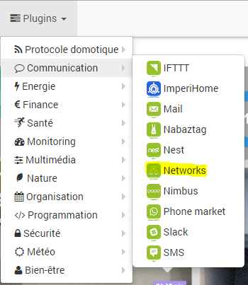
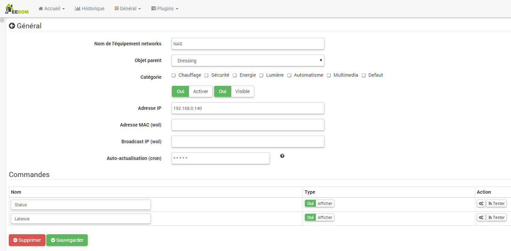

# Plugin Networks

This plugin allows you to ping or wake-on-lan on network equipment.

# Plugin configuration 

After downloading the plugin, you just need to activate it, there is no configuration at this level.

# Equipment configuration 

The configuration of the Networks equipment is accessible from the plugin menu :

This is what the Networks plugin page looks like (here with 1 device already) :

Once you click on one of them, you get :

Here you find all the configuration of your equipment :

-   **Name de l'équipement Networks** : name of your Networks equipment,
-   **Parent object** : indicates the parent object to which the equipment belongs,
-   **Category** : equipment categories (it can belong to several categories),
-   **Activate** : makes your equipment active,
-   **Visible** : makes your equipment visible on the dashboard,
-   **IP adress** : IP address to ping,
-   **MAC address (wol)** : MAC address for wake-on-lan,
-   **Broadcast IP (wol)** : network broadcast IP address to send wake-on-lan,
-   **Ping method** : Choice of ping method : IP (normal), ARP (preferred for phones or peripherals that fall asleep), PORT (to test if a port is open)
-   **TTL** : Time-to-live, values can be : 
    - 0 : same host
    - 1 : same subnets
    - 32 : same site
    - 64 : same region
    - 128 : same continent
    - 256 : no limit
    If you have a 'Time to live exceeded' error, increase this value. If empty, then the parameter is 255. Note that on some configuration (Docker for example) the 255 is not authorized so it is necessary to decrease this value.
-   **Port** : Port to ping if you are in ping mode on a port (example : 8080 for 192.168.0.12:8080),
-   **Self-updating (cron)** : cron defining the ping frequency,

Below you find the list of orders :

-   **Name** : the name displayed on the dashboard,
-   **Pin up** : allows to display the data on the dashboard,
-   **Test** : Used to test the command.

> **NOTE**
>
> Jeedom will check the IP ping every minute (default).

> **Important**
>
> If you do not enter the MAC and broadcast address then you will not have a wake-on-lan command.

> **NOTE**
>
> MAC address must be of the form : 5E:FF:56:A2:AF:15
