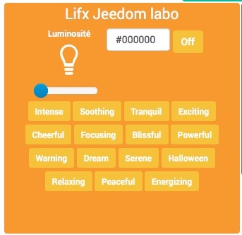

# Lifx plugin 

Plugin to interact with Lifx bulbs (Local)

# Install the plugin 

After installing the plugin, you just need to activate it :

**Dependencies**

Normally the dependencies are launched automatically, if not you will have to click on **Restart**

# Setup : Scan your network 

**Setup**

To configure the plugin, you must scan your network automatically via the plugin.

To Add Lifxes Automatically : **Plugins** -→ **Communicating objects** -→ **Lifx** -→ **To scan**

Once the scan is finished, you will see the Lifx detected.

You can then activate them by clicking on one of the Lifx (which took the name you gave it on the Lifx application), then activate and save it to have all the commands associated with your Lifx.

**Dashboard section** :

# Create a new Color mode 

If we like a color that we apply with the Lifx app, we can easily retrieve it in the Lifx plugin.

You just have to go to **Plugins** -→ **Communicating objects** -→ **Lifx** -→ then choose the lifx where you want to copy the color

Then click on **Test** on the order **Create a mode**

Just reload the page to see a new command appear which has the current Lifx color configuration. You can change its name at any time.

