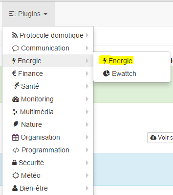
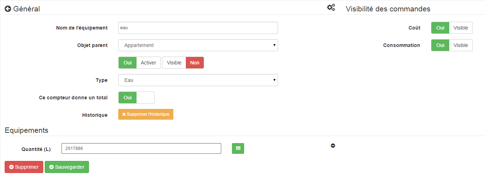
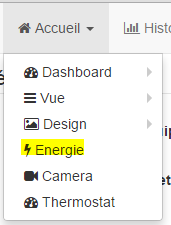
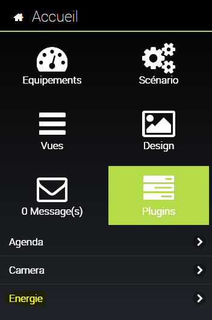

# Energy Plugin

This plugin allows you to establish an energy balance of your home by providing a panel giving the consumption items

# Plugin configuration 

After downloading the plugin, you need to activate it. You then have access to the basic configuration of the plugin :

Here you find the basic configuration :

-   **Pricing** : this part allows you to configure the pricing parameters
    -   **Motto** : allows you to configure your currency (by default €)
-   **Water** : water management configuration
    -   **Activate** : activate or not water management
    -   **Rate** : water price per L
-   **Gas** : gas management configuration
    -   **Activate** : activate or not gas management
    -   **Rate** : gas price per kWh
-   **Electricity** : electricity management configuration
    -   **Activate** : activate or not the electricity management
    -   **Pricing** : choice of pricing mode, fixed or peak / off-peak hours
    -   **Rate** : electricity price per kWh

If you are in peak / off-peak hours :

Here you can enter the tariff in peak and off-peak hours as well as the toggle hours (3 zones maximum).

> **Tip**
>
> It is possible in fixed pricing mode to put calculation formulas, for example 0.05 + 0.05 \* \#\[ma\]\[commande\]\[mode\]\#, so if \#\[ma\]\[commande\]\[mode\]\# worth 1 then the price will be 0.1 otherwise 0.05. This allows you to manage all cases if you have current pricing information.

# Equipment configuration 

The configuration of "energy" equipment is accessible from the plugin menu :

This is what the energy plugin page looks like (here with 5 equipments already) :

Once you click on one of the devices, you get :

Here you find all the configuration of your equipment :

-   **Name of equipment** : name of your energy equipment
-   **Parent object** : indicates the parent object to which the equipment belongs
-   **Activate** : makes your equipment active
-   **Visible** : makes it visible on the dashboard
-   **Type** : allows to choose the "energy" type (electricity, water or gas)
-   **This counter gives a total** : tells jeedom that this equipment gives the total consumption for the affected object. For example if you have a teleinfo counter or a water meter which shows you the total consumption of your home, you check this box and assign the counter to the object which represents the home (and therefore certainly the parent object of all others).
-   **History** : allows you to completely erase the history of your counter. It is recommended to do this after configuration of the equipment to avoid leaving with the consumption history of the modules and therefore having the first day totally distorted.

> **Important**
>
> Attention when an energy equipment is in total it will appear only on the object to which it belongs and not on its parents

On the right you will also find selectors that allow you to choose what to display on the widget.

Below you find the configuration of the equipment. A button on the right allows you to add more :

-   **Category** : equipment consumption category (categories are fixed, you cannot add any). In total counter mode, only the Other category is possible.
-   **Power** : how to have the power of this equipment ? this is where you can simulate consumption. For example here there is \#\[Chambre\]\[Lumière\]\[Etat\]\# \* 0.6 : the state of my light varies from 0 to 100, so when my lamp is on I have 100 \* 0.6 = 60 or a power of 60 watt which corresponds to the power of my bulb.
-   **Consumption** : command giving the consumption of the equipment, if you leave empty and the power field is filled then the plugin will automatically calculate the consumption.
-   **Delete** (little minus button) : to delete the line.

# Water or gas meter 

Two possibilities :

-   either you have an order which indicates the consumption, and there you just have to indicate the consumption.
-   or it is also possible to indicate the indexes by hand then to save.

# Teleinfo 

For teleinfo, you just need to put the different indexes of your teleinfo in the equipment consumption field (either all in the same field with + in the middle, or create one field per index).

# Panel 

Once your different energy equipment has been configured, you have a panel accessible from the home menu :

This is the result :

Here you can choose, the panel display period, the grouping of data (day or month) and the type of energy you want to display (depending on the active data or not).

The panel is also accessible by mobile via Plugins → Energy :

Once on it you get :

# FAQ 

**My counters don't seem to be in real time.**

The energy plugin is not there to do real time, it takes a reading every 15 min. So in the case of the simulation of
consumption, it takes 15 min for a change of state to be taken into account, if your lamp only stays on for 10 min
consumption will therefore not be taken into account.

**My counters don't move anymore.**

During the calculation the plugin looks if the new value is much higher than the old one if it is not the case then it ignores the new value. To reset this value to 0, click on "Delete history" on the equipment configuration

