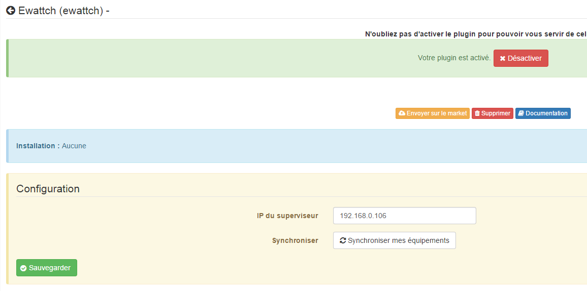

Ewattch 
=======

Description
-----------

Ce plugin permet d’établir et de récupérer les informations du
superviseur Ewattch.

Plugin configuration
-----------------------

Après téléchargement du plugin il vous faut l’activer, vous avez ensuite
accès à la configuration de base du plugin :

Vous retrouvez ici la configuration de base :

-   **IP du superviseur** : IP du superviseur sur le réseau

-   **Synchroniser** : Permet de synchroniser la liste des équipements
    sur le superviseur avec Jeedom

Equipment configuration
-----------------------------

La configuration des équipements Ewattch est accessible à partir du menu
Plugins :

Voilà à quoi ressemble la page du plugin Ewattch (ici avec déjà quelques
équipements) :

> **Tip**
>
> Comme à beaucoup d’endroits sur Jeedom, mettre la souris tout à gauche
> permet de faire apparaître un menu d’accès rapide (vous pouvez, à
> partir de votre profil, le laisser toujours visible).

Once you click on one of them, you get:

You can find here the full configuration of your device :

-   **Nom de l’équipement** : nom de votre équipement Ewattch,

-   **Parent Object** : means the parent object the equipment depend
    equipment,

-   **Enable**: to make your equipment active,

-   **Visible**: makes it visible on the dashboard,

-   **Category**: categories of equipment (it may belong to
    plusieurs catégories),

-   **ID** : ID logique de l’équipement dans le superviseur (il est
    recommandé de ne pas y toucher),

-   **IP** : IP du superviseur (à titre indicatif pour le moment).

En dessous, vous retrouvez la configuration de l’équipement :

-   the name displayed on the dashboard,

-   le sous-type,

-   ID logique de la commande dans le superviseur (il est recommandé de
    ne pas y toucher),

-   historiser : permet d’historiser la donnée,

-   afficher : permet d’afficher la donnée sur le dashboard,

-   unité : unité de la donnée (peut être vide),

-   min/max : bornes de la donnée (peuvent être vides),

-   configuration avancée (petites roues crantées) : permet d’afficher
    the advanced configuration of the command (historization method,
    widget…​),

-   Tester : permet de tester la commande,

-   supprimer (signe -) : permet de supprimer la commande.

