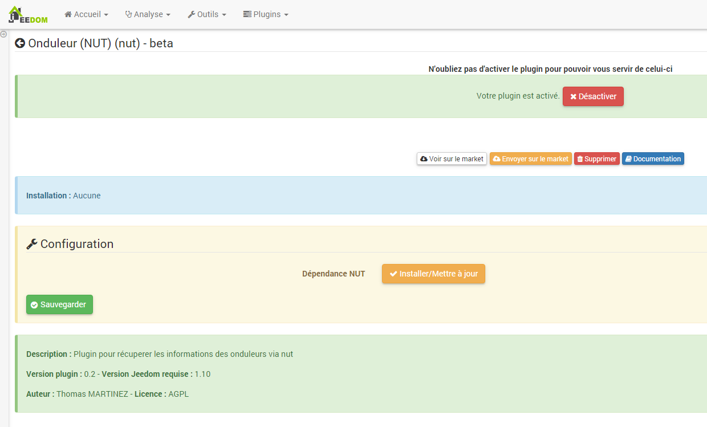
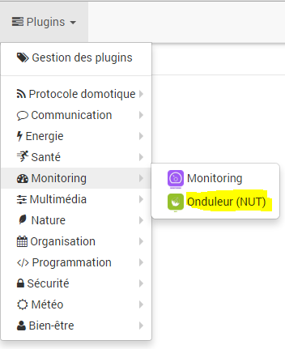
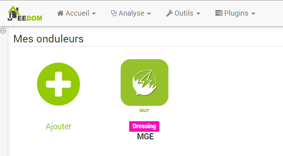

Ce plugin permet de récuperer les informations en provenance d’un
serveur NUT (Network UPS Tools)

== Plugin configuration

Après téléchargement du plugin, il suffit juste de l’activer et ensuite
de cliquer sur "Installer/Mettre à jour"

Equipment configuration
=============================

La configuration des équipements NUT est accessible à partir du menu
plugin :

Voilà à quoi ressemble la page du plugin NUT (ici avec déjà 1
équipement) :

> **Tip**
>
> Comme dans beaucoup d’endroits sur Jeedom, placer la souris tout à
> gauche permet de faire apparaître un menu d’accès rapide (vous pouvez,
> à partir de votre profil, le laisser toujours visible).

Once you click on one of them, you get:

You can find here the full configuration of your device :

-   **Nom de l’équipement Onduleur** : nom de votre équipement NUT,

-   **Parent Object** : means the parent object the equipment depend
    equipment,

-   **Enable**: to make your equipment active,

-   **Visible**: makes your equipment visible on the dashboard,

-   **Catégorie** : catégorie de votre équipement NUT

-   **Adresse IP NUT** : L’adresse IP du serveur NUT

-   **Nom d’utilisateur** : nom d’utilisateur du serveur NUT (laisser
    vide si il n’y en a pas)

-   **Mot de passe** : Mot de passe du serveur NUT (laisser vide si il
    n’y en a pas)

-   **ID de l’ups** : ID de l’UPS

> **Note**
>
> Un serveur NUT peut gérer plusieurs UPS, c’est alors l’ID de l’UPS qui
> permet d’indiquer à Jeedom à quel UPS l’équipement fait réference

> **Tip**
>
> Si vous ne connaissez pas l’ID de votre/vos UPS laissez le champs vide
> puis enregistrez l’équipement, Jeedom va automatiquement remplir le
> champs ID de l’UPS et créer autant d’équipement que vous avez d’UPS
> sur votre serveur NUT.

Below you will find the list of commands:

-   **Nom** : le nom affiché sur le dashboard,

-   **Afficher** : permet d’afficher la donnée sur le dashboard

-   **Tester** : permet de tester la commande,

> **Important**
>
> Les commandes créées peuvent être différentes en fonction des
> installations, cela dépend de ce que renvoi le serveur NUT

> **Tip**
>
> Si votre serveur NUT est sur un NAS Synology, le nom utilisateur est
> 'monuser', le mot de passe 'secret' et l’ID 'ups'. Bien qu’en laissant
> la zone vide le plugin la rempli dans la plupart des cas.
