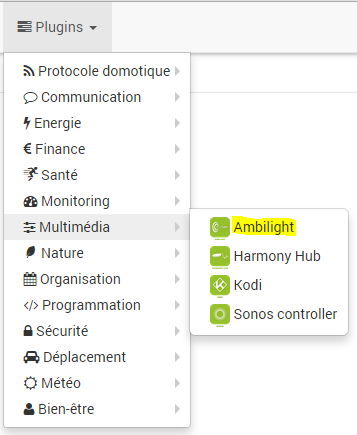
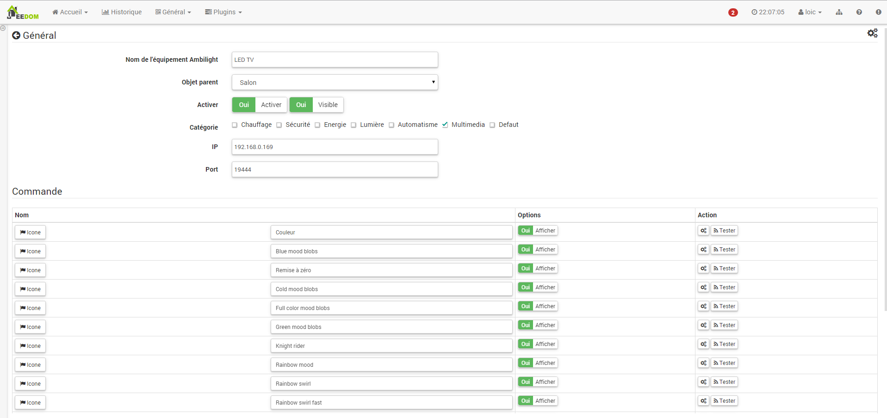

Ce plugin permet la gestion d’un serveur hyperion (il faut que le
serveur Json soit actif), avec la gestion des couleurs et le lancement
d’effet

== Plugin configuration

After downloading the plugin, you just have to activate it,
there is no configuration at this level.

Equipment configuration
=============================

La configuration des équipements Ambilight est accessible à partir du
menu Plugins :

Voilà à quoi ressemble la page du plugin Ambilight (ici avec déjà 1
équipement) :

> **Tip**
>
> Comme à beaucoup d’endroits sur Jeedom, placer la souris tout à gauche
> permet de faire apparaître un menu d’accès rapide (vous pouvez, à
> partir de votre profil, le laisser toujours visible).

Once you click on one of them, you get:

You can find here the full configuration of your device :

-   **Nom de l’équipement Ambilight** : nom de votre équipement
    Ambilight,

-   **Parent Object** : means the parent object the equipment depend
    equipment,

-   **Enable**: to make your equipment active,

-   **Visible**: makes your equipment visible on the dashboard,

-   **IP** : L’IP du serveur hyperion

-   **Port** : le port du serveur hyperion json (par défaut 19444)

En dessous vous retrouvez la liste des commandes :

-   **Nom** : le nom affiché sur le dashboard,

-   **Afficher** : permet d’afficher la donnée sur le dashboard

-   **Tester** : permet de tester la commande,

