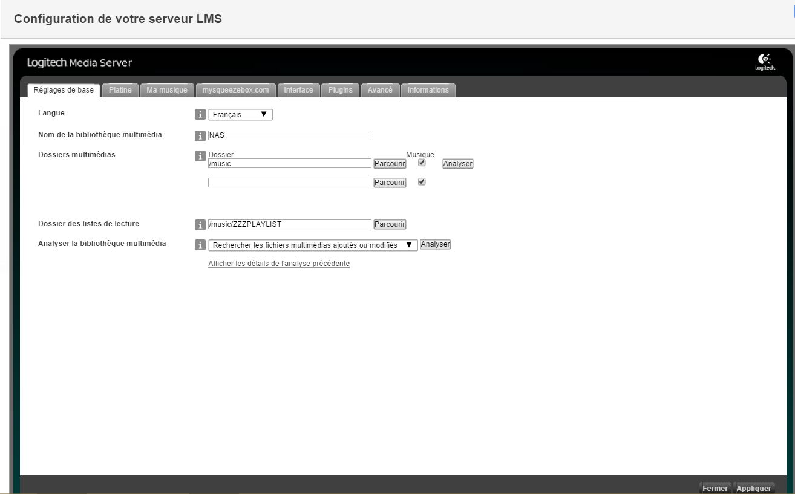
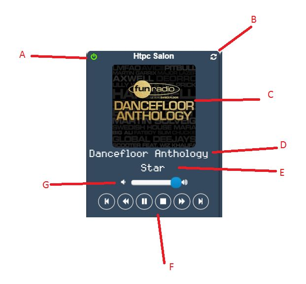
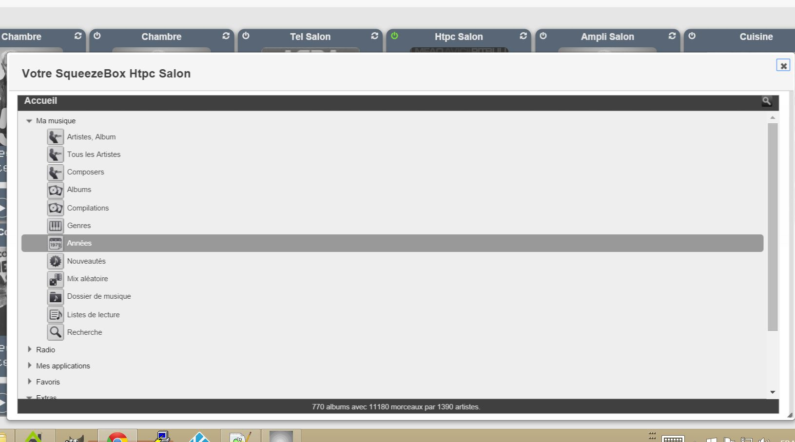
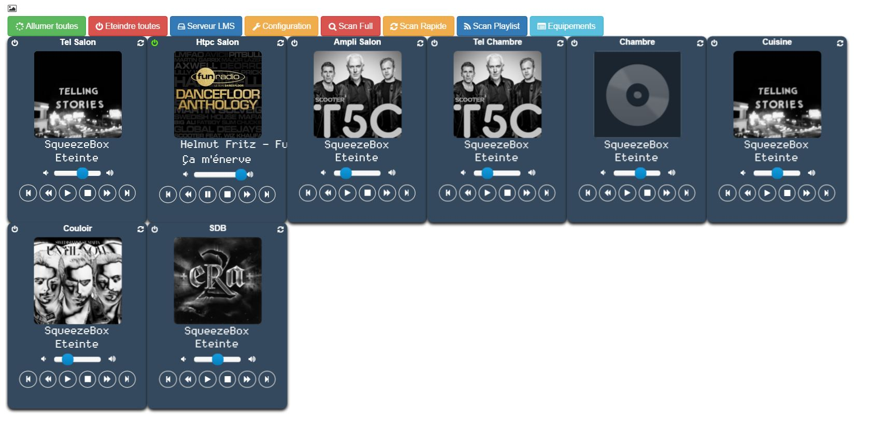

# SqueezeBox Control plugin 

This plugin allows you to control your entire SqueezeBox environment

This plugin allows you to scan all your SqueezeBoxes, to assign them to the right part if possible. And to be able to control them, synchronize them, make them speak, etc.

# Setup 

Like any Jeedom plugin, you must download the plugin from the market and then activate it. After that begins the configuration step.

**Atttention particulière pour les utilisateurs de LMS sur SYNOLOGY**

If you use LMS on your Nas Synology, you should know that the version offered by synology is old. But there is a repository to benefit from the latest LMS version 7.9. I strongly advise you to install this version on your NAS, which fixes many bugs.

[VERSION 7.9 for Synology](http://forums.slimdevices.com/showthread.php?103636-Test-Repo-for-LMS-7-9-0-on-Synology-DSM-5-*)

**Atttention particulière aux utilisateurs du plugin SqueezeBox (le deuxième) du market*

In order to avoid any risk of conflict if you use the other SqueezeBox plugin, I strongly advise you to deactivate it and uninstall the extension in the LMS server.

## Installation and configuration of the LMS plugin

In order to benefit from a good synchronization between Jeedom and your SqueezeBox server, it is necessary to install and configure a plugin on the SqueezeBox server. To do this, you just need to add the repository which is given on the plugin page like this :

Click on parameter :

Then on the Plugins tab, at the bottom fill in the repository provided by Jeedom and apply:

You can then install the JeedomSBcontrol plugin, the server will ask you to restart it will have to be done. After restarting, you must configure the JeedomSBcontrol plugin by clicking on parameters. You must enter the Jeedom IP address as well as the API key. If you need to use / jeedom this is also the place to enter it.

Once the parameters have been entered, you must restart the LMS server one last time (be careful if you change the parameters, you must restart the LMS server for the changes to take effect

## Installation and configuration of the Jeedom plugin. 

The configuration of the Jeedom plugin is rather simple.

You just need to enter the IP address of your LMS server. If you have a port different from port 9000 you can also enter it in the Port field. And finally if you have protected LMS with a password you can also enter it. In 90% of cases only the IP address is necessary.

Once done, just SAVE. Once the backup is done, you can click on LAUNCH to launch the self-discovery of your SqueezeBoxes.

When the scan is finished you should see the version of your LMS server as well as the number of SB detected.

To observe the result, simply go to PLugons / Multimedia / SqueezeBox Control:

You will arrive on the following page :

You will see that your squeezeboxes have appeared and that those that could have been assigned to an object are.

On this page in addition to your equipment you can see three options at the top :

- **Panel** : allows you to access the specific SqueezeBox Control panel also available here :

- **Setup** : allows you to access the server configuration
LMS directly

- **Server** : allows you to access your LMS server directly

# The equipments 

When you click on an item of equipment, you arrive on its page :

You will find on this page all the info of your SqueezeBox, as well as all the commands and some options (others will come) :

- **No volume :** allows you to adjust the step of a Volume + or Volume action-
- **Atuto On/Off sur synchro :** if this option is activated if a sync is done on this squeezebox, it will turn on and off when out of sync.
- **Jingle Pre TTS :** allows to define if before a speech synthesis there will be a jingle of the dingdong type.
- **Engine :** allows you to choose the speech synthesis engine (picotts, google, voxygen). A scenario command allows you to change it on the fly.
- **Tts options :** allows to choose the voice or the language of the text-to-speech according to the chosen engine. A scenario command allows you to change it on the fly.

# The dashboard 

If you display your squeezebox on the dashboard this is what you will get :

- **At :** Allows both to control the switching on and off of your SqueezeBox and to know at a glance if it is switched on
- **B :** Allows you to synchronize your SqueezeBox to another, to all others, from another or to desynchronize it (see the synchronization section for more details)
- **VS :** Allows you to see the cover of the current reading (will be in color or in Black and White depending on the state of the SqueezeBox). A click on the jacket also allows direct access to its media library :

- **D :** Displays the artist and the current album (this scroll text beyond a certain length)
- **E :** Displays the title of the current reading (this text scroll beyond a certain length)
- **F :** Control panel with basic functions (Back, Fast rewind, Play / Pause, Stop, Fast forward, Next)
- **G :** Volume control panel (slider and two Vol- and Vol + buttons)

# Dashboard synchronization panel

When you click on the synchronization button a window opens :

On this window you can see the current synchronization status of your squeezebox. Here are the available options :

- **Sync from :** allows you to synchronize this squeezebox from the squeezebox chosen in the drop-down menu
- **Synchronize to :** allows you to synchronize this squeezebox to the squeezebox chosen in the drop-down menu
- **Synchronize to all :** allows you to synchronize this squeezebox to all your squeezeboxs
- **Désynchroniser :** only visible if the squeezebox is in sync, and this action allows to desynchronize it.

# Pannel SqueezeBox Control

This panel allows you to have an overview of all your squeezeboxes :

You can indeed filter your SqueezeBox by objects with the hidden menu on the left. At a glance you can see the squeezeboxes on, off, in sync. Obviously all the actions available on the dashboard are also available here.

However, other options are available at the top :

- **Light up toutes :** turns on all squeezeboxes
- **Turn off toutes :** turns off all squeezeboxes
- **Server LMS :** allows direct access to your LMS server
- **Setup :** allows direct access to the configuration of your LMS server
- **Full scan :** allows you to trigger a complete scan of your media library on the LMS server
- **Quick Scan :** allows you to trigger a quick scan of your media library on the LMS server
- **Scan Playlist :** allows you to trigger a scan of your playlists on the LMS server
- **Devices :** allows you to go directly to the general page of your equipment

# Orders available via scenario

Many commands are available via scenarios (others will come). Here is the complete list :

- **Album :** info command containing the current album
- **Light up :** turns on the squeezebox
- **Light up tous :** turns on all squeezeboxes
- **Artist :** info command containing the artist in progress
- **Advanced :** Fast forward
- **Désynchroniser :** allows you to desynchronize the squeezebox
- **State :** Know the state of the squeezebox
- **Turn off :** turns off the squeezebox
- **Turn off tous :** turns off all squeezeboxes **Play Album :** command message allowing to play the album passed in parameter (message) (current alpha function works but may not give the desired result)
- **Play Artist :** command message allowing to play the artist passed in parameter (message) (current alpha function works but may not give the desired result)
- **Play Genre :** message command allowing to play the genre passed in parameter (message) (current alpha function works but may not give the desired result)
- **Play Playlist :** command message allowing to play the playlist passed in parameter (message) (current alpha function works but may not give the desired result)
- **Play Piece :** command message allowing to play the song passed in parameter (message) (current alpha function works but may not give the desired result) Will also give the songs that contain the word
- **Play Favorites :** command message allowing to play the favorites corresponding to what is passed in parameter (message) (this function is based on the indexes and can take several indexes separated by; . We can also define a range with - .  Example : 0.0-0.2; 2 will play a favorite with index 2 or something between 0.0 and 0.2 included. LMS indexes are based on a directory architecture and are explained in the LMS doc)
- **Play Favorites by Name :** command message allowing to play the favorites corresponding to what is passed in parameter (message) (based on the names it takes in parameter a single name and will add all the corresponding favorites. Example : radio will return all favorites that contain radio or are in a directory that contains radio another example : radio / will necessarily give favorites which are in a favorites directory which is called radio. This command is not case sensitive)
- **Play Url :** command message allowing to play a url passed in parameter
- **Play :** command to play the squeezebox
- **Mute :** command to mute the squeezebox
- **Not mute :** command to restore the sound of the squeezebox
- **Speak :** message command to make the squeezebox speak
- **Speak full options :** message command to make the squeezebox speak. The message will be the text, the title may contain several options 

- multi : allows to speak on several squeezebox at the same time : multi = toilet; bedroom will make the squeezebox that initiates the command speak as well as toilet and bedroom
- Volume : allows to define the volume to be used for the TTS : volume=70
- voice : only for TTSwebserver, allows to choose the voice at random from a list or among all (except pico) : Example : voice = all or voice = melodine; sorciere
- jingle : allows you to choose a jingle to play before (or to choose from a list) example : jingle = cuckoo or jingle = cuckoo; be careful
- playurl : allows to continue by reading an url after the tts (example playurl = XXXXXXXXXX)
- playfavoris : ditto with an index favorite (see favorites command)
- playfavorisname : idem but with the functions of the favorites command name
- playalbum : ditto with the name of an album or part of the name)
- playartist : ditto with the name of an artist (or part of the name)
- playgender : ditto with the name of a genus
- playsong : ditto with the name of a song (or part of the name)
- playplaylist : ditto with the name of a playlist
- playstop : with playstop = 1 this will stop the squeezeboxes after tts (otherwise they will resume their initial state)
- playoff : with playoff = 1 this will stop the squeezeboxes after tts (otherwise they will resume their initial state)

- **Configure TTS :** very interesting option allowing in a scenario to change the setting of the TTS engine on the fly (see section The TTS in scenario)
- **Pause :** command to pause the squeezebox
- **Previous :** order previous song
- **Back off :** fast return command
- **Scan Fast :** command to trigger a quick scan of your media library on the LMS server (ideal for scheduling regular scans)
- **Full scan :** command to trigger a complete scan of your media library on the LMS server (ideal for scheduling regular scans)
- **Scan Playlist :** command to trigger a scan of your playlists on the LMS server (ideal for scheduling regular scans)
- **STOP :** command to stop the squeezebox (not turn it off)
- **Next :** next song command
- **Sync with :** info command allowing to know with whom the squeezebox is synchronized
- **Sync since :** message command allowing to synchronize the squeezebox from the squeezebox passed in parameter (message) The value can either be the mac address of the squeezebox or the exact name it has in Jeedom
- **Sync to :** message command allowing to synchronize the squeezebox to the squeezebox passed in parameter (message) The value can either be the mac address of the squeezebox or the exact name it has in Jeedom
- **Sync to all :** command to synchronize the squeezebox to all your squeezeboxes
- **Current title :** info command containing the current title
- **Volume :** control to adjust the volume
- **Volume Status :** info command with current volume
- **Volume + :** volume control
- **Volume- :** control to lower the volume

# TTS in scenario 

The tts in scenario is simple. You can make your squeezebox speak according to the predefined parameters on the equipment. But you can also in your scenarios come and change the parameters to make notifications with different voices or engines depending on the announcement to be made:

To do this, use the "Configure TTS" function". It allows to define the engine and the voice before launching the synthesis, examples :

The possible options for the engine are (be careful, respect lower case capital letters)

+ ------------------ + ------------------------------ --------------------------- +
| Engine           | Possible options                                       |
+ ================== + =============================== ============================ +
| **picottts**     | fr-FR, de-DE, en-US, en-GB, es-ES, it-IT                |
+ ------------------ + ------------------------------ --------------------------- +
| **google**       | fr, af, sq, ar, hy, ca, zh-CN, zh-TW, hr, cs, da, nl,   |
|                  | en, en-us, en-au, eo, fi, de, el, ht, hi, hu, is, id,   |
|                  | it, ja, ko, la, lv, mk, no, pl, pt, ro, ru, sr, sk, es, |
|                  | sw, sv, ta, th, tr, vi, cy                              |
+ ------------------ + ------------------------------ --------------------------- +
| **voxygen**      | Agnes, Bicool, Hush, Damien, DarkVadoor, Electra, Emma, |
|                  | Eva, Fabienne, Guy, Helene, JeanJean, John, Loic,       |
|                  | Ludovic, Matteo, Melodine, Michel, Papi, Philippe,      |
|                  | Ramboo, Robot, Sidoo, Witch, Yeti, Zozo, Adel,       |
|                  | Matthias, Sylvia, Bibi, Bronwen, Elizabeth, Paul,       |
|                  | Amanda, Phil, Marta, Pedro, Sonia                       |
+ ------------------ + ------------------------------ --------------------------- +

If the motor entered is invalid nothing will be changed. If the option is invalid by default, the first in the list will be assigned

# Example scenario

