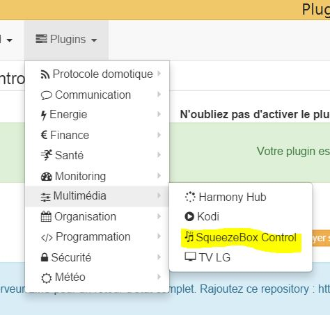
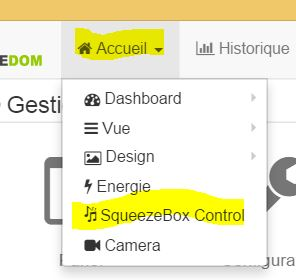
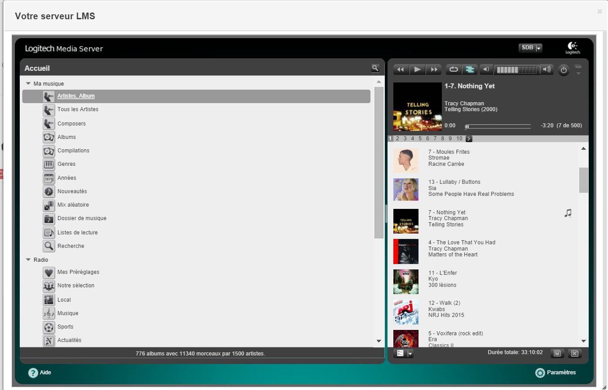

SqueezeBox Control 
==================

Description
-----------

Ce plugin permet de contrôler tout votre environnement SqueezeBox

 \

 \

Ce plugin permet de scanner toutes vos SqueezeBox, de les attribuer à la
bonne pièce si cela est faisable. Et de pouvoir les contrôler, les
synchroniser, les faire parler etc…​.

 \

Configuration
-------------

 \

Comme tout plugin Jeedom, il faut télécharger le plugin depuis le market
puis l’activer. Suite à cela commence l’étape de configuration.

 \

### Attention particulière pour les utilisateurs de LMS sur SYNOLOGY 

 \

Si vous utilisez LMS sur votre Nas Synology, il faut savoir que la
version proposée par synology est vieille. Mais il existe un repository
pour bénéficier de la dernière version LMS la 7.9. Je vous conseille
fortement d’installer cette version sur votre NAS, qui corrige de
nombreux bugs.

[VERSION 7.9 pour
Synology](http://forums.slimdevices.com/showthread.php?103636-Test-Repo-for-LMS-7-9-0-on-Synology-DSM-5-*)

 \

### Attention particulière aux utilisateurs du plugin SqueezeBox (le deuxième) du market 

 \

Afin d’éviter tout risques de conflit si vous utilisez l’autre plugin
SqueezeBox, je vous conseille très fortement de le désactiver et de
désinstaller l’extension dans le serveur LMS.

 \

### Installation et configuration du plugin LMS 

 \

Afin de bénéficier d’une bonne synchronisation entre Jeedom et votre
serveur SqueezeBox, il est nécessaire d’installer et configurer un
plugin sur le serveur SqueezeBox. Pour ce faire, il vous suffit de
rajouter le repository qui est donné sur la page du plugin comme cela :

 \

Cliquez sur paramètre :

 \

 \

Ensuite sur l’onglet Plugins, tout en bas renseigner le repository
fournit par Jeedom et appliquer:

 \

 \

Vous pouvez ensuite installer le plugin JeedomSBcontrol, le serveur va
vous demander de redémarrer il faudra le faire. Après le redémarrage il
faut paramétrer le plugin JeedomSBcontrol en cliquant sur paramètres.
Vous devez renseigner l’adresse IP de Jeedom ainsi que la clé API. Si
vous avez besoin d’utiliser /jeedom c’est ici aussi qu’il faut le
renseigner.

Une fois les paramètres renseignés il faut redémarrer une dernière fois
le serveur LMS (attention si vous changez les paramètres il faut
redémarrer le serveur LMS pour que les changements soient pris en compte

 \

### Installation et configuration du plugin Jeedom. 

 \

La configuration du plugin Jeedom est plutôt simple.

 \

 \

Il vous suffit juste de renseigner l’adresse IP de votre serveur LMS. Si
vous avez un port différent du port 9000 vous pouvez le renseigner aussi
dans le champ Port. Et enfin si vous avez protégé LMS par un mote de
passe vous pouvez aussi le renseigner. Dans 90% des cas seul l’adresse
IP est nécessaire.

Une fois fait, il vous suffit de SAUVEGARDER. Une fois la sauvegarde
faite, vous pouvez cliquer sur LANCER pour lancer l’autodécouverte de
vos SqueezeBoxs.

Lorsque le scan sera finis vous devriez voir la version de votre serveur
LMS ainsi que le nombre de SB détectée.

Pour observer le résultat il vous suffit de vous rendre dans
PLugons/Multimédia/SqueezeBox Control:

 \

 \

Vous arriverez sur la page suivante :

 \

 \

Vous pourrez constater que vos squeezebox sont apparues et que celles
qui ont pu être attribuées à un objet le sont.

Sur cette page en plus de vos équipements vous pouvez voir trois options
en haut :

**Panel :** vous permet d’accéder au panel spécifique SqueezeBox Control
aussi disponible ici :

 \

 \

**Configuration :** vous permet d’accéder à la configuration du serveur
LMS directement

 \

 \

**Serveur :** vous permet d’accéder à votre serveur LMS directement

 \

 \

Les équipements 
---------------

Lorsque vous cliquez sur un équipement vous arrivez sur la page de
celui-ci :

 \

 \

Vous retrouverez sur cette page toutes les infos de votre SqueezeBox,
ainsi que toutes les commandes et quelques options (d’autres viendront)
:

**Pas du volume :** vous permet de régler le pas d’une action Volume+ ou
Volume-

**Auto On/Off sur synchro :** si cette option est activée si une synchro
est faite sur cette squeezebox, elle s’allumera et s’éteindra à la
désynchro.

**Jingle Pre TTS :** permet de definir si avant une synthèse vocale il y
aura un jingle du type dingdong.

**Moteur :** permet de choisir le moteur de synthèse vocale (picotts,
google, voxygen). Une commande scénario permet de le changer à la volée.

**Options tts :** permet de choisir la voix ou la langue de la synthèse
vocale en fonction du moteur choisi. Une commande scénario permet de le
changer à la volée.

 \

Le dashboard 
------------

Si vous affichez votre squeezebox sur le dashboard voilà ce que vous
obtiendrez :

 \

 \

**A :** Permet à la fois de controller l’allumage et l’extinction de
votre SqueezeBox et de savoir en un coup d’oeil si elle est allumée

**B :** Permet de synchroniser votre SqueezeBox vers une autre, vers
toutes les autres, depuis une autre ou de la désynchroniser (voir la
partie synchronisation pour plus de détails

**C :** Permet de voir la jaquette de la lecture en cours (sera en
couleur ou en Noir et Blanc en fonction de l’état de la SqueezeBox). Un
clique sur la jaquette permet aussi d’accéder à sa médiathèque
directement :

 \

 \

**D :** Affiche l’artiste et l’album en cours ( ce texte scroll au dela
d’une certaine longueur)

**E :** Affiche le titre de la lecture en cours ( ce texte scroll au
dela d’une certaine longueur)

**F :** Panneau de commande avec les fonctions de base (Précédent,Retour
rapide, Lecture/Pause, Stop, Avance rapide, Suivant)

**G :** Panneau de contrôle du volume (slider et deux boutons Vol- et
Vol+)

 \

Panneau de synchronisation du dashboard : 
-----------------------------------------

Lorsque vous cliquez sur le bouton de synchronisation une fenêtre
s’ouvre :

 \

 \

Sur cette fenêtre vous pouvez voir l’état actuel de synchronisation de
votre squeezebox. Voici les options disponibles :

 \

**Synchroniser depuis :** permet de synchroniser cette squeezebox depuis
la squeezebox choisie dans le menu déroulant

**Synchroniser vers :** permet de synchroniser cette squeezebox vers la
squeezebox choisie dans le menu déroulant

**Synchroniser vers toutes :** permet de synchroniser cette squeezebox
vers toutes vos squeezeboxs

**Désynchroniser :** uniquement visible si la squeezebox est en synchro,
et cette action permet de lé désynchroniser.

 \

Pannel SqueezeBox Control : 
---------------------------

Ce panel vous permet d’avoir une vue d’ensemble de toutes vos
squeezeboxs :

 \

 \

Vous pouvez en effet filtrer vos SqueezeBox par objets avec le menu
masqué sur la gauche. En un coup d’oeil vous pouvez voir les squeezebox
allumées, éteintes, en synchro. Bien évidemment toutes les actions
disponibles sur le dashboard sont aussi disponibles ici.

Cependant d’autres options sont disponibles en haut :

 \

**Allumer toutes :** permet d’allumer toutes les squeezeboxs

**Eteindre toutes :** permet d’éteindre toutes les squeezeboxs

**Serveur LMS :** permet d’accéder directement à votre serveur LMS

**Configuration :** permet d’accéder directement à la configuration de
votre serveur LMS

**Scan Full :** permet de déclencher un scan complet de votre
médiathèque sur le serveur LMS

**Scan Rapide :** permet de déclencher un scan rapide de votre
médiathèque sur le serveur LMS

**Scan Playlist :** permet de déclencher un scan de vos playlists sur le
serveur LMS

**Equipements :** permet d’aller directement sur la page générale de vos
équipements

 \

Commandes disponibles via scénario : 
------------------------------------

 \

De nombreuses commandes sont disponibles via scénarios (d’autres
viendront). Voici la liste complète :

 \

**Album :** commande info contenant l’album en cours

**Allumer :** permet d’allumer la squeezebox

**Allumer tous :** permet d’allumer toutes les squeezebox

**Artiste :** commande info contenant l’artiste en cours

**Avance :** avance rapide

**Désynchroniser :** permet de désynchroniser la squeezebox

**Etat :** Connaitre l’état de la squeezebox

**Eteindre :** permet d’éteindre la squeezebox

**Eteindre tous :** permet d’éteindre toutes les squeezebox

**Jouer Album :** commande message permettant de jouer l’album passé en
paramètre (message) (fonction alpha en cours fonctionne mais peut ne pas
donner le résultat voulu)

**Jouer Artiste :** commande message permettant de jouer l’artiste passé
en paramètre (message) (fonction alpha en cours fonctionne mais peut ne
pas donner le résultat voulu)

**Jouer Genre :** commande message permettant de jouer le genre passé en
paramètre (message) (fonction alpha en cours fonctionne mais peut ne pas
donner le résultat voulu)

**Jouer Playlist :** commande message permettant de jouer la playlist
passée en paramètre (message) (fonction alpha en cours fonctionne mais
peut ne pas donner le résultat voulu)

**Jouer Morceau :** commande message permettant de jouer le morceau
passée en paramètre (message) (fonction alpha en cours fonctionne mais
peut ne pas donner le résultat voulu) Donnera aussi les morceaux qui contiennent le mot

**Jouer Favoris :** commande message permettant de jouer les favoris correspondant
à ce qui est passé en paramètre (message) (cette fonction se base sur les indexs et peut prendre plusieurs index séparés par des ; . On peut aussi définir un range avec - . 
Exemple : 0.0-0.2;2  jouera un favoris qui a pour index 2 ou quelquechose entre 0.0 et 0.2 inclus. Les indexs de LMS sont basés sur une architecture de répertoire et sont expliqués sur la doc LMS)

**Jouer Favoris par nom :** commande message permettant de jouer les favoris correspondant
à ce qui est passé en paramètre (message) (basés sur les noms elle prend en paramètre un seul nom et ajoutera tous les favoris correspondant. exemple : radio retournera tous les favoris qui contiennent radio ou sont dans un répertoire qui contien radio
autre exemple : radio/ donnera forcément des favoris qui sont dans un répertoire favoris qui se nomme radio. Cette commande n'est pas sensible à la casse)

**Jouer Url :** commande message permettant de jouer une url passée en
paramètre

**Lecture :** commande permettant de mettre en lecture la squeezebox

**Muet :** commande permettant de couper le son de la squeezebox

**Non Muet :** commande permettant de remettre le son de la squeezebox

**Parle :** commande message permettant de faire parler la squeezebox

**Parle full options :** commande message permettant de faire parler la squeezebox. Le message sera le texte le titre lui peut contenir plusieurs options 

- multi : permet de faire parler sur plusieurs squeezebox à la fois : multi=toilettes;chambre fera parler la squeezebox qui initie la commande ainsi que toilettes et chambre
- volume : permet de définir le volume à utiliser pour le TTS : volume=70
- voice : seulement pour TTSwebserver, permet de faire choisir la voix au hasard parmis une liste ou parmi toutes (sauf pico) : exemple : voice=all  ou voice=melodine;sorciere
- jingle : permet de choisir un jingle à jouer avant (ou à choisir parmi une liste) exemple : jingle=coucou  ou jingle=coucou;attention
- playurl : permet d'enchainer par la lecture d'une url apres le tts (exemple playurl=XXXXXXXXXX)
- playfavoris : idem avec un favoris en index (cf commande favoris)
- playfavorisname : idem mais avec les fonctions de la commande favoris nom
- playalbum : idem avec le nom d'un album ou un bout du nom)
- playartist : idem avec le nom d'un artiste (ou un bout du nom)
- playgenre : idem avec le nom d'un genre
- playsong : idem avec le nom d'un morceau (ou un bout du nom)
- playplaylist : idem avec le nom d'une playlist
- playstop : avec playstop=1 cela stoppera les squeezebox apres le tts (sinon elles reprennent leur etat initiale)
- playoff : avec playoff=1 cela arretera les squeezebox apres le tts (sinon elles reprennent leur etat initiale)

**Paramétrer TTS :** option très intéressante permettant dans un
scénario de changer le réglage du moteur TTS à la volée (voir section Le
TTS en scénario)

**Pause :** commande permettant de mettre en pause la squeezebox

**Précédent :** commande chanson précédente

**Recule :** commande retour rapide

**Scan Fast :** commande permettant de déclencher un scan rapide de
votre médiathèque sur le serveur LMS (idéal pour programmer des scans
réguliers)

**Scan Full :** commande permettant de déclencher un scan complet de
votre médiathèque sur le serveur LMS (idéal pour programmer des scans
réguliers)

**Scan Playlist :** commande permettant de déclencher un scan de vos
playlists sur le serveur LMS (idéal pour programmer des scans réguliers)

**Stop :** commande permettant de mettre en stop la squeezebox (pas
l’éteindre)

**Suivant :** commande chanson suivante

**Synchro avec :** commande info permettant de savoir avec qui est
synchonisée la squeezebox

**Synchro depuis :** commande message permettant de synchroniser la
squeezebox depuis la squeezebox passé en paramètre (message) La valeur
peut soit être l’adresse mac de la squeezebox soit le nom exact qu’elle
a dans Jeedom

**Synchro vers :** commande message permettant de synchroniser la
squeezebox vers la squeezebox passé en paramètre (message) La valeur
peut soit être l’adresse mac de la squeezebox soit le nom exact qu’elle
a dans Jeedom

**Synchro vers tous :** commadne permettant de synchroniser la
squeezebox vers toutes vos squeezebox

**Titre en cours :** commande info contenant le titre en cours

**Volume :** commande permettant de regler le volume

**Volume Status :** commande info avec le volume actuel

**Volume+ :** commande permettant de monter le volume

**Volume- :** commande permettant de baisser le volume

 \

Le TTS en scénario 
------------------

Le tts en scénario est simple. Vous pouvez faire parler votre squeezebox
en fonction des paramètres prédéfinis sur l’équipement. Mais vous pouvez
aussi dans vos scénarios venir changer les paramètres pour faire des
notifications avec des voix ou moteur différents en fonction de
l’annonce à faire:

Pour cela il faut utiliser la fonction "Paramétrer TTS". Elle permet de
définir le moteur et la voix avant de lancer la synthèse , exemples :

Les options possibles pour le moteur sont (attention respectez les
majuscules minuscules)

+------------------+---------------------------------------------------------+
| Moteur           | Options possibles                                       |
+==================+=========================================================+
| **picottts**     | fr-FR, de-DE, en-US, en-GB, es-ES, it-IT                |
+------------------+---------------------------------------------------------+
| **google**       | fr, af, sq, ar, hy, ca, zh-CN, zh-TW, hr, cs, da, nl,   |
|                  | en, en-us, en-au, eo, fi, de, el, ht, hi, hu, is, id,   |
|                  | it, ja, ko, la, lv, mk, no, pl, pt, ro, ru, sr, sk, es, |
|                  | sw, sv, ta, th, tr, vi, cy                              |
+------------------+---------------------------------------------------------+
| **voxygen**      | Agnes, Bicool, Chut, Damien, DarkVadoor, Electra, Emma, |
|                  | Eva, Fabienne, Guy, Helene, JeanJean, John, Loic,       |
|                  | Ludovic, Matteo, Melodine, Michel, Papi, Philippe,      |
|                  | Ramboo, Robot, Sidoo, Sorciere, Yeti, Zozo, Adel,       |
|                  | Matthias, Sylvia, Bibi, Bronwen, Elizabeth, Paul,       |
|                  | Amanda, Phil, Marta, Pedro, Sonia                       |
+------------------+---------------------------------------------------------+

Si le moteur saisit est invalide rien ne sera changé. Si l’option est
invalide par défaut sera attribué le premier de la liste

Exemple de scénario : 
---------------------

 \

 \

