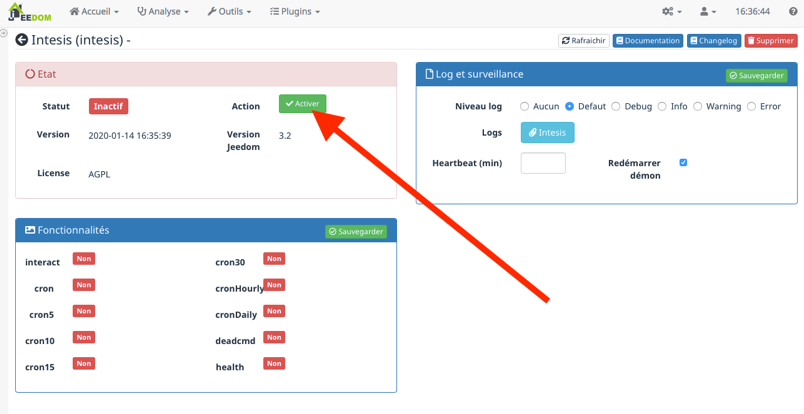
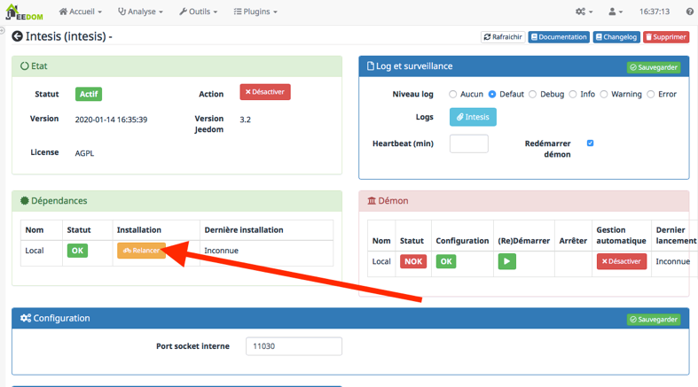
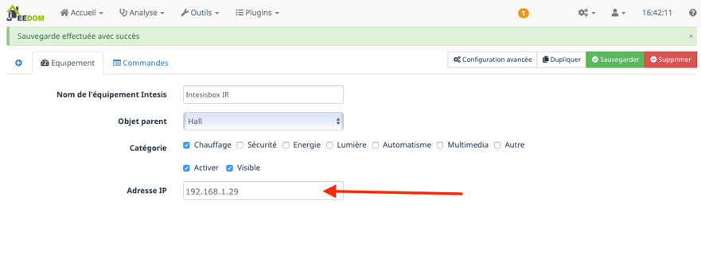
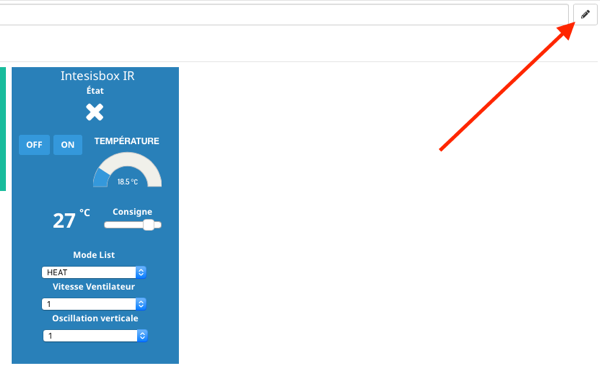

# Intesis 

Plugin to control **les passerelles « Intesis Wifi (ASCII) AC Interfaces » (anciennement dénommées Intesisbox).**  based on the WMP protocol.

Les passerelles « Intesis Wifi (ASCII) AC Interfaces » sont des box qui permettent de domotiser des systèmes de climatisation gainables (interface Intesis à connecter en filaire sur le bus du climatisateur) ou à split avec télécommande infrarouge (interface Intesis IR).

This plugin supports all models of Intesis Wifi (ASCII) AC Interfaces (both wired and IR), but **is not compatible with IntesisHome gateways** (and in particular not with Intesis gateways from the IntesisHome range).

Intesis Wifi (ASCII) AC Interfaces gateways are [available for sale here.](https://www.domadoo.fr/fr/323_intesis-unites-ac-domestiques-daikin-vers-une-interface-wi-fi-rac)

# Plugin configuration 

After downloading the plugin, you must first activate it, as  any Jeedom plugin :

Then, it is strongly advised to start the installation of the dependencies (even if they appear OK) :

Finally, start the demon :

Finally, you have to check that everything is green and OK :

There is nothing else to do.

Rien n'est à modifier dans le champ « Port socket interne » de la section « Configuration ».

# How to declare a new intesis Wifi interface in Jeedom

Rendez-vous dans le menu « Plugins / Protocole domotique / Intesis » :

You arrive on the next page, which consists of two sections :

- « Gestion », avec les options suivantes : « Ajouter » et « Configuration » (cette option vous renvoie à la page de configuration du plugin, décrite au point précédent).
- « My Intesis » : This is where the Intesis wifi gateways managed by Jeedom are displayed.

Vous devez donc cliquer sur l'option « Ajouter » et renseigner le nom de l'équipement (Climatisation Salon, par exemple) :

Vous devez ensuite compléter les autres champs de la page de configuration du nouvel équipement Intesis, dont l'objet, la catégorie, cocher « Activer » et « Visible », puis vous devez **enter the IP address** your Intesisbox Wifi gateway :

>**Important**
>
>You must make sure that your Intesisbox Wifi gateway has a fixed IP on your local network, otherwise its IP could change in which case Jeedom would no longer be able to control the gateway.

All you have to do is save.

# The orders

Rendez-vous dans l'onglet « Commandes » de la page de configuration du nouvel équipement Intesis.

Ici vous pouvez masquer et rendre visibles les différentes commandes de type « action » et « info » disponibles (les commandes de type « info » peuvent également être historisées) :

The plugin offers a total of 14 commands. 

The orders de type « action » (actionneurs) disponibles sont les suivantes :

- We : To turn on the air conditioner
-	Off : To turn off the air conditioner
- Instructions : To change the air conditioner temperature setpoint
- List mode : To change the operating mode of the air conditioner (Auto, Heat, Dry, Fan, Cool)
- Up-down swing : To modify the oscillation mode of the vertical air flow orientation blades (1, 2, 3 and Swing)
- Left-right swing : To modify the oscillation mode of the horizontal air flow orientation blades (1, 2, 3 and Swing)
- Fan speed : To modify the fan rotation speed (from 1 to 4)

The orders de type « info» (capteurs) disponibles sont les suivantes :

-	State : Air conditioner ON / OFF status feedback
-	Setpoint info : Temperature setpoint status feedback
-	Fashion : Air conditioner operating mode status feedback (Auto, Heat, Dry, Fan, Cool)
-	High-low oscillation info : Status feedback of the oscillation mode of the vertical blades of the air conditioner.
-	Left-right oscillation info : Status feedback of the oscillation mode of the horizontal blades of the air conditioner.
-	Fan speed info : Fan speed status feedback
-	Temperature : Room ambient temperature

You can hide commands that are not useful to you. This may be the case, for example, if your air conditioner does not have air flow orientation blades.

À l'inverse, vous pouvez rendre visibles les commandes de type « info » qui vous sont utiles.

# The Intesis widget

As indicated in point 3) above, the commands that appear on the widget are only those that you have made visible before.

>**Note**
>
>Pour les commandes de type « info », le retour d'état se fait toutes les 5 minutes. So if you use the remote control of the air conditioner to modify the setpoint (or other), Jeedom reflects this state in the Widget within a maximum period of 5 minutes.

As with any Jeedom widget, you can rearrange the commands on the widget using the edit mode (for this, click on the pencil in the top left) :

Some examples of Intesis widgets with different visible commands (on Jeedom V3) :

Example of Intesis widget on Jeedom V4 :

