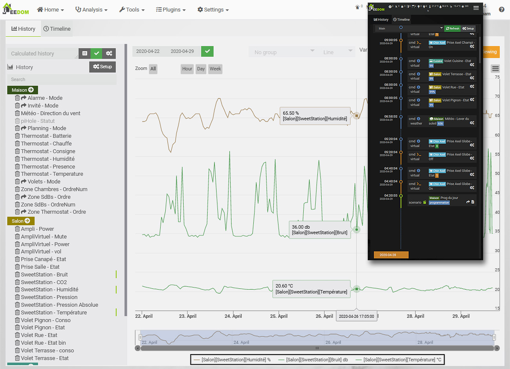
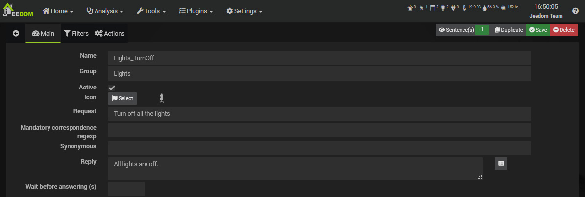

# Presentation

Jeedom is an open-source and *cloudless* home automation solution (without server in the cloud). It works without subscription, which guarantees the functioning of your home automation without internet, as well as the security of your data.. It is also extremely open, multi-protocol, customizable, and highly scalable.

Jeedom offers a core, the Core, embedding the structure and the central functions.

Different [Plugins](https://market.jeedom.com) can then propose new functions.

The Core includes:

## Dashboard / Summary

*Equipment, including actuators or sensors, is organized by objects. Objects can, for example, represent physical parts*.

## Historical

*All the information can be saved (temperature curve, consumption, door openings, etc.), and accessible in Analysis → History or from the Dashboard tiles.*

## Scenarios

*Scenarios allow you to automate all or part of your equipment. They are built with different blocks. Conditional blocks (If Then, Otherwise), actions, programming (IN x minutes or A hhmm), loop, comment, or php code. All blocks are nestable into each other, offering endless possibilities.*

## Interactions

*The interaction system in Jeedom allows you to perform actions from text or voice commands.*

## Update center

*The update center allows you to update all of Jeedom's functionality, including the core software and its Plugins. Other extension management functions are available (delete, reinstall, check, etc.).*

# Market

Around this core are Plugins, which can be of all kinds :

-   Home automation protocol (Z-Wave, RFXcom, EnOcean…),
-   IP protocol (KNX, xPL…),
-   Communicating object (Nest, Netatmo…),
-   High level (alarm, thermostat ...),
-   Interface (widget),
-   Organization (calendar, Google calendar),
-   Development (script).

These Plugins can be installed from the Market and allow you to extend the possibilities of Jeedom.

Jeedom allows any plugin to chat with another on a standardized basis. This allows for example to use the thermostat or alarm Plugins with any home automation protocol or even an IP plugin or communicating object ...

# Links

Several video tutorials have been made to show the important features of Jeedom, facilitate its use and familiarize the user with the software..

However since the realization of these tutorials, the Jeedom interface has been able to evolve and functionalities added. The documentation therefore remains the reference to consult in case of needs, questions, etc..

Here is the list of available tutorials :

-   [Jeedom tutorial 1 : First start](https://www.youtube.com/watch?v=UTECRBGEUtI)
-   [Jeedom 2 tutorial : Getting started with Jeedom (Object, Market, Plugin, Module)](https://www.youtube.com/watch?v=2LU1neNvbus)
-   [Jeedom 3 tutorial : Jeedom, Widgets, Mails and Scenarios](https://www.youtube.com/watch?v=OJn33XbpiH8)
-   [Jeedom 4 tutorial : Jeedom, Using the Agenda plugin](https://www.youtube.com/watch?v=EBuvIabg3Cc)
-   [Jeedom 5 tutorial : Scripts in Jeedom using the Script plugin](https://www.youtube.com/watch?v=FRbQILAogX0)
-   [Jeedom 6 tutorial : Scenarios in Jeedom with the Weather plugin](https://www.youtube.com/watch?v=w0ErP3wyEoA)
-   [Jeedom 7 tutorial : Presentation of the Energy plugin](https://www.youtube.com/watch?v=DZfA_DxqbNs)
-   [Jeedom 8 tutorial : Discovery of Plan Mode](https://www.youtube.com/watch?v=2IkXF6CBCAE)
-   [Jeedom 9 tutorial : DataTransfert plugin, Auto Backups and Dropbox](https://www.youtube.com/watch?v=wLOfJygFc8k)
-   [Jeedom 10 tutorial : Make Jeedom talk (Android)](https://www.youtube.com/watch?v=3Pc3VJFWHo4)
-   [Jeedom 11 tutorial : Discovery window of a standard installation](https://www.youtube.com/watch?v=hW1d1FvkmSs)
-   [Jeedom 12 tutorial : Discovery of the Thermostat plugin](https://www.youtube.com/watch?v=T21gqp1SQK0)
-   [Jeedom 13 tutorial : Discovery of the Alarm plugin](https://www.youtube.com/watch?v=JjnWeU614gc)
-   [Jeedom tutorial 14 : Discovery of Interactions](https://www.youtube.com/watch?v=Z8SHo_Xwk0Q)
