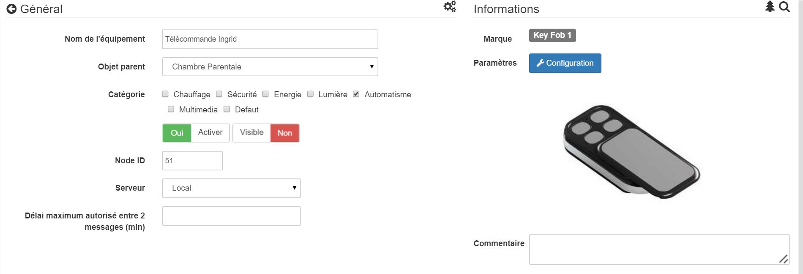

Aeotec Keyfob 
=============

\

-   **The module**

\

\

-   **The Jeedom visual**

\

\

Summary 
------

\

The Aeon Labs keychain remote control with a modern and pleasant design
has 4 buttons to control all types of devices
Z-Wave such as lamps, blinds, etc.

With its very small dimensions, you can easily put it
in your pocket. Easy to use and elegant, it is equipped with a
ring to attach it to keys, which makes it available to
when leaving home or when returning home.

Each button allows you to control two devices or scenes thanks to the
management of short and long presses. This remote control can also be
well used as primary as secondary controller.

\

Functions 
---------

\

-   Key fob remote control

-   Primary or secondary controller

-   Ultra compact and ultra design

-   4 configurable buttons

-   Manages up to 8 devices / scenes

-   Sliding protection flap

-   Ease of use and installation

\

Technical characteristics 
---------------------------

\

-   Type of module : Z-Wave transmitter

-   Food? : 1 Lithium 3V CR2450 battery

-   Battery life : 1 year

-   Frequency: 868.42 MHz

-   Transmission distance : 100m in open field

-   Operating temperature : -10 ° C to 50 ° C

-   Dimensions? : 55 x 30 x 13mm (L x W x H)

\

Module data 
-----------------

\

-   Mark : Aeotec?

-   Name : Key Fob

-   Manufacturer ID : 134

-   Product Type : 1

-   Product ID : 22

\

Setup 
-------------

\

To configure the OpenZwave plugin and know how to put Jeedom in
inclusion refer to this
[Documentation](https://jeedom.fr/doc/documentation/plugins/openzwave/en_US/openzwave.html).

\

> **Important**
>
> To put this module in inclusion mode, press the button
> LEARN, in accordance with its paper Documentation?.

\

\

Once included you should get this :

\

\

### Commands 

\

Once the module has been recognized, the commands associated with the modules will be
disponibles.

\

\

Here is the list of commands :

\

-   Buttons? : it is the command which will push the button up

1 : Button 1 short press

2 : Button 1 long press

3 : Button 2 short presses

4 : Button 2 long presses

5 : Button 3 short presses

6 : Button 3 long presses

7 : Button 4 short presses

8 : Button 4 long presses

\

### Setup? of the module 

\

> **Important**
>
> During a first inclusion always wake up the module just after
> inclusion?.

\

Then if you want to configure the module according to
of your installation, you have to go through the button
"Setup "of Jeedom's OpenZwave plugin.

\

\

You will arrive on this page (after clicking on the tab
Settings)

\

\

Parameter details :

\

-   250: operating mode of the remote control (absolutely
    Scene for remote control)

All other parameters are only useful in case of direct association
between the remote control and modules.

\

### Groups 

\

This module has a single association group. It is
indispensable.

\

\

Good to know 
------------

\

### Specificities 

To use this module as a remote control, proceed as follows :

-   1 : Include remote control

-   2 : Wake up the remote control

-   3 : Change parameter 250 to true (do so even if
    already appears true)

-   4 : Wake up the remote control and make sure the change has been
    taken into account

-   5 : Change the operating mode of the remote control while remaining
    press the two buttons on the back for 3 seconds.

Wakeup 
------

\

To wake up this module there is only one way :

-   press and hold the LEARN button for 3 seconds

\

Faq. 
------

\

This module wakes up by pressing and holding the LEARN button for 3 seconds.

\

This module is a battery module, the new configuration will not be
take into account that if you wake up the remote control.

\

IMPORTANT note 
---------------

\

> **Important**
>
> You have to wake up the module : after its inclusion, after a change
> of the configuration, after a change of wakeup, after a
> change of association groups

\

**@sarakha63**
