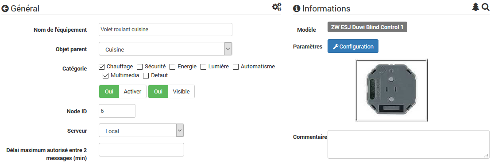

DUWI 05436 "Volet roulant" 
==========================

 \

-   **Le module**

 \

 \

-   **Le visuel Jeedom**

 \

 \

Summary 
------

 \

Le module volet roulant DUWI 05436 permet de contrôler des volets
roulants dans deux directions.

Ses principales caractéristiques sont :

-   La possibilité d'utiliser un 'Commun' sur lequel commuter la montée
    ou la descente. Du coup il est possible de commander les deux
    directions avec n'importe quel type de tension, voire un neutre.

-   La possibilité d'envoyer un signal montée / descente en continu sans
    limite de temps.

Be careful: ce module n'envoie pas son état au contrôleur z-wave lorsque
l'utilisateur appuie directement sur les boutons. Il faut faire un
'Refresh' sur sa position pour mettre à jour, ou régler le Poll (voir
plus loin).

 \

Functions 
---------

 \

-   Montée / descente

-   Un fil commun qui sera commuté sur montée ou descente

-   Nécessite le neutre pour fonctionner

-   Protection par fusible

-   Temps de montée et de descente réglables par paramètrage ou par
    apprentissage sur le module

-   L'interrupteur est fourni avec le module, non interchangeable

 \

Caractéristiques Techniques 
---------------------------

 \

-   Type de module : récepteur / actionneur Z-Wave

-   Alimentation 230V, 50Hz

-   Neutre nécessaire

-   Charge Maxi : 1800W (résistif), 460VA (inductif)

-   Fusible : T8AH

-   Fréquence : 868,42 Mhz

-   Dimensions : 52 x 52 x 31mm

-   Plage de température : 0°C / +40°C

 \

Données du module 
-----------------

 \

-   Marque : Popp/Duwi

-   Name : ZW ESJ Blind Control

-   Fabricant ID : 100

-   Type produit : 16385

-   Produit ID : 0

 \

Connection 
---------

 \

Setup 
-------------

 \

Pour configurer le plugin OpenZwave et savoir comment mettre Jeedom en
inclusion référez-vous à cette
[documentation](https://jeedom.fr/doc/documentation/plugins/openzwave/fr_FR/openzwave.html).

 \

> **IMPORTANT**
>
> Pour mettre le module en mode inclusion, il faut appuyer trois fois
> sur la montée ou la descente. L'exclusion se fait de la même manière.

 \

Une fois inclus vous devriez obtenir ceci :

 \

 \

### Commands 

 \

Une fois le module reconnu, les commandes associées au module seront
available.

 \

 \

Voici la liste des commandes :

 \

-   State : c'est la position actuelle du volet, en pourcentage de 0 à 99

-   Descendre : commande pour descendre complètement

-   Monter : commande pour monter complètement

-   STOP : arrêt immédiat du mouvement

-   Refresh : rafraichîr l'état actuel du module

-   Level : slider pour positionner une ouverture partielle

 \

#### Réglage des temps de montée et de descente : 

Il faut démonter l'interrupteur pour avoir accès aux deux boutons
"montée" et "descente".

Positionnez le volet tout en haut si vous voulez régler le temps de
descente, et inversement.

Appuyez au moins 2s sur les deux boutons (montée et descente)
simultanément. La led doit se mettre à clignoter en vert.

Appuyez ensuite en continu sur le bouton de descente ou de montée,
jusqu'à atteindre la position désirée. Lorsque vous lâchez le bouton, la
led s'allume en vert fixe quelques secondes. Le temps est mémorisé.

Recommencer l'opération dans l'autre sens.

 \

### Setup du module 

 \

Ensuite si vous voulez effectuer la configuration du module en fonction
de votre installation, il faut pour cela passer par la bouton
"Setup" du plugin OpenZwave de Jeedom.

 \

 \

Vous arriverez sur cette page (après avoir cliqué sur l'onglet
paramètres)

 \

 \

Détails des paramètres :

 \

-   0 : Running Time :

Ce sont les temps de montée et descente. Vous devriez y retrouver votre
apprentissage.

Le codage est fait par deux paires d'octets : la première pour la montée
et la seconde pour la descente.

Les valeurs sont codées en héxadécimal dans le module et remises en
décimal dans l'affichage de Jeedom.

For example : pour 4626, cela donne en héxadécimal : 0x1212. Soit 0x12
pour la montée et 0x12 pour la descente. Soit, ramené à nouveau en
décimal : 18s pour montée et descente.

A noter : forcer une valeur à zéro pour ce paramètre impliquera que le
module commutera sur montée ou descente sans limite de temps. Il faudra
alors envoyer un 'STOP' pour interrompre.

-   1 : STOP-functionnality : Enabled ou Disabled :

Sert à indiquer si un appui dans la direction opposée pendant un
déplacement stoppe le volet ou le renvoie immédiatement dans le sens
opposé.

 \

### Groups 

 \

Ce module ne possède qu'un seul groupe d'association dans lequel doit se
trouver votre contrôleur Z-Wave.

 \

 \

Bon à savoir 
------------

 \

-   Comme précisé au début, le module ne reporte pas les changements de
    positions faits par l'utilisateur en appuyant directement
    sur l'interrupteur. Pour avoir un retour d'état, il faut donc :

        o soit configurer un poll à 5 minutes dans la configuration, onglet 'valeurs'

    o soit créer un scénario qui lance la commande 'Refresh' toutes les x minutes (au minimum 1 minute)

-   Paramétrer un fonctionnement sans limite de temps peut s'avérer
    utile pour les commandes de VMC

 \

### Visuel alternatif 

 \

> **Tip**
>
> Le Widget "Store\_2\_IMG" utilisé sur la commande d'info "State". Ce
> widget est sympa car il montre les états 'partiellement ouvert'.

**@Theduck38**
