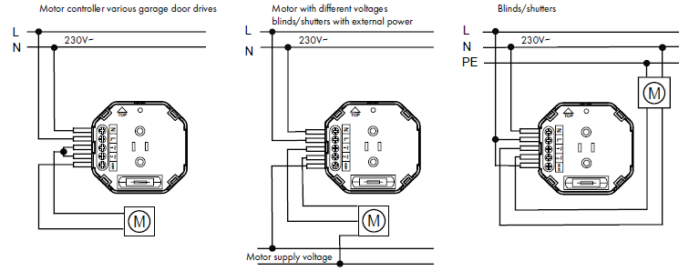

DUWI 05436 "Roller shutter" 
==========================

\

-   **The module**

\

\

-   **The Jeedom visual**

\

\

Summary 
------

\

The DUWI 05436 roller shutter module is used to control shutters
rolling in two directions.

Its main features are :

-   The possibility of using a 'Common' on which to switch the climb
    or the descent. So it is possible to order both
    directions with any type of voltage, even a neutral.

-   The ability to send a continuous up / down signal without
    time limit.

Be careful: this module does not send its status to the z-wave controller when
the user presses the buttons directly. You have to make a
'Refresh 'on its position to update, or adjust the Poll (see
further).

\

Functions 
---------

\

-   Down up

-   A common wire which will be switched on ascent or descent

-   Requires neutral to operate

-   Fuse protection

-   Rise and fall times adjustable by setting or by
    module learning

-   The switch is supplied with the module, not interchangeable

\

Technical characteristics 
---------------------------

\

-   Type of module : Z-Wave receiver / actuator

-   230V, 50Hz power supply

-   Neutral required

-   Max load : 1800W (resistive), 460VA (inductive)

-   Fuse : T8AH

-   Frequency : 868.42 Mhz

-   Dimensions : 52 x 52 x 31mm

-   Temperature range : 0 ° C / + 40 ° C

\

Module data 
-----------------

\

-   Mark : Popp / Duwi

-   Name : ZW ESJ Blind Control

-   Manufacturer ID : 100

-   Product type : 16385

-   Product ID : 0

\

Connection 
---------

\

Setup 
-------------

\

To configure the OpenZwave plugin and know how to put Jeedom in
inclusion refer to this
[documentation](https://jeedom.fr/doc/documentation/plugins/openzwave/en_US/openzwave.html).

\

> **IMPORTANT**
>
> To put the module in inclusion mode, press three times
> on the ascent or descent. Exclusion is done the same way.

\

Once included you should get this :

\

\

### Commands 

\

Once the module has been recognized, the commands associated with the module will be
available.

\

\

Here is the list of commands :

\

-   State : this is the current position of the shutter, in percentage from 0 to 99

-   Go down : command to descend completely

-   Ascend : command to mount completely

-   STOP : immediate movement stop

-   Refresh : refresh the current state of the module

-   Level : slider to position a partial opening

\

#### Setting the rise and fall times : 

The switch must be removed to access the two buttons
"ascent "and" descent".

Position the flap at the very top if you want to adjust the
descent, and vice versa.

Press at least 2s on both buttons (up and down)
simultaneously. The LED should start to flash green.

Then press and hold the down or up button,
until reaching the desired position. When you let go of the button, the
LED lights up solid green for a few seconds. Time is memorized.

Repeat the operation in the other direction.

\

### Setup of the module 

\

Then if you want to configure the module according to
of your installation, you have to go through the button
"Setup "of Jeedom's OpenZwave plugin.

\

\

You will arrive on this page (after clicking on the tab
settings)

\

\

Parameter details :

\

-   0 : Running Time :

These are the rise and fall times. You should find your
.

 : 
.

.

For example :  : . 
. 
 : .

 : 
. 
.

-   1 :  :  :

.

\

### Groups 

\

.

\

\

Good to know 
------------

\

-   
    
    on the switch.  :

        '

    

-   
    

\

### Alternative visual 

\

> **Tip**
>
> 
> '.

**@Theduck38**
