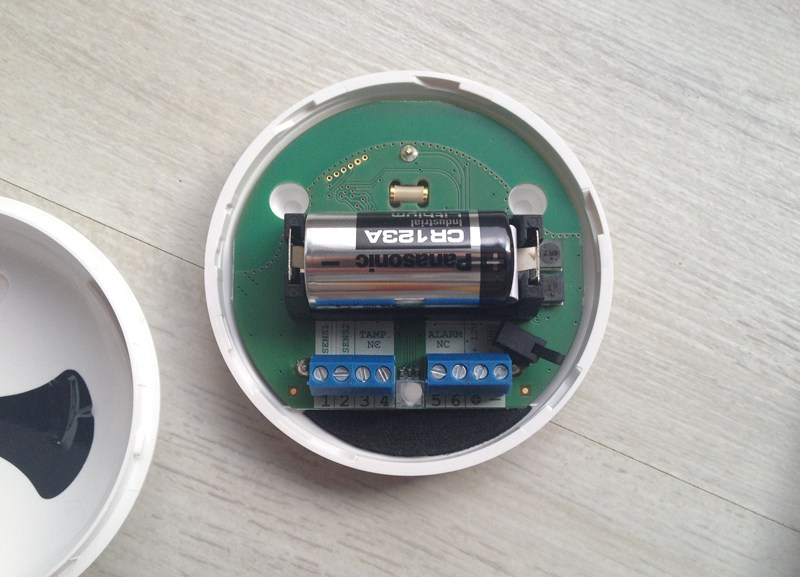

" 
==============================

\

-   **The module**

\

\

-   **The jeedom visual**

\

\

Summary 
------

\

.

.

. 

.

. 
.

. 
.

.

\

Functions 
---------

\

-   

-   

-   

-   

-   

-    ?? 

\

Technical characteristics 
---------------------------

\

-   Type of module : Z-Wave transmitter

-    : 

-   Battery type : 

-   Battery life : 2 years

-    : 

-    :

-    : 

-   Frequency : 868.42 MHz

-   Transmission distance : 50m free field, 30m indoors

-   Dimensions : 

-   Operating temperature : 
    

-   Temperature measurement range : -20 to 100 ° C

-   Measurement accuracy : 

-   Standards : EMC 2004/108 / EC and R & TTE 199/5 / WE

\

Module data 
-----------------

\

-   Mark : Fibar Group

-   Model : 

-   Maker : 

-   Manufacturer ID : 271

-   Product Type : 2816

-   Product ID : 4097

\

Setup 
-------------

\

To configure the OpenZwave plugin and know how to put Jeedom in
inclusion refer to this
[documentation](https://jeedom.fr/doc/documentation/plugins/openzwave/en_US/openzwave.html).

\

> **IMPORTANT**
>
> To put this module in inclusion mode, press the button 3 times
> 
> .

\

\

Once included you should get this :

\

\

### Commands 

\

Once the module has been recognized, the commands associated with the module will be
available.

\

\

Here is the list of commands :

\

-    : 
    

-   Temperature : it is the temperature measurement command

-   Sabotage : this is the sabotage command. It signals the opening
    of the case

-   Drums : it's the battery command

\

### Setup of the module 

\

> **IMPORTANT**
>
> During a first inclusion always wake up the module just after
> inclusion.

\

Then it is necessary to configure the module in
depending on your installation. This requires going through the button
"Setup "of Jeedom's OpenZwave plugin.

\

\

You will arrive on this page (after clicking on the tab
Settings)

\

\

Parameter details :

\

-   Wakeup : this is the module wake-up interval (value
    recommended 21600)

-   .  :
    valeur de 0 à 3600 s (0 par défaut/ dès qu‘il n'y a plus de détection il
    

-   . . Value :

        0 : 
        1 : 
        2 : 
        3 : .

-   .  : 
    . 
    
    speed ! 

-   .  : 
    = . 
    
    .

-   .  : 
    
    .

-   51. : 
    
    .

-   .  : 
    = 
    

-   .  : ,
    

\

### Groups 

\

For optimum operation of your module. Jeedom must be
:

\

\

Good to know 
------------

\

Wakeup 
------

\

To wake up this module, press the central button 3 times

\

Faq. 
------

\

This module wakes up by pressing 3 times on its inclusion button.

\

.

\

IMPORTANT note 
---------------

\

> **IMPORTANT**
>
> You have to wake up the module : after its inclusion, after a change
> of the configuration, after a change of wakeup, after a
> change of association groups

\

\
 :
<http://blog.domadoo.fr/2014/12/18/jeedom-guide-dutilisation-du-detecteur-dinondation-fibaro-fgfs-001/>
 :
<http://www.fibaro.com/manuals/en/-Flood-Sensor/-Flood-Sensor-en-2.1-2.3.pdf>

\

