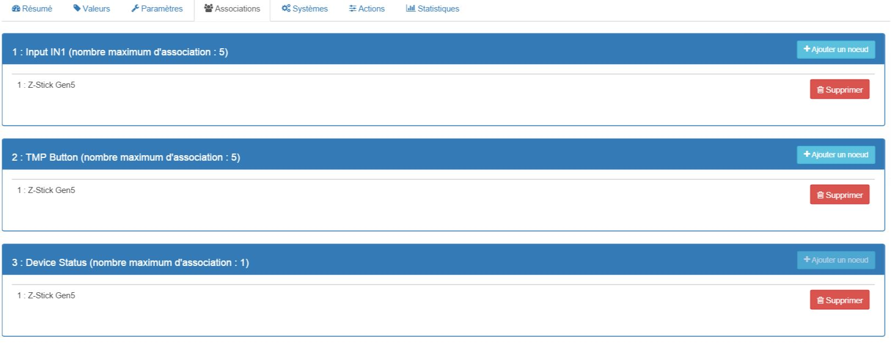

Fibaro Détecteur d'ouverture - FGK-101 
======================================

 \

-   **The module**

 \

 \

-   **Le visuel Jeedom**

 \

 \

Summary 
------

 \

Ce détecteur alimenté par pile et compatible Z-Wave dispose d'un capteur
reed, un interrupteur de proximité à fonctionnement magnétique, qui
permet de détecter l'ouverture d'une porte ou d'une fenêtre lorsque les
deux éléments sont éloignés.

Le dispositif est constitué d'une partie avec un aimant (la partie
mobile), fixée sur la porte ou la fenêtre, ainsi que de l'unité
principale positionnée sur la partie fixe de la fenêtre/porte avec des
vis ou un adhésif. Lorsque les deux parties ne sont plus en face, un
signal radio Z-Wave est automatiquement envoyé.

De plus, ce détecteur dispose d'une entrée analogique permettant d'y
connecter une sonde de température 1-Wire DS18B20. Ce détecteur dispose
aussi d'une entrée filaire, il peut ainsi être utilisé comme un
transmetteur universel : laissez de côté son contact magnétique, et
reliez ses entrées à vis à tout détecteur (normalement fermé) de votre
choix tel qu'un détecteur de fumée, de gaz ou de monoxyde de carbone,
Etc..

Un contrôleur Z-Wave (télécommande, dongle …​) est nécessaire afin
d'intégrer ce détecteur dans votre réseau si vous avez déjà un réseau
existant.

 \

Functions 
---------

 \

-   Détecteur d'ouverture

-   Bouton pour inclure/exclure le détecteur

-   Détection pile faible

-   Protection anti-sabotage

-   1 entrée filaire sans potentiel

-   1 entrée analogique 1-Wire (pour connecter une sonde de
    température DS18B20)

-   Très petit, dimensions réduites

-   Facilité d'utilisation et d'installation

 \

Caractéristiques techniques 
---------------------------

 \

-   Type de module : Emetteur Z-Wave

-   Color : Blanc (FGK-101/102/103/104/105/106/107 selon couleur)

-   Alimentation : Pile ER14250 (1/2AA) 3,6V

-   Fréquence : 868,42 Mhz

-   Distance de transmission : 50m champ libre, 30m en intérieur

-   Dimensions: 76 x 17 x 19 mm

-   Température de fonctionnement : 0-40°C

 \

Données du module 
-----------------

 \

-   Marque : Fibar Group

-   Name : Fibaro FGK-101 avec sonde de température (DS18B20)

-   Fabricant ID : 271

-   Type Produit : 1792

-   Produit ID : 4096

 \

Setup 
-------------

 \

Pour configurer le plugin OpenZwave et savoir comment mettre Jeedom en
inclusion référez-vous à cette
[documentation](https://jeedom.fr/doc/documentation/plugins/openzwave/fr_FR/openzwave.html).

 \

> **IMPORTANT**
>
> Pour mettre ce module en mode inclusion il faut appuyer 3 fois sur le
> bouton d'inclusion, conformément à sa documentation papier.

 \

 \

Une fois inclus vous devriez obtenir ceci :

 \

 \

### Commands 

 \

Une fois le module reconnu, les commandes associées au module seront
available.

 \

 \

Voici la liste des commandes :

 \

-   State : c'est la commande qui remontera l'état ouvert ou fermé du
    module

-   Drums : c'est la commande qui permet de remonter l'état de la
    drums

 \

Vous pouvez masquer ou afficher ces commandes comme vous le souhaitez.

 \

### Setup of the module 

 \

> **IMPORTANT**
>
> Lors d'une première inclusion réveillez toujours le module juste après
> l'inclusion.

 \

Ensuite si vous voulez effectuer la configuration du module en fonction
de votre installation, il faut pour cela passer par la bouton
"Setup" du plugin OpenZwave de Jeedom.

 \

 \

Vous arriverez sur cette page (après avoir cliqué sur l'onglet
Paramètres)

 \

 \

Détails des paramètres :

 \

-   Wakeup : c'est l'interval de réveil du module (valeur
    recommandée 7200)

-   1: permet de régler le délai d'annulation de l'alarme de l'entrée IN
    (contact sec)

-   2: permet de choisir si la led bleue doit clignoter à l'ouverture et
    la fermeture de votre porte par exemple

-   3: permet de définir le type contact relié au bornier (IN)

-   5: déconseillé de changer ce paramètre sauf si vous savez pourquoi
    (définit le type de signal envoyé au groupe d'association 1)

-   7: valeur envoyée au groupe d'association 1

-   9: permet de régler l'envoi du signal d'annulation entre l'entrée IN
    et le groupe d'association 1

-   12: permet de régler la sensibilité au changement de température (si
    une sonde 1 wire est reliée au module)

-   13: permet de régler l'envoi en mode broadcast des signaux de
    température et de tamper

-   14: permet d'activer la fonctionnalité d'activation de scènes

 \

### Groups 

 \

Ce module possède trois groupes d'association, seul le troisième est
indispensable.

 \

 \

Bon à savoir 
------------

 \

### Spécificités 

 \

> **Tip**
>
> Ce module est très capricieux sur les wakeup et nécessite une très
> forte proximité avec le contrôleur lors de son inclusion

 \

### Visuel alternatif 

 \

 \

Wakeup 
------

 \

Pour réveiller ce module il y a une seule et unique façon de procéder :

-   appuyer 3/4 fois sur le bouton d'inclusion. Il peut être nécessaire
    de le faire plusieurs fois de suite (2 ou 3)

 \

F.A.Q. 
------

 \

Ce module se réveille en appuyant 3 fois sur un des boutons tamper. Mais
il faut que l'autre bouton tamper soit enfoncé.

 \

Ce module à une portée très faible. Il est conseillé de faire
l'inclusion au plus proche de votre box.

 \

Ce module est un module sur drums, la nouvelle configuration sera
prise en compte au prochain wakeup.

 \

Note importante 
---------------

 \

> **IMPORTANT**
>
> Il faut réveiller le module : après son inclusion, après un changement
> de la configuration , après un changement de wakeup, après un
> changement des groupes d'association

 \

**@sarakha63**
