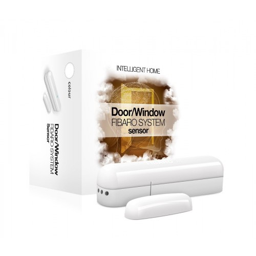
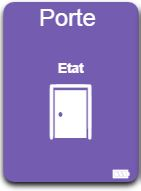

Fibaro Opening detector - FGK-101 
======================================

\

-   **The Module?**

\

\

-   **The Jeedom visual**

\

\

Summary 
------

\

This battery-powered and Z-Wave compatible detector has a sensor
reed, a proximity switch with magnetic operation, which
detects the opening of a door or window when the
two elements are distant.

The device consists of a part with a magnet (the part
mobile), attached to the door or window, as well as the unit
main positioned on the fixed part of the window / door with
screw or adhesive. When the two parts are no longer opposite, a
Z-Wave radio signal is automatically sent.

In addition, this detector has an analog input allowing
connect a 1-Wire DS18B20 temperature probe. This detector has
also from a wired input, so it can be used as a
universal transmitter : leave aside its magnetic contact, and
connect its screw inputs to any detector (normally closed) of your
choice such as smoke, gas or carbon monoxide detector,
etc.

A Z-Wave controller (remote control, dongle, Etc.?.) is required in order to
integrate this detector into your network if you already have a network
existant.

\

Functions 
---------

\

-   Opening detector

-   Button to include / exclude the detector

-   Low battery detection

-   Tamper protection

-   1 potential-free wired input

-   1 analog 1-Wire input (to connect a
    temperature DS18B20)

-   Very small, reduced dimensions

-   Ease of use and installation

\

Technical characteristics 
---------------------------

\

-   Type of Module : Z-Wave transmitter

-   Color? : White (FGK-101/102/103/104/105/106/107 depending on color)

-   Food? : ER14250 (1 / 2AA) 3.6V battery

-   Frequency : 868.42 Mhz

-   Transmission distance : 50m free field, 30m indoors

-   Dimensions?: 76 x 17 x 19 mm

-   Operating temperature : 0-40 ° C

\

Module data 
-----------------

\

-   Mark? : Fibar Group

-   Name : Fibaro FGK-101 with temperature probe (DS18B20)

-   Manufacturer ID : 271

-   Product Type : 1792

-   Product ID : 4096

\

Setup 
-------------

\

To configure the OpenZwave plugin and know how to put Jeedom in
inclusion refer to this
[Documentation](https://jeedom.fr/doc/documentation/plugins/openzwave/en_US/openzwave.html).

\

> **Important**
>
> To put this Module in inclusion mode, press the button 3 times
> inclusion button, according to its paper Documentation?.

\

\

Once included you should get this :

\

\

### Commands 

\

Once the Module has been recognized, the commands associated with the Module will be
disponibles.

\

\

Here is the list of commands :

\

-   State : it is the command which will raise the open or closed state of the
    Module?

-   Drums : it is the command which allows to go up the state of the
    drums?

\

You can hide or show these commands as you wish.

\

### Setup? of the Module 

\

> **Important**
>
> During a first inclusion always wake up the Module just after
> inclusion?.

\

Then if you want to configure the Module according to
of your installation, you have to go through the button
"Setup "of Jeedom's OpenZwave plugin.

\

\

You will arrive on this page (after clicking on the tab
Settings)

\

\

Parameter details :

\

-   Wakeup? : this is the Module?'s wake-up interval (value
    7200 recommended)

-   1: sets the delay for canceling the IN input alarm
    (dry contact)

-   2: allows to choose if the blue led should flash on opening and
    closing your door for example

-   3: used to define the contact type connected to the terminal block (IN)

-   5: not recommended to change this setting unless you know why
    (defines the type of signal sent to association group 1)

-   7: value sent to association group 1

-   9: allows you to set the sending of the cancellation signal between the IN input
    and association group 1

-   12: allows to adjust the sensitivity to temperature change (if
    a 1 wire probe is connected to the Module?)

-   13: allows to set the sending in broadcast mode of the signals of
    temperature and tamper

-   14: activates the scene activation feature

\

### Groups? 

\

This Module has three association groups, only the third is
indispensable.

\

\

Good to know 
------------

\

### Specificities 

\

> **Tip**
>
> This Module is very finicky on wakeup and requires a very
> strong proximity to the controller when included

\

### Alternative visual 

\

\

Wakeup 
------

\

To wake up this Module there is only one way :

-   press the inclusion button 3/4 times. It may be necessary
    to do it several times in a row (2 or 3)

\

Faq. 
------

\

This Module wakes up by pressing 3 times on one of the tamper buttons. But
the other tamper button must be pressed.

\

This Module has a very low range. It is advisable to do
inclusion closest to your box.

\

This Module is a battery Module?, the new configuration will be
taken into account at the next wakeup.

\

IMPORTANT note 
---------------

\

> **Important**
>
> You have to wake up the Module : after its inclusion, after a change
> of the configuration, after a change of wakeup, after a
> change of association groups

\

**@sarakha63**
