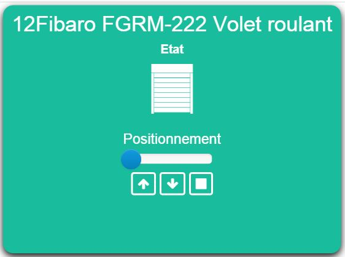
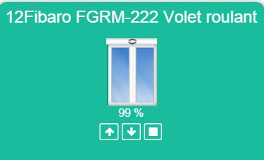

Fibaro FGR-222 "Roller shutter" 
==============================

\

-   **The module**

\

\

-   **The Jeedom visual**

\

\

Summary 
------

\

The FGR-222 micromodule will allow you to manage the motorizations of
shutter with electronic stop, Venetian blinds or the doors of
garage thanks to the Z-Wave protocol while keeping your switch
existing. You will therefore be able to activate the connected motor by
using the existing switch, a Z-Wave transmitter or directly
from the button on the micromodule.

In addition, this micromodule is capable of transmitting consumption
instantaneous (W) and cumulative (KWh) electrical power of the equipment
attached to.

A Z-Wave controller (remote control, dongle, etc.) is required in order to
integrate this module into your network if you already have a network
existing.

Each Z-Wave module functions as a wireless repeater with the
other modules, to ensure full coverage of your
dwelling.

NOTE : This module requires neutral to operate.

\

Functions 
---------

\

-   Control your blinds or roller shutters remotely

-   Compatible with BSO and Venetian blind with positioning of
    slats

-   Installs behind an existing switch

-   Up / down and positioning function

-   Compatible with motors with mechanical or electronic stop

-   Measurement of instantaneous and cumulative consumption

-   Wireless update with the Fibaro Home Center 2 box

-   Z-Wave network coverage test function

-   Small, discreet and aesthetic

-   Ease of use and installation

\

Technical characteristics 
---------------------------

\

-   Type of module : Z-Wave receiver

-   Food : 230V, 50 Hz

-   Power consumption : &lt; 0,8W

-   Wiring : 3 wire, neutral required

-   Max load : 1000W

-   Frequency : 868.42 Mhz

-   Signal strength : 1mW

-   Transmission distance : 50m free field, 30m indoors

-   Dimensions: 17 x 42 x 37 mm

-   Operating temperature : 0-40 ° C

-   Limit temperature : 105 ° C

-   Standards : LVD (2006/95 / EC), EMC (2004 / 10B / EC), R & TTE (1999/5 / EC)

\

Module data 
-----------------

\

-   Mark : Fibar Group

-   Name : Fibaro FGR-222

-   Manufacturer ID : 271

-   Product Type : 770

-   Product ID : 4096

\

Setup 
-------------

\

To configure the OpenZwave plugin and know how to put Jeedom in
inclusion refer to this
[Documentation](https://jeedom.fr/doc/Documentation/plugins/openzwave/en_US/openzwave.html).

\

> **IMPORTANT**
>
> To put this module in inclusion mode, press the button 3 times
> inclusion button, according to its paper documentation.

\

\

Once included you should get this :

\

\

### Commands 

\

Once the module has been recognized, the commands associated with the module will be
available.

\

\

Here is the list of commands :

\

-   State : It is the command which allows to know the position of
    your shutter

-   Positioning : It is the command which makes it possible to define the
    opening percentage

-   Up : This is the command that allows you to fully open the shutter

-   Down : It is the command that completely closes the shutter

-   Refresh : It is the command which allows to ask again the position
    of the shutter

-   Power : Command allowing to have the consumption of the module

-   Consumption : Control allowing to know the power
    instant used by the module

-   STOP : Control to stop the movement of the shutter

-   STOP BSO : Command to stop the movement (in mode
    adjustable slat)

-   Tilt : Allows you to tilt the slats (adjustable slat mode)

-   Decline : Allows to decline the slats (adjustable slat mode)

-   Not : Used to define the step for pressing Decline or
    Tilt

\

### Configuration of the module 

\

Then if you want to configure the module according to
of your installation, you have to go through the button
"Configuration "of Jeedom's OpenZwave plugin.

\

\

You will arrive on this page (after clicking on the tab
Settings)

\

\

Parameter details :

\

-   1: allows to block the module (to freeze a shutter) (in the case
    pressing a switch)

-   2: ditto but for zwave commands

-   3: type of reports (classic or fibar)

-   10: operating mode (Venetian blind, shutter, etc.)

-   12: duration of a full turn (in Venetian blind mode)

-   13: allows you to choose when the slats should return to their
    previous position

-   14: allows to choose the type of switch

-   17: allows to choose how long after the limit defined in 18
    the shutter stops

-   18: engine safety power

-   22: N / A

-   29: allows to calibrate the flap

-   30 to 35: allows to define the behavior of the module
    different zwave alarms

-   40: power delta to trigger an increase of information (even in
    outside the period defined in 42)

-   42: info feedback period

-   43: energy delta to trigger an ascent of information (even in
    outside the period defined in 42)

-   44: allows to choose whether or not consumption and power
    must include that of the module itself

-   50: allows to choose if the module should send the info to the nodes
    in association in scene mode or in association mode

\

### Groups 

\

This module has 3 association groups, only the third is
essential.

\

\

Good to know 
------------

\

### Reset 

\

\

You can reset your consumption meter by clicking
on this button available in the System tab.

\

### IMPORTANT 

\

> **IMPORTANT**
>
> For status feedback to work in Jeedom, it is necessary to
> force the equipment calibration (parameter 29 to "Yes") and the
> positioning must be active (parameter 10 with values "Active
> direct "," Active Venetian "or" Active door ").

\

### Alternative visual 

\

\

Wakeup 
------

\

No notion of wakeup on this module.

\

Faq. 
------

\

Read the Reset section of this doc.

\

**@sarakha63**
