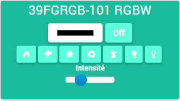
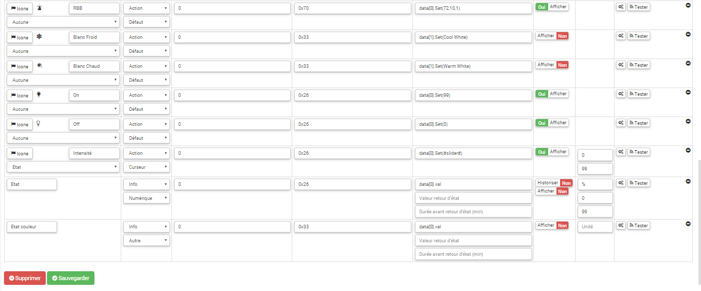
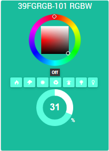

Fibaro RGVB Controler - FGRGB-101 
=================================

\

-   **The module**

\

\

-   **The Jeedom visual**

\

\

Summary 
------

The Z-Wave Fibaro FGRGB-101 micromodule allows you to choose between
12 / 24V low voltage lights (halogen or LED), an RGB LED strip
or RGB + white or even to connect analog probes using
0-10V standard.

-   4 analog inputs 0 to 10V to connect to many sensors
    compatible, potentiometers, push buttons (monostable)
    or switches (bistable).

-   4 dimmer outputs (PWM) to control :

-   \ * i.e. 1 channel of RGB + White LED (RGBW) 12 / 24V

-   \ * or 4 channels of white LEDs 12 / 24V

-   \ * or 4 channels of 12 / 24V halogen lamps (144W 12V / 288W 24V max.)

-   \ * or 12 / 24V fans.

-   Requires separate 12 / 24V power supply.

-   Global or instantaneous or cumulative consumption measurement.

-   Repeater function (router) to extend the Z-Wave network.

\

Functions 
---------

-   Order low voltage lights 12 / 24V (halogen or LED)

-   Installs behind an existing switch

-   Previously programmed light simulation

-   ON / OFF and Variation function

-   Small, discreet and aesthetic

-   Ease of use and installation

\

Technical characteristics 
---------------------------

-   Food : 12 V or 24 V DC

-   Maximum output power :

-   \ * 12A in total (addition of all channels),

-   \ * 6A max. per channel

-   Maximum power with halogen lamps :

-   \ * 12V - 144W total (all channels),

-   \ * 24V - 288W total (all channels)

-   PWM modulation frequency : 244 Hz

-   Consumption : 0.3W

-   Radio protocol : Z-Wave at 868.4 MHz (EU)

-   Z-Wave transmit power : 1mW

-   Operating temperature : 0 - 40 C

-   For installation in boxes : Ø≥50 mm

-   Dimensions : 42 x 37 x 17 mm

-   European standards : EMC 2004/108 / EC R & TTE 199/5 / WE

-   This module requires a Z-Wave controller to operate.

\

Module data 
-----------------

-   Mark : Fibar Group

-   Name : Fibaro FGRGB-101 RGBW

-   Manufacturer ID : 271

-   Product Type : 2304

-   Product ID : 4096

\

Setup 
-------------

To configure the OpenZwave plugin and know how to put Jeedom in
inclusion refer to this
[Documentation](https://jeedom.fr/doc/Documentation/plugins/openzwave/en_US/openzwave.html).

\

> **IMPORTANT**
>
> To put this module in inclusion mode, press the button 3 times
> inclusion button, according to its paper documentation.

\

\

Once included you should get this :

\

\

### Commands 

Once the module has been recognized, the commands associated with the module will be
available.

\

\

Here is the list of commands :

-   Color : It is the command which allows to set the color code to
    Pin up

-   Fireplace : It is the command that simulates an atmosphere of
    Fireplace

-   Thunderstorm : This is the command that simulates a Storm atmosphere

-   Dawn : This is the command that simulates an Aude atmosphere
    (progressive sunrise)

-   Fading : This is the command that simulates the entire
    color spectrum

-   RBB : This is the command that simulates a cop atmosphere

-   White cold : This is the command that simulates having a
    cool white color, if the color strip allows it. (this
    command is not visible by default)

-   White hot : This is the command that simulates having a
    warm white color, if the color strip allows it. (this
    command is not visible by default)

-   We : This is the command that turns on the strip on the
    last color chooses before

-   Off : This is the command that turns off the banner

-   Intensity : It is the command which allows to adjust the intensity
    bright

Note that on the dashboard all the information is found on the same
Icon

\

### Configuration of the module 

You can configure the module according to your
installation. This requires going through the "Configuration" button of the
Jeedom OpenZwave plugin.

\

\

You will arrive on this page (after clicking on the tab
Settings)

\

\

Parameter details :

Please refer to the previous screenshot, the settings
being translated into french.

\

### Groups 

This module has five association groups, only the fifth is
essential.

\

Good to know 
------------

### Specificities 

Use of 0-10V sensors.

\

> **Bail**
>
> For now, the default configuration of jeedom does not allow it
> not, but a specific configuration can be considered.

### Alternative visual 

\

\

Wakeup 
------

No notion of wakeup on this module.

\

Faq. 
------

For now, the default configuration of jeedom does not allow it,
but a specific configuration can be considered.

\

